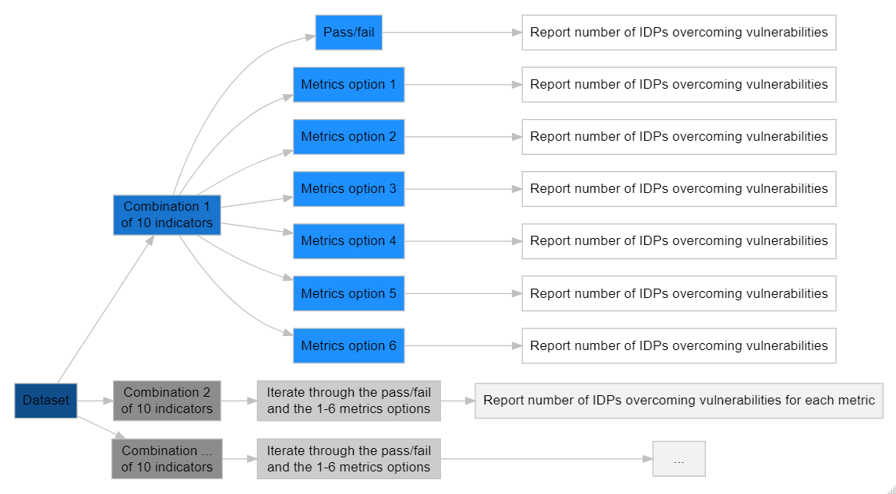

```{r setup, include=FALSE}
library(tidyverse)
library(hrbrthemes)
library(patchwork)
library(kableExtra)
library(DiagrammeR)
library(targets)
knitr::opts_chunk$set(echo = F, message = F, warning = F, results = 'asis', cache = T, fig.align="center")
```

```{r nigeria_targets}
DS_Original_nigeria <- targets::tar_read("DS_Original_nigeria") %>% select(-Durable_Solutions)
DS_Option2_nigeria <- targets::tar_read("DS_Option2_nigeria") %>% select(-Durable_Solutions)
DS_Option3_nigeria <- targets::tar_read("DS_Option3_nigeria") %>% select(-Durable_Solutions)
DS_Option4_nigeria <- targets::tar_read("DS_Option4_nigeria") %>% select(-Durable_Solutions)
DS_Option5_nigeria <- targets::tar_read("DS_Option5_nigeria") %>% select(-Durable_Solutions)
DS_Option1_nigeria <- targets::tar_read("DS_Option1_nigeria") %>% select(-Durable_Solutions)
DS_Option6_nigeria <- read_csv("ecdf/nigeria.csv") %>% select(-Durable_Solutions)

DS_Original_nohlp_nigeria <- targets::tar_read("DS_Original_nohlp_nigeria") %>% select(-Durable_Solutions)
DS_Option1_nohlp_nigeria <- targets::tar_read("DS_Option1_nohlp_nigeria") %>% select(-Durable_Solutions)
DS_Option2_nohlp_nigeria <- targets::tar_read("DS_Option2_nohlp_nigeria") %>% select(-Durable_Solutions)
DS_Option3_nohlp_nigeria <- targets::tar_read("DS_Option3_nohlp_nigeria") %>% select(-Durable_Solutions)
DS_Option4_nohlp_nigeria <- targets::tar_read("DS_Option4_nohlp_nigeria") %>% select(-Durable_Solutions)
DS_Option5_nohlp_nigeria <- targets::tar_read("DS_Option5_nohlp_nigeria") %>% select(-Durable_Solutions)
DS_Option6_nohlp_nigeria <- read_csv("ecdf/nigeria_nohlp.csv") %>% select(-Durable_Solutions)

```

```{r hargeisa_targets}
DS_Original_hargeisa <- targets::tar_read("DS_Original_hargeisa") %>% select(-Durable_Solutions)
DS_Option1_hargeisa <- targets::tar_read("DS_Option1_hargeisa") %>% select(-Durable_Solutions)
DS_Option2_hargeisa <- targets::tar_read("DS_Option2_hargeisa") %>% select(-Durable_Solutions)
DS_Option3_hargeisa <- targets::tar_read("DS_Option3_hargeisa") %>% select(-Durable_Solutions)
DS_Option4_hargeisa <- targets::tar_read("DS_Option4_hargeisa") %>% select(-Durable_Solutions)
DS_Option5_hargeisa <- targets::tar_read("DS_Option5_hargeisa") %>% select(-Durable_Solutions)
DS_Option6_hargeisa <- read_csv("ecdf/hargeisa.csv") %>% select(-Durable_Solutions)

DS_Original_nohlp_hargeisa <- targets::tar_read("DS_Original_nohlp_hargeisa") %>% select(-Durable_Solutions)
DS_Option1_nohlp_hargeisa <- targets::tar_read("DS_Option1_nohlp_hargeisa") %>% select(-Durable_Solutions)
DS_Option2_nohlp_hargeisa <- targets::tar_read("DS_Option2_nohlp_hargeisa") %>% select(-Durable_Solutions)
DS_Option3_nohlp_hargeisa <- targets::tar_read("DS_Option3_nohlp_hargeisa") %>% select(-Durable_Solutions)
DS_Option4_nohlp_hargeisa <- targets::tar_read("DS_Option4_nohlp_hargeisa") %>% select(-Durable_Solutions)
DS_Option5_nohlp_hargeisa <- targets::tar_read("DS_Option5_nohlp_hargeisa") %>% select(-Durable_Solutions)
DS_Option6_nohlp_hargeisa <- read_csv("ecdf/hargeisa_nohlp.csv") %>% select(-Durable_Solutions)
```


```{r sudan_targets}
DS_Original_sudan <- targets::tar_read("DS_Original_sudan") %>% select(-Durable_Solutions)
DS_Option1_sudan <- targets::tar_read("DS_Option1_sudan") %>% select(-Durable_Solutions)
DS_Option2_sudan <- targets::tar_read("DS_Option2_sudan") %>% select(-Durable_Solutions)
DS_Option3_sudan <- targets::tar_read("DS_Option3_sudan") %>% select(-Durable_Solutions)
DS_Option4_sudan <- targets::tar_read("DS_Option4_sudan") %>% select(-Durable_Solutions)
DS_Option5_sudan <- targets::tar_read("DS_Option5_sudan") %>% select(-Durable_Solutions)
DS_Option6_sudan <- read_csv("ecdf/sudan.csv") %>% select(-Durable_Solutions)

DS_Original_nohlp_sudan <- targets::tar_read("DS_Original_nohlp_sudan") %>% select(-Durable_Solutions)
DS_Option1_nohlp_sudan <- targets::tar_read("DS_Option1_nohlp_sudan") %>% select(-Durable_Solutions)
DS_Option2_nohlp_sudan <- targets::tar_read("DS_Option2_nohlp_sudan") %>% select(-Durable_Solutions)
DS_Option3_nohlp_sudan <- targets::tar_read("DS_Option3_nohlp_sudan") %>% select(-Durable_Solutions)
DS_Option4_nohlp_sudan <- targets::tar_read("DS_Option4_nohlp_sudan") %>% select(-Durable_Solutions)
DS_Option5_nohlp_sudan <- targets::tar_read("DS_Option5_nohlp_sudan") %>% select(-Durable_Solutions)
DS_Option6_nohlp_sudan <-read_csv("ecdf/sudan_nohlp.csv") %>% select(-Durable_Solutions)

```

```{r colombia_targets}
DS_Original_colombia_hh <- targets::tar_read("DS_Original_colombia") %>% select(-Durable_Solutions)
DS_Option2_colombia_hh <- targets::tar_read("DS_Option2_colombia") %>% select(-Durable_Solutions)
DS_Option3_colombia_hh <- targets::tar_read("DS_Option3_colombia") %>% select(-Durable_Solutions)
DS_Option4_colombia_hh <- targets::tar_read("DS_Option4_colombia") %>% select(-Durable_Solutions)
DS_Option5_colombia_hh <- targets::tar_read("DS_Option5_colombia") %>% select(-Durable_Solutions)
DS_Option1_colombia_hh <- targets::tar_read("DS_Option1_colombia") %>% select(-Durable_Solutions)
DS_Option6_colombia_hh <- read_csv("ecdf/colombia.csv") %>% select(-Durable_Solutions)
```

\newpage 

<!-- # Executive summary 

The *International Recommendations on IDP Statistics* (IRIS), developed by the *Expert Group on Refugee, IDP and Statelessness Statistics* (EGRISS), provide a framework for capturing a country's stock of IDPs for statistical purposes. To correctly calculate the stock, it is crucial to define when IDP households and individuals enter the stock and when they exit the stock. This note relates to the latter, and specifically to the way by which households exit the stock by overcoming key displacement-related vulnerabilities - sometimes referred to colloquially as the "solutions measure". The IRIS have advanced the debate on a statistical measure on solutions considerably. Nevertheless, as stated in the recommendations themselves, these achievements do not yet result in a final and applicable statistical measure which can be applied directly in the work of statistical producers. 

After revisiting the conceptual framework for the solutions measure set out in the IRIS, the paper identifies 9 methodological challenges that remain to allow the IRIS solutions measure to be fully applicable in statistical production. The paper then makes concrete recommendations for how EGRISS can refine and further mature the solutions measure to become a fully workable statistical instrument. 

+	Challenge 1: Selection of a statistical metric
    + *Summary*: Different metric options are available to implement the two IRIS requirements that IDP households (1) meet each of the 10 sub-criteria capturing the overcoming of key displacement-related vulnerabilities and that IDP households are (2) compared to a benchmark population. The available metric options range from (1) a full composite index, (2) a composite metric at the criterion level, (3) a composite index at sub-criterion level, (4) a homogeneous cell approach, (5) a regression-based approach to (6) a cumulative distribution approach. Metric options that fully implement the requirement to pass IDP households on each sub-criterion (options 3+4) yield very little exits from the stock while options that average across all sub-criteria yield a higher number of exits (options 1, 5, 6). Option 2 requires further development to be made fully applicable. 
    + *Recommendation*: EGRISS should not consider a composite index at the sub-criterion level (data needs to high) or a regression-based approach (not easy to compare). A composite measure at the criterion level and a homogeneous cell approach require further investigation but the homogeneous cell approach is likely to not work well in practice. A full composite index can only be considered if EGRISS clearly standardizes the set of indicators to make an assessment and identifies if any sub-criteria must be passed (e.g. freedom to move). If feasible for national statistical offices, an alternative is an approach based on empirical cumulative distributions. 
+ Challenge 2: Selection of statistical indicators
    + *Summary*: The simulations show that the indicator selection, i.e. the question which indicators to choose to measure the 10 sub-criteria,  matters less for the overall exit from the IDP stock than identifying a metric to combine the different indicators. Nevertheless, missing data, problems to aggregate to the household level, and non-applicability of indicators can create differences in the exit from the IDP stock, suggesting a need to standardize indicators across contexts. 
    + *Recommendation*: It is suggested that EGRISS standardizes the indicators to operationalize the 10 sub-criteria as much as possible to increase comparability across contexts, relying on a selection of the SDG indicators and the Durable Solutions Library indicators. This note proposes a selection of indicators.

\newpage

+ Challenge 3: The property restitution and compensation sub-criterion
    + *Summary*: Out of the ten sub-criteria currently specified in the IRIS solutions measure, the sub-criterion *4.1 Property restitution and compensation* stands out as particularly restrictive in terms of allowing any exits from the IDP stock due to the fact that restitution or compensation mechanisms exist only in a very limited number of cases across the world. A direct implication of this is that the IRIS solutions measure, as it currently stands, will barely allow any exits from the IDP stock in practice.
    + *Recommendation*: It is suggested that the focus on HLP restitution is reinterpreted as security of tenure for the solutions measure. This would require re-labeling the sub-criterion and operationalizing it in a way that is applicable across displacement contexts.
+ Challenge 4: Dealing with missing data
    + *Summary*: IRIS posits that no assessment can be made and thus that households should remain in the IDP stock if data is missing for any of the solution measure’s sub-criteria. This is problematic given that a relevant proportion of households – almost a third of households across the simulations - are affected by missing data. In the vast majority of cases, this data is missing “by design”, i.e. for perfectly valid reasons such as a household without children not being asked about current school attendance of children. 
    + *Recommendation* For data missing “by design”, the IRIS recommendation should be adjusted and it should be clarified that missing data due to valid skip patterns and non-applicability should be interpreted as the absence of vulnerability in that particular indicator.
+	Challenge 5: Data aggregation to the household level
    + *Summary*: Related to the problem of missing data is the fact that some of the sub-criteria are more naturally measured on the individual-level than the household-level. To make a meaningful assessment of the household-level exit of IDPs from the overall stock, it should be made clear how data collected from individual respondents can be aggregated to the household level. Potential aggregation rules are a pass if all household members or if at least one member achieves a pass.
    + *Recommendation*: It is recommended that the IRIS should be adjusted and a specification should be added to explain how each sub-criterion should be aggregated to the household level.
+	Challenge 6-9: 
    + *Summary*: Beyond the challenges assessed in this report, the IRIS also has to address how to deal with statistical uncertainty in the target/benchmark values (challenge 6), how to define the final comparator population (challenge 7), how to factor assistance into the solutions measure (challenge 8) and how to deal with changing benchmark values over time (challenge 9).
    + *Recommendation*: It is recommended to revisit these problems once more clarity on challenges 1-5 is achieved. This can include methodological analyses on the difference between low, best, and high estimates of IDP exits from the stock (to address challenge 6), the difference between host community and national averages in the same displacement contexts (to address challenge 7), and the change in IDP exits over time in panel data (to address challenge 9). Regarding the challenge of how to define the comparator population, a nationally representative benchmark is favorable compared to host community benchmarks. 
    
\newpage --> 

# Introduction

The *International Recommendations on IDP Statistics* (IRIS), developed by the *Expert Group on Refugee, IDP and Statelessness Statistics* (EGRISS), provide a framework for capturing a country's stock of IDPs for statistical purposes. To correctly calculate the stock, it is crucial to define when individuals enter the stock and when they exit the stock. This paper relates to the latter, and specifically to the way by which individuals exit the stock by overcoming key displacement-related vulnerabilities - sometimes referred to colloquially as the "IRIS solutions measure". 

It is important to note that the purpose of a statistical definition for the "end of displacement" is explicitly **not** to identify specific households or individuals that are no longer displaced (e.g. for programming or assistance purposes) but only to enable aggregate statistics on the amount of internal displacement in each country that can be compared globally. Separate from the "solutions measure", IRIS also proposes a distinct but related framework to assess progress towards the achievement of durable solutions - colloquially referred to as the "progress measure". The progress measure aims to allow decision-makers "to understand at a glance in which aspects of vulnerability IDPs are struggling compared to others [...] and in which they are doing relatively well" (IRIS, page 55). While progress and solution can likely be measured with similar statistical indicators, their aims and application are very different: informing decisions on policy areas that need attention as well as more granular assistance-related decisions (through the IRIS progress measure) vs informing aggregate statistics on IDP stocks (IRIS solutions measure).  

This note focuses on the IRIS solutions measure and how this measure can be implemented in practice. The IRIS have advanced the debate on a statistical measure on solutions considerably, including in the following ways:

- Specification of 5 priority criteria and 10 priority sub-criteria that should form the basis of a statistical measure
- Move to a context-dependent assessment of durable solutions rather than an absolute approach
- Narrowing of benchmark options (to national averages or host community averages)
- Recommendation of quality criteria to assess the suitability of indicators to measure each sub-criterion

\noindent Nevertheless, as stated in the recommendations themselves, the above achievements do not result in a final and applicable statistical measure which can be applied directly in the work of statistical producers. This methodological paper first outlines the conceptual framework for the solutions measure as suggested by the IRIS and identifies the remaining methodological challenges that persist in turning this into a fully applicable statistical measure. The main body of the paper then makes concrete suggestions, and provides decision points for EGRISS on how to overcome these challenges. The suggestions in this paper are backed up by empirical data from Hargeisa, Nigeria, Colombia and Sudan. Considering the absence of a concrete statistical measure at this stage, a simulation approach - cycling through all foreseeable metric and indicator choice for the solutions measure - is applied to illustrate exit from the IDP stock. 

# State of play on the "IRIS solutions measure"

## The conceptual framework: ten sub-criteria and two principles

Based on the *Framework for Durable Solutions by the Inter-Agency Standing Committee* (IASC), the IRIS specifies a set of 5 priority criteria and 10 sub-criteria that need to be measured in every displacement context to take IDPs out of the national stock as having overcome their displacement-related vulnerabilities (see Table \ref{tab:IASC}). The indicators for each of the 10 sub-criteria should be collected at the household or individual level.

```{r}
IASC <- data.frame(
  "Criteria" = c("1. Safety and security", " ",
                 "2. Adequate standard of living", " ", " "," ",
                 "3. Access to livelihoods", " ",
                 "4. Restoration of housing, land and property",
                 "5. Documentation"),
  "Subcriteria" = c("1.1 Victims of violence","1.2 Freedom of movement",
                     "2.1 Food security", "2.2 Shelter and housing", 
                     "2.3 Medical services", "2.4 Education",
                     "3.1 Employment and livelihoods", "3.2 Economic security",
                     "4.1 Property restitution and compensation", "5.1 Documentation")
)
knitr::kable(IASC,"latex", booktabs = TRUE,
             linesep = "",
             caption= "\\label{tab:IASC}IASC durable solution criteria and identified sub-criteria") %>%
  kable_styling(latex_options = "hold_position", font_size=10)
```

\noindent To then assess how many displaced households in a specific context have progressed towards a durable solution, the situation of IDPs must be compared with that of the comparator population (national average or "host community" average). The logic is that IDPs that perform similar or better than the comparator population in each sub-criterion are no longer considered displaced for the purpose of statistics.^[Note that this framework is used to count the aggregate number of IDPs in a given context. It is not used to assess the allocation of aid to an individual or household.] The IRIS promulgates this as follows: 

> *\footnotesize "The methodology used for calculating the composite measure is a simple pass/no pass (or binary) scenario at sub-criteria level that is then accumulated to produce a score at criteria level, and ultimately an overall score for the measure. [...] **To determine if a sub-criterion has been overcome or not, for each household, a target needs to be set** [...] It is foreseen that target setting will be more complex with categorical or binary indicators [...] If all sub-criteria receive a 'pass' mark, then that criterion [...] has been overcome. For criteria with multiple sub-criteria, **all sub-criteria would need to receive a 'pass' mark for the criteria to be overcome**. All of the five key-displacement related vulnerabilities (the five criteria) need to achieve a 'pass' mark for the composite measure to be fulfilled.[...] It is recommended to use the general/national population as the comparison group when deciding on the targets or thresholds for scoring each sub-criteria [...] In specific circumstances, thresholds can be set through a comparison with the average situation of a subset of the general population."* (IRIS, page 58-61) 

\noindent To sum it up, the IRIS established that the solutions measure should be based on an assessment of the ten sub-criteria, and should follow two key principles, namely (a) benchmarking against a comparator, and (b) achieving a pass in *each* of the sub-criteria.

Table \ref{tab:example} provides an example to understand this framework. Household A passes the criteria *1. Safety & security*, *4. Restoration of HLP rights*, and *5. Documentation*. However, because it has not passed the two sub-criteria in *3. Access to livelihood*, it does not pass this criterion. The household also does not pass the criterion *2. Adequate standard of living* because it has not passed the sub-criterion *2.4 Education* and the framework requires to pass all sub-criteria. Overall, no durable solution has been achieved in this example and the household should not exit the IDP stock.  

\begin{table}[htp!]
\centering
\footnotesize
\caption{Example household in the IRIS framework}
\label{tab:example}
\begin{tabular}{llll}
\toprule
& \multicolumn{2}{c}{Sub-criterion (compared to a benchmark)} & Result on criterion level \\
\midrule
\textbf{Household A} & 1.1 Victims of violence &  Pass & 2/2 (Passed) \\
&  1.2 Freedom of movement &  Pass & \\
  \cmidrule{2-4}
& 2.1 Food security & Pass & 3/4 (Not passed) \\
& 2.2 Shelter and housing &  Pass & \\
& 2.3 Medical services & Pass & \\
& 2.4 Education & No pass & \\
  \cmidrule{2-4}
& 3.1 Employment \& livelihoods  & No pass & 0/2 (Not passed) \\
& 3.2 Economic security & No pass & \\
  \cmidrule{2-4}
& 4.1 Property restitution \& compensation & Pass & 1/1 (Passed) \\
  \cmidrule{2-4}
& 5.1 Documentation & Pass & 1/1 (Passed) \\
\midrule
& \multicolumn{3}{l}{\textbf{Overall:} No durable solution achieved: displacement not ended} \\
\bottomrule
\end{tabular}
\end{table}

## Nine remaining methodological challenges

While this framework appears intuitive, there are several challenges and methodological gaps when implementing it in practice. 

\noindent The first methodological challenge arises from the above-cited assumption that it is possible to set a comparator target/benchmark for each sub-criterion which a household needs to match or surpass. The IRIS states that “target setting will be more complex with categorical or binary indicators”; however, **such benchmark comparison is not just complex but indeed technically meaningless for binary and categorical indicators. Binary and categorical household-level data points cannot be directly compared with average/distribution values in the comparator population**. To illustrate this problem, imagine a binary indicator "household has access to medical services" was selected to operationalize sub-criterion *2.3 Medical services*. The value for any given household can only be yes or no, 1 or 0. The target value derived from the comparator population, in contrast, would be a percentage on a scale, let us assume 5% of the comparator population have access to medical services. Achieving a pass for any given household in comparison with the target value can only be achieved by achieving a "yes" in this indicator – despite the fact that access to medical services is extremely low in the comparator population. In effect, the value of the comparator population is irrelevant, because the condition for achieving a pass would not have changed if the comparator value had been, say, 1% or 90%.  In other words, the entire idea of a contextualized target/benchmark that underlies the IRIS approach is devalued for binary or categorical indicators. Unfortunately, such types of indicators appear the pragmatic and thematically most valid choice of metric under the vast majority of sub-criteria. 

The second methodological challenge is that **no set of statistical indicators has been agreed on to capture the 10 sub-criteria**. The lack of an agreed, measurable set of indicators presents a real challenge in operationalizing the IRIS framework. While this methodological assessment aims to shed some light on how specific indicators affect the exit from the IDP stock, further empirical work will be needed to assess how the indicator choice affects the aggregate stock of IDPs in a displacement context. Eventually, more suitable datasets will need to be produced to facilitate this. 

A third challenge relates to one of the ten sub-criteria of the solutions measure, namely *4.1 Property restitution and compensation*. An implicit assumption in examining access to restitution or compensation mechanisms is that such mechanism are in place in displacement contexts. Experts on housing, land and property confirm that this is only the case in a limited number of cases across the world, and even where those mechanisms exist, there are issues in terms of equitable access to them and their effectiveness. Given the principles discussed above, this effectively bars household from exiting the IDP stock in the vast majority of countries. A decision on the **operationalization or the reframing of this sub-criterion** may be needed to develop a realistic solutions measure. 

Even if a set of statistical indicators can be agreed on to operationalize the 10 sub-criteria, it is unlikely that data will be available for all selected indicators in all situations. The IRIS specifies that if data is missing an assessment of whether displacement has been overcome cannot be made. This results in a fourth methodological challenge where data points are missing by design (e.g. households without children cannot be assessed for whether children currently attend school). Further empirical work provides an opportunity to assess and further explore the feasibility of this approach and gain greater insight on the aggregate **effects of missing data points**.   

A fifth methodological challenge is the unclear guidance on the **aggregation of individual-level indicators to the household-level**. Some of the sub-criteria promoted for the solutions measure are more naturally measured on the individual-level than the household-level. For example, employment is easiest to assess on the individual-level. There is hence a need to develop clear rules on how different indicators should be aggregated to the household-level at which the assessment and comparison with national/host community averages takes place. 

The sixth not addressed methodological challenge arises if the **comparator value comes with a level of statistical uncertainty**. Assume the benchmark value for the national/host population was produced using a sample survey – it would thereby come with a confidence interval around the comparator point estimate. It is not clear yet if a displaced household would have to perform as good as or better than the benchmark's point estimate or whether displaced households should "just" perform as good as or better than the lower bound of the confidence interval in the benchmark population. Deciding on an approach towards statistical uncertainty is crucial as the IDP stock estimates in most countries are not derived from a full mapping of the complete IDP population but from sampled surveys of displaced and non-displaced households. How to deal with levels of statistical uncertainty is relevant for binary but also metric indicators. 

A seventh area left open by IRIS is the **definition of the comparator population** itself – national or "host". If a host community is to be used as comparator, a clear definition of the term will need to be developed. While it may be preferable for IRIS to *not* provide a standardized recommendation on this and leave flexibility to data producers, further empirical work is recommended to at least assess how the choice of the comparator population affects the aggregate results across different context, and facilitate an evidence-informed decision. 

As the eight challenge, the IRIS solution measure should address to what extent assistance received should be "factored out / imputed out" before an assessment is made of how many IDPs exit the stock. For example, if IDPs overcome key-displacement related vulnerabilities because their shelter and housing is provided through humanitarian assistance, they may exit the stock without actually having overcome their housing-related vulnerabilities. While the solutions measure only produces an aggregate number, the measure should ensure that the overall exit from the IDP stock is not based on the **overcoming of vulnerabilities through humanitarian assistance** but through sustainable solutions.   

Related to the definition of a comparator population is the nineth challenge, on how to deal with **changing benchmark values over time**. If for example unemployment in the host community/ national population drops from one stock assessment to the next due to improving economic conditions in a country, this increases the benchmark value, and IDPs that have previously been taken out of the stock as having overcome their vulnerabilities may fall under the comparator benchmark again, re-entering and thereby enlarging the stock without the occurrence of any new displacement-causing events. 

\begin{story}[ht]
  \framedbox{

  \textbf{Challenge 1:} Find a way to make the benchmarking against target population statistically applicable 
          
  \textbf{Challenge 2:} Specify one or several statistical indicators for each of the 10 sub-criteria
  
  \textbf{Challenge 3:} Address sub-criterion on property restitution and compensation

  \textbf{Challenge 4:} Specify how missing data points should be dealt with
  
  \textbf{Challenge 5:} Clarify the aggregation of individual-level indicators to the household level
  
   \textbf{Challenge 6:} Address how to deal with statistical uncertainty in the target/benchmark values
                      
  \textbf{Challenge 7:} Define the comparator population
  
  \textbf{Challenge 8:} Specify how assistance is factored into the solutions measure
  
  \textbf{Challenge 9:} Address changing benchmark values over time
  }
  \caption[]{Remaining methodological challenges for a workable solutions metrics}
  \label{box:box1}
\end{story}


# Methodology

```{r load_data}
source("simulations.R")
data_nigeria <- targets::tar_read("data_nigeria")
data_hargeisa <- targets::tar_read("data_hargeisa")
data_sudan <- targets::tar_read("data_sudan")
data_colombia <- targets::tar_read("data_colombia")

indicators_nigeria <- extract_indicators(data_nigeria)
indicators_hargeisa <- extract_indicators(data_hargeisa)
indicators_sudan <- extract_indicators(data_sudan)
indicators_colombia <- extract_indicators(data_colombia)

sudan_helper <- sapply(indicators_sudan, length)
colombia_helper <- sapply(indicators_colombia, length)

DS <- data.frame(
  "Subcriteria in IRIS" = c(IASC$Subcriteria,
                            "Number of possible combinations"),
  "Durable Solutions \nLibrary" = c(7,1,1,8,4,3,8,10,6,4, " "),
  "IDP Profiling \nin Hargeisa" = 
    c(sapply(indicators_hargeisa, length),nrow(expand.grid(indicators_hargeisa))),
  "IDP Profiling \nin Nigeria" =
    c(sapply(indicators_nigeria, length),nrow(expand.grid(indicators_nigeria))),
  "IDP Profiling \nin El Fasher" =
    c(sudan_helper[1],0,sudan_helper[2:9], nrow(expand.grid(indicators_sudan))),
   "LSMS \nin Colombia" =
    c(colombia_helper[1],0,colombia_helper[2:7],0, colombia_helper[8], nrow(expand.grid(indicators_colombia)))
)
```


```{r cell_options}
cells_hargeisa <- combn(names(select(data_hargeisa, starts_with("HH_"))),3) %>% t()
cells_nigeria <- combn(names(select(data_nigeria, starts_with("HH_"))),3) %>% t()
cells_colombia <- combn(names(select(data_colombia, starts_with("HH_"))),3) %>% t()
```


This paper provides actionable suggestions for overcoming the above challenges, and aims to substantiate all suggestions with empirical evidence. Given that - for now - the solutions measure is not yet statistically workable, the empirical evidence on effects of any proposal on the aggregate IDP stock cannot be based on a single "solutions measure estimate" because this does not yet exist. To overcome this, we took stock of all potential metric choices and all potential indicator choices, and ran iterative simulations of all combinations thereof (see Figure  \ref{fig:sim_approach}). We selected four empirical contexts (Hargeisa, Nigeria, Colombia, Sudan). In each dataset, 1000 possible combinations of 10 indicators (one for each of the sub-criteria) were assessed using all five metric options outlined further below. The results - both in terms of the mean and distribution of exits from the stock across combinations - are highly indicative and insightful for understanding the effect of a proposed solution on the aggregate exits from the IDP stock, without having to decide for one or the other option. Annex [I](#annex-i-detailed-simulations-methodology) provides further details on the simulation methodology. 

{width=95%}

```{r flow_diagram, eval=F}

# DO NOT RUN! Produces html output

grViz("
digraph dot {

graph [layout = dot, rankdir = LR]

node [shape = Rounded,
      style = filled,
      color = grey,
      fontname= Arial]

node [fillcolor = dodgerBlue4]
Dataset

node [fillcolor = dodgerBlue3]
b[label= 'Combination 1\nof 10 indicators'] 

node [fillcolor = gray55]
c[label= 'Combination 2 \nof 10 indicators']  
d[label= 'Combination ... \nof 10 indicators'] 

node [fillcolor =  dodgerBlue]
e[label = 'Pass/fail']
f[label = 'Metrics option 1'] 
g[label = 'Metrics option 2'] 
h[label = 'Metrics option 3'] 
i[label = 'Metrics option 4'] 
j[label = 'Metrics option 5'] 

node [fillcolor =  gray80]
k[label = 'Iterate through the pass/fail \nand the 1-5 metrics options'] 
l[label = 'Iterate through the pass/fail \nand the 1-5 metrics options']  

node [fillcolor =  white, label = 'Report number of IDPs overcoming vulnerabilities']
m n o p q r 

node [fillcolor =  gray95]
s[label = 'Report number of IDPs overcoming vulnerabilities for each metric'] 
t[label = '...'] 

edge [color = grey]
Dataset -> {b c d}
b -> {e f g h i j}
c -> {k}
d -> {l}
e -> {m}
f -> {n}
g -> {o}
h -> {p}
i -> {q}
j -> {r}
k -> {s}
l -> {t}

}")

```

# Overcoming challenge 1: Addressing the selection of a statistical metric

A necessary next step towards an applicable metric is to address how the various sub-criteria are combined and then compared to the national population or the host community in a statistically applicable way ("challenge 1" in the above list). The overall aim is to be able to compare an IDP household to a benchmark on all 10 sub-criteria to decide whether a household performs the same or even better than the national average or the host community and should hence no longer be counted as IDP household in official statistics.  As this comparability is currently not technically applicable in the IRIS solutions metric, different metric options - approaches to combine indicators and compare them with a benchmark population - are available to develop the IRIS solution measure.

## Metric options

### Pass/fail measure: Implementing the IRIS without a comparator population ^[For completeness and to allow comparisons with other metric options, this note also demonstrates simulations based on this approach but will not discuss the suitability of a pass/fail measure as option going forward.]

The current measure described in IRIS does not allow for a meaningful comparison between IDPs and host communities/national averages. One could make the decision to fully focus on a pass/fail decision on the sub-criterion level (as demonstrated in Table \ref{tab:example} above) by only assessing whether a household achieves the sub-criterion. This is not a desirable option because no comparison takes place, and it thereby fails to comply with the fundamental logic set out in IRIS for a solutions measure, which is that it should be assessed relative to a host/national benchmark. A consequence of a context-blind pass/fail approach is that this option is likely to produce very low numbers of IDPs overcoming their vulnerabilities because achieving a ‘one’ for all 10 indicators is a hard threshold in many displacement contexts.  

### Option 1: An actual composite metric across all criteria

The approach currently outlined in IRIS is referred to as "composite" measure but an actual composite measure sums up indicators to one score. Because IRIS prescribes that a pass needs to be achieved in each sub-criterion/indicator and a single indicator per sub-criterion is implicitly assumed, the current IRIS solutions measure is strictly speaking not a composite measure. 

Hence, one option to explore that aligns with the contextualized approach would be to redefine the overall framework as an actual composite index. This would mean adding up all indicators across all criteria to one score (see an illustration in Table \ref{tab:option1}). This household level index could then be more readily compared to the average value of the same composite index in the comparator population. The shortcoming of this approach is that a household may be taken out of the IDP stock despite underperformance on a specific key criterion or sub-criterion (which is a deviation from the IRIS requirement that a pass needs to be achieved at the sub-criterion level).\footnote{One way to address this shortcoming could be to create a "hybrid" composite measure. For example, one could imagine a full composite index for the criteria 2, 3 and 5 while the more rights-based criteria 1 (freedom to move) and 4 (property restitution) are scored as a pass or no pass.} 

\begin{table}[!htp]
\caption{\label{tab:option1}Option 1: A full composite metric for all sub-criteria}
\centering
\footnotesize
\begin{tabular}[t]{llll}
\toprule
 & Sub-criteria & Indicator & \\
\midrule
Household A & 1.1 Victims of violence & Indicator 1.1.a & 1\\
 & 1.2 Freedom of movement & Indicator 1.2.a & 1\\
 & 2.1 Food security & Indicator 2.1.a & 1\\
 & 2.2 Shelter and housing & Indicator 2.2.a & 1\\
 & 2.3 Medical services & Indicator 2.3.a & 1\\
 & 2.4 Education & Indicator 2.4.a & 0\\
 & 3.1 Employment and livelihoods & Indicator 3.1.a & 0\\
 & 3.2 Economic security & Indicator 3.2.a & 0\\
 & 4.1 Property restitution and compensation & Indicator 4.1.a & 1\\
 & 5.1 Documentation & Indicator 5.1.a & 1\\
\midrule
 & Total composite index for the household &  & 7/10\\
 & Benchmark average &  & 8.6/10\\
 \midrule
\multicolumn{4}{l}{\rule{0pt}{1em}\textbf{Decision:} The household has not overcome displacement as the composite index is below the benchmark.}\\
\bottomrule
\end{tabular}
\end{table}

\newpage

### Option 2: A set of composite indices at the criterion level

Rather than construct a single index across all criteria, one could define composite indices for each criterion (see Table \ref{tab:option2}). For example, the composite index for the criterion on *2. Adequate standard of living* could consist of four or more equally weighted indicators corresponding to the four related sub-criteria (*2.1. Food security, 2.2 Shelter and housing, 2.3 Medical services, 2. 4 Education*). A household could then score values of 0-4 on this sub-criterion index (or 0%, 25%, 50%, 75%, 100%). This score can be compared with a distribution average in the comparator population for the same composite index. As with option 1 above, this would constitute a deviation from IRIS, which explicitly states that a pass needs to be achieved at the sub-criterion level; under this option a household may be taken out of the IDP stock despite underperformance on a specific sub-criterion. 

In order to construct an index in each criterion, at least 2 binary indicators per criterion would be required, but more would be recommended. A small number of indicators per criterion would result in a cruder measure, thereby barely overcoming challenge 1 (as we will still be comparing discrete values – e.g. 0;1;2 in the case of 2 indicators for a given criterion - with a continuous distribution average; so for a given household to perform on par or better than the benchmark, it would be irrelevant whether the benchmark valuer was, say, 0.1 or 0.9 – in either case the household in question would need to score a 1 to achieve a pass on this criterion). Assuming at least 3 indicators per each of the 5 criteria (and 4 indicators in the case of criterion 2, in alignment with its 4 sub-criteria), this would result in an overall computation based on at least 16 indicators.

\begin{table}[!htpb]
\caption{\label{tab:option2}Option 2: A composite metric at the criterion level}
\centering
\footnotesize
\scalebox{0.9}{
\begin{tabularx}{\textwidth}{lXXllX}
\toprule
 & Criterion & Sub-criteria & Indicator & Composite & Comparison to benchmark (population average) \\
\midrule
Household A & \multirow{3}{\hsize}{1. Safety and security} & \multirow{2}{\hsize}{1.1 Victims of violence} & Indicator 1.1.a & 2/3 & 1.9 (Pass because \\
& & & Indicator 1.1.b &   & 2 > 1.9)\\
& & 1.2 Freedom of movement & Indicator 1.2.a & & \\
\midrule
 & \multirow{4}{\hsize}{2. Adequate standard of living}  & 2.1 Food security & Indicator 2.1.a & 3/4 & 3.5 (No pass because \\
 & & 2.2 Shelter and housing & Indicator 2.2.a &  & 3 < 3.5) \\
 & & 2.3 Medical services & Indicator 2.3.a & & \\
 & & 2.4 Education & Indicator 2.4.a & & \\
 \midrule
 &  \multirow{3}{\hsize}{3. Access to livelihoods} & \multirow{2}{\hsize}{3.1 Employment and livelihoods} & Indicator 3.1.a & 2/3 & 1.9 (Pass because \\
 & & & Indicator 3.1.b &   &  2 > 1.9)  \\
 & & 3.2 Economic security & Indicator 3.2.a & & \\
 \midrule
 &  \multirow{3}{\hsize}{4. Restoration of housing, land and property} & \multirow{3}{\hsize}{4.1 Property restitution and compensation} & Indicator 4.1.a & 1/3 & 0.9 (Pass because \\
  & & & Indicator 4.1.b &   & 1 > 0.9) \\
   & & & Indicator 4.1.c &   &  \\
 & \multirow{3}{\hsize}{5. Access to documentation} & \multirow{3}{\hsize}{5.1 Documentation} & Indicator 5.1.a & 0/3 & 0.9 (No pass because \\
   & & & Indicator 5.1.b &   &  0 < 0.9)  \\
   & & & Indicator 5.1.c &   &  \\
 \midrule
& \multicolumn{5}{>{\hsize=\dimexpr4\hsize+6\tabcolsep+3\arrayrulewidth\relax}X}{\textbf{Decision:} The household has not overcome displacement-related vulnerabilities as the composite index for some criteria is lower than the benchmark.}\\
\bottomrule
\end{tabularx}
}
\end{table}

\newpage

### Option 3: A set of composite sub-indices at the sub-criterion level

Very similar to the second approach, one could define composite indices within each sub-criterion (see Table \ref{tab:option3}). For example, the composite index for sub-criterion *2.1 Food security* could be associated with 3 equally weighted binary indicators. A household could then score values of 0-3 on this sub-criterion index (or 0%, 33%, 66%, 100%). This score can be compared with a distribution average in the comparator population for the same composite index. The major difference between this option and options 1&2 above is that this option would not constitute a methodological deviation from IRIS, in that it would ensure that a pass is achieved at the sub-criterion level for a household to be taken out of the IDP stock. 

However, there is a serious feasibility issue with this option. As with the preceding option, at least 2 binary indicators are required per sub-criterion to construct an index, but more would be recommended. A small number of indicators per sub-criterion would result in a cruder measure, thereby barely overcoming challenge 1 (as we will still be comparing discrete values – e.g. 0;1;2 in the case of 2 indicators for a given sub-criterion - with a continuous distribution average; so for a given household to perform on par or better than the benchmark, it would be irrelevant whether the benchmark valuer was, say, 0.1 or 0.9 – in either case the household in question would need to score a 1 to achieve a pass on this criterion). Assuming at least 3 indicators per each of the 10 sub-criteria, this would result in an overall computation based on at least 30 indicators – which appears overly burdensome for widespread application. 

\begin{table}[!htbp]
\caption{\label{tab:option3}Option 3: A composite metric at the sub-criterion level}
\centering
\scalebox{0.55}{
\begin{tabularx}{1.7\textwidth}{lXXllX}
\toprule
 & Sub-criteria & Indicators & & Composite & Comparison to benchmark \\
\midrule
Household A & \multirow{3}{\hsize}{1.1 Victims of violence} & Indicator 1.1.a & 1 & 3 & 2.8 (Pass)\\
& & Indicator 1.1.b & 1 & & \\
& & Indicator 1.1.c & 1 & & \\
\midrule
& \multirow{3}{\hsize}{1.2 Freedom of movement} & Indicator 1.2.a & 1 & 3 & 2.5 (Pass) \\
& & Indicator 1.2.b & 1 & & \\
& & Indicator 1.2.c & 1 & & \\
\midrule
 &  \multirow{3}{\hsize}{2.1 Food security} & Indicator 2.1.a & 1 & 2 & 1.1 (Pass)\\
 & & Indicator 2.1.b & 0 & & \\
& & Indicator 2.1.c & 1 & & \\
\midrule
 & \multirow{3}{\hsize}{2.2 Shelter and housing} & Indicator 2.2.a & 1 & 2 & 1.9 (Pass) \\
  & & Indicator 2.2.b & 0 & & \\
& & Indicator 2.2.c & 1 & & \\
\midrule
 &\multirow{3}{\hsize}{ 2.3 Medical services} & Indicator 2.3.a & 1 & 3 & 3 (Pass)  \\
   & & Indicator 2.3.b & 1 & & \\
& & Indicator 2.3.c & 1 & & \\
 \midrule
  &\multirow{3}{\hsize}{2.4 Education} & Indicator 2.4.a & 1  & 1 & 2.5 (No pass) \\
    & & Indicator 2.4.b & 0 & & \\
& & Indicator 2.4.c & 0 & & \\
 \midrule 
 & \multirow{3}{\hsize}{3.1 Employment and livelihoods} & Indicator 3.1.a & 0 & 0 & 1.5 (No pass) \\
  & & Indicator 3.1.b &  0 & &  \\
 & & Indicator 3.1.c &  0 & &  \\
    \midrule
 & \multirow{3}{\hsize}{3.2 Economic security} & Indicator 3.2.a & 0 & 1 & 2.9 (No pass) \\
  & & Indicator 3.2.b &  0 & &  \\
  & & Indicator 3.2.c &  1 & &  \\
 \midrule
 & \multirow{3}{\hsize}{4.1 Property restitution and compensation} & Indicator 4.1.a & 1 & 3 & 2.5 (Pass)\\
  & & Indicator 4.1.b & 1  & &  \\
   & & Indicator 4.1.c & 1  & & \\
   \midrule
 & \multirow{3}{\hsize}{5.1 Documentation} & Indicator 5.1.a & 0 & 2 & 1.8 (Pass)\\
   & & Indicator 5.1.b &  1 & & \\
   & & Indicator 5.1.c &  1 &  & \\
 \midrule
& \multicolumn{5}{>{\hsize=\dimexpr4\hsize+6\tabcolsep+3\arrayrulewidth\relax}X}{\textbf{Decision:} The household has not overcome displacement as some composite indices on the sub-criterion level are lower than the benchmark.}\\
\bottomrule
\end{tabularx}
}
\end{table}

\newpage

### Option 4: Comparison of homogeneous cells: 

Rather than trying to create a continuous indicator value at the household level through composite indices as in the first three options, an alternative approach could be to divide the IDP population into small homogeneous "cells" – for example by location of displacement, area of habitual residence and year of arrival (see Table \ref{tab:option4}). Even if selecting just one indicator per sub-criterion (i.e. 10 indicators for the measure overall), for each cell an average proportion achieving a pass could be calculated which subsequently can be compared against the distribution average in the comparator benchmark. The decision whether displacement has ended is no longer made on the individual household level but on the cell level. If an IDP cell has achieved a durable solution in comparison to the benchmark, all IDPs in this group are taken out of the stock of IDPs. If the cell has not achieved a durable solution, all IDPs remain as IDPs in the stock. 

The advantage of this option is that it is the only one to truly overcome challenge 1 and fully deliver to the contextualized approach proposed by IRIS, in that it would be comparing continuous cell values with benchmark continuous values. The shortcoming of this option is that the aggregate results may depend heavily on the criteria chosen for dividing IDP populations into cells. A strong assumption of homogeneity in the cells is necessary.


\begin{table}[!htp]
\caption{\label{tab:option4}Option 4: Comparison of homogeneous cells}
\centering
\footnotesize
\scalebox{0.9}{
\begin{tabularx}{\textwidth}{XXlXX}
\toprule
 & Sub-criteria & Indicator & Percentages in cell Z & Benchmark comparison \\
\midrule\multirow{10}{\hsize}{Cell Zcomposed of different IDP households (e.g. based on current location, area of origin and year of arrival } & 1.1 Victims of violence & Indicator 1.1.a & 29\% pass indicator in cell Z & 28\% pass indicator in population  (Pass) \\
 & 1.2 Freedom of movement & Indicator 1.2.a & 26\% & 25\% (Pass) \\
 & 2.1 Food security & Indicator 2.1.a & 2.2\% & 2\% (Pass) \\
 & 2.2 Shelter and housing & Indicator 2.2.a & 19\% & 19\% (Pass) \\
 & 2.3 Medical services & Indicator 2.3.a & 3.5\% & 3\% (Pass)\\
 & 2.4 Education & Indicator 2.4.a & 1\% & 3.5\% (No pass)\\
 & 3.1 Employment and livelihoods & Indicator 3.1.a & 12\% & 15\% (No pass)\\
 & 3.2 Economic security & Indicator 3.2.a & 25\% & 29\%  (No pass)\\
 & 4.1 Property restitution and compensation & Indicator 4.1.a & 31\% & 25\% (Pass)\\
 & 5.1 Documentation & Indicator 5.1.a & 35\% & 18\% (Pass)\\
\midrule
& \multicolumn{4}{>{\hsize=\dimexpr4\hsize+6\tabcolsep+3\arrayrulewidth\relax}X}{\textbf{Decision:} All households in cell Z (that includes household A) have not overcome displacement as their average distribution in some sub-criteria is lower than the average in the benchmark.}\\
\bottomrule
\end{tabularx}
}
\end{table}


\begin{story}[htpb!]
  \framedbox{
\textbf{Using key-informant interviews and qualitative data collections for the solutions measure}
\bigskip

Many data collections in contexts of forced displacement use key informant interviews, focus groups and other qualitative strategies. These data collections, such as the Displacement Tracking Matrix by the International Organization for Migration, are crucial and reliable data sources for humanitarians and rapid response teams. However, for the production of official statistics on IDP exits from the stock a representative sample of IDP households is required that can be compared with national or host community averages. Nevertheless, data on the community-level, as often generated through key informants, can be a valuable step in the transition to a fully comparable micro-level solutions measure. In the homogeneous cell approach (Option 4), interviews with community leaders and other informants could be used to identify if particular IDP subgroups and communities perform well on the 10 sub-criteria if no household-level or individual-level is available or data collections are infeasible. For example, information on the freedom to move may be informative on the community-level until household- and individual-level data is produced.
}
  \caption[]{The role of qualitative data collections in metric option 4}
  \label{box:IOM}
\end{story}

\newpage

### Option 5: Classifier/regression-based approach

Another option for the solutions measure could be to take a regression-based approach in which the 10 sub-criteria are used as covariates to predict whether a household should still be classified as an IDP household or not (see Table \ref{tab:option5}). A probabilistic classifier, such as a logistic regression, would estimate whether an IDP household is distinct from the host community (i.e. high probability to be an IDP) or whether an IDP household is very similar to households in the host community (i.e. low probability to be an IDP). 

Important decisions to make before implementing this option are which classifier to select, how to select probability cut-off points to determine whether a specific household is similar to IDPs or to hosts, and how to deal with sample imbalance in the data. While this approach would overcome the challenge of comparing IDP households with host community households, this approach needs further clarifications and is not sensible to underperformance on specific indicators. 

\begin{table}[!htp]
\caption{\label{tab:option5}Option 5: A classifier/regression-based approach}
\centering
\footnotesize
\scalebox{0.9}{
\begin{tabularx}{\textwidth}{XlXXX}
\toprule
 & Sub-criteria & Indicator & & Regression weights \\
\midrule
Household A & 1.1 Victims of violence & Indicator 1.1.a & 1 Pass & -1.58\\
 & 1.2 Freedom of movement & Indicator 1.2.a & 1 Pass & -0.04\\
 & 2.1 Food security & Indicator 2.1.a & 1 Pass & 1.59\\
 & 2.2 Shelter and housing & Indicator 2.2.a & 1 Pass & -2.24\\
 & 2.3 Medical services & Indicator 2.3.a & 1 Pass & 0.48 \\
 & 2.4 Education & Indicator 2.4.a & 0 No Pass & 4.48\\
 & 3.1 Employment and livelihoods & Indicator 3.1.a & 0 No Pass & 6.72\\
 & 3.2 Economic security & Indicator 3.2.a & 0 No Pass & 2.13\\
 & 4.1 Property restitution and compensation & Indicator 4.1.a & 1 Pass & 4.32\\
 & 5.1 Documentation & Indicator 5.1.a & 1 Pass & -0.22\\
\midrule
 & \multicolumn{2}{l}{\rule{0pt}{1em}Predicted probability for household (e.g. logit transformed)} &  & 0.439 \\
  & \multicolumn{2}{l}{\rule{0pt}{1em}Cut-off point} &  & 0.5 \\
 \midrule
 & \multicolumn{4}{>{\hsize=\dimexpr3\hsize+30\tabcolsep+10\arrayrulewidth\relax}X}{\textbf{Decision:} The household has not overcome displacement as the predicted probability of being similar to the host community is below the cut-off point.}\\
\bottomrule
\end{tabularx}
}
\end{table}

### Option 6: Empirical cumulative distribution approach

Another approach is to focus on the multidimensional empirical cumulative distribution (eCDF). In line with IRIS, the general idea remains that an IDP household A is less vulnerable than another household if household A has overcome all vulnerabilities that the comparison household has overcome. The empirical cumulative distribution then describes the share of households that are more vulnerable than a given household. For example (also conceptually displayed in Figure \ref{fig:ecdf}), imagine that a household A has overcome 7 of the 10 displacement-related vulnerabilities. Given the distribution of vulnerabilities in the comparator population, we can say that around 82.5% of the comparator households have not yet overcome all of these vulnerabilities. The 82.5% are hence the share of host community households that are more vulnerable than the example IDP household A. This share also describes the probability that the IDP household A is less vulnerable than a "randomly selected" or average household. In the example, the probability that household A is less vulnerable that the average comparator household is high, with over 80%. 

While previous metric options provide a clear-cut decision whether a specific household exits the stock or not, this metric generates a probability that a given IDP household is less vulnerable than the average comparator household. To then calculate exits from the stock for aggregated statistics, one can calculate the average (weighted) probability of overcoming displacement-related vulnerabilities across all IDP households in comparison to the host community. Although conceptually more complex, the metric option incorporates the logic of IRIS by comparing IDPs to the comparator population while the requirement of achieving a pass on all indicators is implicitly incorporated into the definition of the multivariate cumulative distribution function. 

\bigskip
```{r ecdf, fig.cap="Empirical cumulative distribution", fig.width=7, fig.height=4, out.width="60%"}
set.seed(1234)
minVal <- 0
maxVal <- 10
mn <- (maxVal - minVal)/2
# Generate numbers (mostly) from min to max
x <- rnorm(200, mean = mn, sd = mn/3)
# Do something about the out-of-bounds generated values
x <- pmax(minVal, x)
x <- pmin(maxVal, x)
x <- data.frame(x)
x$x <-round(x$x)

library(ggplot2)
ggplot(x, aes(x)) + stat_ecdf(geom = "step")+
  xlab("Overcome vulnerabilities")+
  ylab("Share of comparator households \n Cumulative probability")+
  geom_vline(aes(xintercept=6.99), color="dodgerblue",size=1)+
  geom_text(aes(x=8,y=0.5, label="Household A \nhas overcome \n7 vulnerabilities"),color="dodgerblue")+
  geom_hline(aes(yintercept=0.825), color="dodgerblue",linetype=2, size = 1)+
  geom_text(aes(x=2.1,y=0.73,label="82.5% of comparator \nhouseholds have not \n overcome vulnerabilities"),color="dodgerblue")+
  theme_bw()

```


\noindent Box \ref{box:box2} summarizes the main advantages and disadvantages of the different metrics options. The paper going forward aims to provide empirical information how these metrics perform (that is how many IDPs they count as having overcome their displacement-related vulnerabilities). 


\begin{story}[htpb!]
  \framedbox{
\begin{minipage}{0.2\textwidth}
\footnotesize
1. Composite metrics \\
across all criteria \\

2. Composite metrics at \\
the criterion level \\

3. Composite metrics at \\
the sub-criterion level \\~\\

4. Homogeneous cells \\~\\

5. Classifier/ \\
regression-based \\~\\

6. Empirical cumulative \\
distribution \\

\end{minipage}%
\hfill
\begin{minipage}{0.72\textwidth}
\footnotesize
\begin{tabular}{|p{\textwidth}}
\textcolor{red}{X} Ignores principle that a pass is require in each sub-criterion\\
\checkmark Low amount of indicators required\\~\\

\textcolor{orange}{O} Relaxes principle that a pass is required to the criterion level\\
\textcolor{orange}{O} Medium amount of indicators required \\~\\

\checkmark Complies with principle that a pass is required in each sub-criterion \\
\textcolor{red}{X} Very high amount of indicators required\\~\\

\checkmark Complies with principle that a pass is required in each sub-criterion \\
\checkmark Low amount of indicators required\\
\textcolor{red}{X} Adds methodological complexity to define homogeneous cells\\~\\

\textcolor{red}{X}  Ignores principle that a pass is required in each sub-criterion \\
\checkmark Low amount of indicators required\\
\textcolor{red}{X} Analysis requires familiarity with regression-based analysis\\~\\

\checkmark Complies with principle that a pass is required in each sub-criterion \\
\textcolor{orange}{O} Implements probability rather than strict decision\\
\textcolor{red}{X} Complexity, requires familiarity with eCDF \\
\end{tabular}
\end{minipage}
}
  \caption[]{Main advantage and disadvantage of different metrics}
  \label{box:box2}
\end{story}


\newpage 

## Simulation results for Hargeisa (UNHCR 2015)

```{r simulation_results_hargeisa}
DS_mean_hargeisa <- mean(c(DS_Option1_hargeisa$DS,
                           DS_Option2_hargeisa$DS, 
                           DS_Option3_hargeisa$DS, 
                           DS_Option4_hargeisa$DS, 
                           DS_Option5_hargeisa$DS,
                           DS_Option6_hargeisa$DS))

DS_perc_mean_hargeisa <- mean(c(DS_Option1_hargeisa$DS_perc,
                                DS_Option2_hargeisa$DS_perc, 
                                DS_Option3_hargeisa$DS_perc, 
                                DS_Option4_hargeisa$DS_perc, 
                                DS_Option5_hargeisa$DS_perc,
                                DS_Option6_hargeisa$DS_perc))

combinations_hargeisa  <- data_hargeisa %>% extract_indicators() %>% generate_combinations()
hargeisa_idps <- data_hargeisa %>% filter(ID ==1)
missing_har <- 1:nrow(combinations_hargeisa) %>% 
    map_dbl(~hargeisa_idps%>% select(as.character(combinations_hargeisa[.x,])) %>% negate(complete.cases)() %>% mean()) %>% 
    enframe(name = NULL, value = "missing")


run_OLS <- function(data){
  lm(DS_perc*100 ~ .,
     data %>% 
       select(., starts_with("I"), -any_of("iteration"), 
              -where(~all(.==first(.))),DS_perc)) %>% 
    broom::tidy(.,conf.int = TRUE)
}


```

The IDP profiling in Hargeisa covered a total of `r sum(data_hargeisa$ID)` IDP households that could be compared directly to their hosts. In the following sections, we simulate how many IDP households would exit the stock if we apply the different metric options 1-6 on different indicators of vulnerability. As a reference, a pass/fail measure that does not compare IDPs with comparator households exits on average `r round(mean(DS_Original_hargeisa$DS),2)` IDP households from the stock in Hargeisa. On average across all simulated indicators and 6 metric options, `r round(DS_mean_hargeisa,2)` IDP households overcome their vulnerabilities and exit the IDP stock. This corresponds to an average of `r round(DS_perc_mean_hargeisa*100,2)`% of the sampled IDP population in Hargeisa. The low exit numbers are largely a result of the fact that IDP households could not be assessed as the IRIS recommends in paragraph 168 that no assessment should take place if data is missing on at least one of the 10 sub-criteria (on average this applies to `r round(mean(missing_har$missing)*100,2)`% of households across the indicator combinations). This note will discuss the challenge of missing data in subsequent sections. 

Table \ref{tab:HAR_metric} summarizes the key findings related to the range of IDP households that exit the stock across all metrics (how much variation there is in results), and how important the choice of individual indicators is in each approach. The table also provides the mean number of IDP households exiting the stock. Overall, very few exits from the stock are possible in the Hargeisa context. As elaborated later, this is to some extent an effect of data missingness and the available indicators for *4.1 Property restitution and compensation*, which are hard to pass for IDP households. It should be noted that a composite measure at the sub-criterion level yields no exits from the stock, independent of the chosen indicators. A full composite index across all 10 sub-criteria and a regression-based approach generate the highest possible exits from the IDP stock, dependent on the indicator set chosen. 

```{r Har_metric}
options <- c("Pass/fail measure (no comparison!)","1: Full composite",
             "2: Composite at criterion level", "3: Composite at sub-criterion level",
             "4: Comparison of homogeneous cells","5: Classifier/ regression-based",
             "6: Empirical cumulative distribution")

data_str <- c("DS_Original_hargeisa",paste0("DS_Option",1:6, "_hargeisa"))


columns <- c(" ","Mean of IDPs exiting the stock",
             "Range of IDPs exiting the stock",
             "Variation in how many IDPs exit the stock")
 
HAR_metric <- data.frame(
  Var1 = options,
  mean = sapply(data_str, function(x){round(mean(get(x)$DS),2)}),
  mean_p = sapply(data_str, function(x){round(mean(get(x)$DS_perc*100),2)}),
  range =  sapply(data_str, function(x){paste(round(range(get(x)$DS)),collapse = " to ")}),
  range_p = sapply(data_str, function(x){paste(round(range(get(x)$DS_perc*100),2),collapse = " to ")}),
  var = sapply(data_str, function(x){round(sd(get(x)$DS),2)})
) %>% 
  mutate(range = paste0(range, " IDPs (" , range_p, "% of stock)"),
         mean = paste0(mean, " IDPs (",mean_p,"% of stock)"),
         var = paste0(c("Very low (SD: ", "Low (SD ","Very low (SD: ",
                       "No variation (SD: ","Very low (SD: ", "Low (SD: ", "Low (SD: "),
                     var,")")) %>% 
  select(-range_p, -mean_p) #%>% t()

# get row and colnames in order
rownames(HAR_metric) <- NULL
colnames(HAR_metric) <- columns

knitr::kable(HAR_metric, "latex",
             booktabs = TRUE, linesep = "",
             caption= "\\label{tab:HAR_metric}Simulation results for Hargeisa across all metrics (Total sample of IDPs: 939 households)") %>%
  kable_styling(latex_options = "hold_position", font_size=10)%>%
  column_spec(1, width = "11em")%>%
  column_spec(2:4, width = "9.5em")
```


Figure \ref{fig:density_hargeisa} depicts the distribution of the simulation results. The figure displays the density of the conducted simulations for the 6 identified metric options. To allow comparisons, a simple pass/fail measure on the sub-criterion level has been added but readers should note that this does not enable any comparisons with hosts. The graph displays on the x-axis what percentage of the IDP population in the dataset has overcome vulnerabilities and exits the stock. The y-axis displays the density of simulations or how many of the simulations shared the same outcome (number of IDPs exiting the stock). Note that the y-axis and the x-axis in the different graphs have their own scaling to make visualization easier. 


```{r density_plots_hargeisa, fig.cap="\\label{fig:density_hargeisa}Density of simulations for all possible metrics (Hargeisa)", fig.width=7,fig.height=5.5, out.width="80%"}
plot_density <- function(data,title){
  ggplot(data)+
    geom_density(aes(x = DS_perc), fill="dodgerblue",alpha = 0.5)+
    geom_vline(aes(xintercept = mean(DS_perc)), 
               linetype = "dashed")+
    scale_x_continuous(labels = scales::label_percent(), limits = c(-0.001,0.8)) +
    labs(x = "Simulated proportion overcoming vulnerabilities", 
         y = "Simulation density",
         title = title)+
    theme_bw()+
    theme(title = element_text(size=8), text = element_text(size= 8),
          axis.title = element_text(size=8))
}

plot_density_no_variation <- function(data,title){
  ggplot(data)+
    geom_density(aes(x = DS_perc), fill="dodgerblue",alpha = 0.5)+
    geom_vline(aes(xintercept = mean(DS_perc)), 
               linetype = "dashed")+
    scale_x_continuous(labels = scales::label_percent()) +
    labs(x = "Simulated proportion overcoming vulnerabilities", 
         y = "Simulation density",
         title = title)+
    theme_bw()+
    theme(title = element_text(size=8), text = element_text(size= 8),
          axis.title = element_text(size=8))
}

(plot_density(DS_Original_hargeisa, "Pass/fail measure") + 
    plot_density(DS_Option1_hargeisa,"1: Full composite"))/
  (plot_density(DS_Option2_hargeisa,"2: Composite at criterion level") + 
     plot_density_no_variation(DS_Option3_hargeisa, "3: Composite at sub-criterion level"))/  
  (plot_density(DS_Option4_hargeisa, "4: Comparison of homogeneous cells") + 
     plot_density(DS_Option5_hargeisa, "5: Classifier/regression-based"))/
  (plot_density(DS_Option6_hargeisa, "6: Empirical cumulative distribution")+plot_spacer())
```


These density plots corroborate what was discussed above. Most simulations - independent of the metric or indicators chosen - result in 0 IDP households overcoming their vulnerabilities and exiting the stock. Because of their high threshold to exit IDPs from the stock, they effectively behave like the pass/fail measure that does not compare IDPs with a comparator population. Making a regression-based assessment (option 5) whether a specific household is predicted to be an IDP household or a host community household is an option that has the highest variability, which means that depending on the indicator combination chosen, the resulting number of IDPs exiting the stock can be higher or lower but the difference is marginal in the case of the Hargeisa data. 

The finding that very few IDP households can exit the stock can be traced back to three challenges that will be discussed in later sections: *Data missingness* for individuals and households on relevant indicators can lead to an inability to assess large proportions of the IDP population because IRIS recommends that no assessment should take place and they should remain in the stock. Second, the *aggregation of individual-level data* to the household level (e.g., employment) can exacerbate the problem of missing data and creates ambiguity as to how to do the aggregation in a reasonable way. Third, the assessment of all 10 sub-criteria and the comparison to hosts is a *very high benchmark* to pass for IDPs in Hargeisa, in particular for the sub-criterion *4.1 Property restitution and compensation*. 


## Simulation results for Nigeria (World Bank 2018)

```{r simulation_results_nigeria}
DS_mean_nigeria <- mean(c(DS_Option1_nigeria$DS,
                          DS_Option2_nigeria$DS, 
                          DS_Option3_nigeria$DS, 
                          DS_Option4_nigeria$DS, 
                          DS_Option5_nigeria$DS,
                          DS_Option6_nigeria$DS))

DS_perc_mean_nigeria <- mean(c(DS_Option1_nigeria$DS_perc,
                               DS_Option2_nigeria$DS_perc, 
                               DS_Option3_nigeria$DS_perc, 
                               DS_Option4_nigeria$DS_perc, 
                               DS_Option5_nigeria$DS_perc,
                               DS_Option6_nigeria$DS_perc))

combinations_nigeria  <- data_nigeria %>% extract_indicators() %>% generate_combinations()
nigeria_idps <- data_nigeria %>% filter(ID ==1)
missing_nig <- 1:nrow(combinations_nigeria) %>% 
    map_dbl(~nigeria_idps%>% select(as.character(combinations_nigeria[.x,])) %>% negate(complete.cases)() %>% mean()) %>% 
    enframe(name = NULL, value = "missing")


```

The IDP profiling in Nigeria covered a total of `r sum(data_nigeria$ID)` IDP households. Because the dataset includes survey weights, these IDPs represent an overall amount of over `r round(sum(nigeria_idps$WT)/1000,2)` thousand IDP households. On average across all simulated indicators and metrics, `r round(DS_mean_nigeria/1000,2)`  thousand IDP households exit the IDP stock, which corresponds to an average of `r round(DS_perc_mean_nigeria*100,2)`% of the IDPs represented by the profiling. For  an average of `r round(mean(missing_nig$missing)*100,2)`% of the IDP households represented by the profiling in Nigeria, IDP households could not be assessed due to missing data on at least one dimension. 

In Nigeria, the different metric options produce varying estimates for the exit from the IDP stock. Using a regression-based approach or one composite metric across all criteria produce the highest number of exits from the IDP stock and are the most sensitive to the indicators used while other approaches show little variation. Assessing exits from the IDP stock through the empirical cumulative distribution also generates a higher exit from the IDP stock. Table \ref{tab:NIG_metric} summarizes the key findings related to variation across indicators and metrics. Most importantly, we find very little variation in the number of IDPs exiting the stock for the composite measure at the sub-criterion level and for homogeneous cells. 

```{r Nig_metric}
data_str_n <- c("DS_Original_nigeria",paste0("DS_Option",1:6, "_nigeria"))
 
NIG_metric <- data.frame(
  Var1 = options,
  mean = sapply(data_str_n, function(x){round(mean(get(x)$DS))}),
  mean_p = sapply(data_str_n, function(x){round(mean(get(x)$DS_perc*100),2)}),
  range =  sapply(data_str_n, function(x){paste(round(range(get(x)$DS)),collapse = " to ")}),
  range_p = sapply(data_str_n, function(x){paste(round(range(get(x)$DS_perc*100),2),collapse = " to ")}),
  var = sapply(data_str_n, function(x){round(sd(get(x)$DS),2)})
) %>% 
  mutate(range = paste0(range, " IDPs (" , range_p, "% of stock)"),
         mean = paste0(mean, " IDPs (",mean_p,"% of stock)"),
         var = paste0(c("Low (SD: ", "High (SD: ","Low (SD: ",
                       "Very low (SD: ","Very low (SD: ", "Very high (SD: ", "High (SD: "),
                     var,")")) %>% 
  select(-range_p, -mean_p)

# get row and colnames in order
rownames(NIG_metric) <- NULL
colnames(NIG_metric) <- columns

knitr::kable(NIG_metric, "latex",
             booktabs = TRUE, linesep = "",
             caption= "\\label{tab:NIG_metric}Simulation results for Nigeria across all metrics (Weighted IDP households: 129.41 thousand)")  %>%
  kable_styling(latex_options = "hold_position", font_size=10)%>%
  column_spec(1, width = "11em")%>%
  column_spec(2:4, width = "9.5em")
```

\noindent Regarding metric option 4, different groupings into cells in Nigeria were tried based on date of arrival, date of displacement, and the origin and displacement location of IDPs. The simulations for both Hargeisa and Nigeria show that the variable used to group the IDP population into homogeneous cells to then make a group-level assessment against the comparator yields little volatility regarding the variables used for defining the cells. Details on the different groupings of IDPs into cells can be found in Box \ref{box:box_cells}. 

Figure \ref{fig:density_nigeria} corroborates the above findings and displays the density of simulation outcomes for the 6 different metric options that could be used to implement the IRIS solutions measure in practice. The options are compared to a simple pass/fail measure which does not implement a comparison to host communities. The composite measure at the criterion level, the composite measure at the sub-criterion level and a comparison of homogeneous cells yield an average number of IDPs exiting the stock close to 0. These three metric options essentially generate similar results to a simple pass/fail measure without comparisons to hosts. In the case of the full composite measure (option 1), the density plots show higher variability and up to `r round(mean(DS_Option1_nigeria$DS_perc)*100,2)` percent of the IDP population assessed in Nigeria may have overcome their displacement-related vulnerabilities according to this measure. For a regression-based approach or the cumulative distribution, the assessment yielded a bimodal distribution.

```{r density_plots_nigeria, fig.cap="\\label{fig:density_nigeria}Density of simulations for all possible metrics (Nigeria)", fig.width=7,fig.height=5.5, out.width="80%"}

(plot_density(DS_Original_nigeria, "Pass/fail measure") + 
    plot_density(DS_Option1_nigeria,"1: Full composite"))/
  (plot_density(DS_Option2_nigeria,"2: Composite at criterion level") + 
     plot_density(DS_Option3_nigeria, "3: Composite at sub-criterion level"))/  
  (plot_density(DS_Option4_nigeria, "4: Comparison of homogeneous cells") + 
     plot_density(DS_Option5_nigeria, "5: Classifier/regression-based"))/
  (plot_density(DS_Option6_nigeria, "6: Empirical cumulative distribution")+plot_spacer())
```

 \begin{story}[htbp!]
  \framedbox{
  \footnotesize
\textbf{How should the IDP population be split into homogeneous cells?} 
\bigskip

To fully assess the suitability of the homogeneous cell approach, we have to assess different ways in which the IDP population can be grouped in cells as the size of cells, the homogeneity within IDP cells and the heterogeneity across IDP cells could affect how many IDP households exit the stock. 


\bigskip
\textbf{Approach I: Grouping variables in the data to split the IDP population:} First, we selected three grouping variables from each of the datasets based on household characteristics - for example the gender of the household head, the location of origin, or the time of displacement - and then we grouped the IDPs into subgroups based on these variables to then calculate the average scores that can be compared to the host community. In the simulations, we can do this iteratively for multiple possible grouping variables (see Annex I for details) in all four displacement contexts. The results suggest: 

\begin{itemize}
\item \textbf{The grouping of the IDP population into cells did not strongly affect the how many IDPs exit the stock}. 
\item The reason for this is that \textbf{achieving a pass on all group averages for all sub-criterion is a hard benchmark to pass}. 
\item More fine-grained groupings (e.g. by clan, by departure period, and by district) can potentially lead to more exits from the stock as some small groups might outperform the host population while this is unlikely for bigger groups (e.g. by gender or region of origin).
\item It is recommended that grouping variables yield similarly sized groups. 
\end{itemize}

\bigskip
Example differences across groupings in Nigeria:

\begin{center}
\scalebox{0.95}{
\scriptsize
\begin{tabular}[t]{lll>{\raggedleft\arraybackslash}p{6.7em}>{\raggedleft\arraybackslash}p{6.7em}>{\raggedright\arraybackslash}p{8em}}
\toprule
Group variable 1 & Group variable 2 & Group variable 3 & Average number of IDPs exiting the stock & Average percentage of IDPs exiting the stock & Range and mean of group size\\
\midrule
Year of arrival & Region of origin & Region of displacement & 43.99 & 0.03 & 3 to 46270  (\textasciitilde{} 1221 )\\
Year of displacement & Year of arrival & Region of origin & 72.29 & 0.06 & 12 to 45057  (\textasciitilde{} 1294 )\\
Year of displacement & Year of arrival & Region of displacement  & 73.37 & 0.06 & 3 to 49797  (\textasciitilde{} 1407 )\\
Year of displacement & Region of origin & Region of displacement  & 49.59 & 0.04 & 3 to 43390  (\textasciitilde{} 1362 )\\
\midrule
Algorithmic clustering &  & & 328.35 & 0.25 &  \\
\bottomrule
\end{tabular}
} 
\end{center}

\bigskip
  \footnotesize
  
\textbf{Approach II: Algorithmic clustering:} Second, we employed automatic hierarchical clustering algorithms to group the IDPs into groups based on their performance on the different indicators. An algorithm identifies IDP households in the data that are similar to each other in the sense that they perform equally well on certain sub-criteria while equally bad on others. These automatic data-driven groupings yield IDP cells that are most homogeneous within the cells and most heterogeneous in comparison to other cells. The results suggest: 

\begin{itemize}
\item \textbf{A data-driven cell approach could potentially increase the exit from the IDP stock}. Similarities between IDP households are exploited and the "best-performing" households are grouped together and taken out of the stock. 
\item While there are easily applicable software packages for hierarchical clustering, \textbf{further exploration is needed if National Statistical Offices can implement such approaches}. 
\end{itemize}

\bigskip
In the example case of Nigeria, algorithmic clustering leads to an average of 328.25 IDPs exiting the stock (0.25\%). This is higher than the mean exit from the IDP stock when using core demographics as groupings (only around  `r round(mean(DS_Option4_nigeria$DS),2)` IDPs or `r round(mean(DS_Option4_nigeria$DS_perc)*100,2)`\% of the stock exit). \\


}
  \caption[]{Identifying IDP subgroups to implement the homogeneous  cell approach}
  \label{box:box_cells}
\end{story}


```{r cells_hargeisa, eval = F}

# Do not run as already printed above

count_groupsize <- function(data, cells, x){
  group_size = data %>% filter(ID == 1) %>% 
    group_by(across(as.character(cells[x,]))) %>% 
    summarise(group_size = sum(WT,na.rm=T))
  
  paste(
  paste(c(round(min(group_size$group_size)),round(max(group_size$group_size))),collapse = " to "),
  " (~", round(mean(group_size$group_size)),")")
}


hargeisa_groups <- sapply(1:10, function(x){count_groupsize(x,data=data_hargeisa %>% mutate(WT = 1),cells=cells_hargeisa)})

DS_Option4_hargeisa %>% 
  group_by(cell_1,cell_2,cell_3) %>% 
  summarise('Average number of IDPs exiting the stock' = round(mean(DS),2),
            'Average percentage of IDPs exiting the stock' = round(mean(DS_perc)*100,2)) %>% ungroup %>% 
  mutate(cell_1 = factor(cell_1,labels = c("Region of origin","Gender","Origin district")),
         cell_2 = factor(cell_2,labels = c("Clan","Gender","Origin district")),
         cell_3 = factor(cell_3,labels = c("Clan","Departure period","Origin district")))%>% 
  rename('Group variable 1'=cell_1,'Group variable 2'=cell_2,'Group variable 3'=cell_3) %>% 
  cbind(., data.frame("Range and mean of group size" = hargeisa_groups)) %>% 
  kable(., "latex", booktabs =T,linesep = "", caption = "Effect of different grouping variables on overall exit from the IDP stock in Hargeisa") %>%
  kable_styling(latex_options = "hold_position", font_size=9) %>% 
  column_spec(4:5, width = "6.7em")%>% 
  column_spec(6, width = "8em")

```


```{r cells_nigeria, eval = F}

# Do not run as already printed above
nigeria_groups <- sapply(1:4, function(x){count_groupsize(x,data=data_nigeria,cells=cells_nigeria)})

DS_Option4_nigeria %>% 
  group_by(cell_1,cell_2,cell_3) %>% 
  summarise('Average number of IDPs exiting the stock' = round(mean(DS),2),
            'Average percentage of IDPs exiting the stock' = round(mean(DS_perc)*100,2)) %>% ungroup %>% 
  mutate(cell_1 = factor(cell_1,labels = c("Year of arrival","Year of displacement")),
         cell_2 = factor(cell_2,labels = c("Year of arrival","Region of origin")),
         cell_3 = factor(cell_3,labels = c("Region of origin","Region of displacement")))%>% 
  rename('Group variable 1'=cell_1,'Group variable 2'=cell_2,'Group variable 3'=cell_3) %>% 
  cbind(., data.frame("Range and mean of group size" = nigeria_groups)) %>% 
  kable(., "latex", booktabs =T,linesep = "", caption = "Effect of different grouping variables on overall exit from the IDP stock in Hargeisa") %>%
  kable_styling(latex_options = "hold_position", font_size=9) %>% 
  column_spec(1:3, width = "8em")%>% 
  column_spec(4:5, width = "7em")%>% 
  column_spec(6, width = "7em")

```


\newpage
## Simulation results for El Fasher (Sudan 2019)

```{r simulation_results_sudan}
DS_mean_sudan <- mean(c(DS_Option1_sudan$DS,
                           DS_Option2_sudan$DS, 
                           DS_Option3_sudan$DS, 
                           DS_Option4_sudan$DS, 
                           DS_Option5_sudan$DS,
                        DS_Option6_sudan$DS))

DS_perc_mean_sudan <- mean(c(DS_Option1_sudan$DS_perc,
                                DS_Option2_sudan$DS_perc, 
                                DS_Option3_sudan$DS_perc, 
                                DS_Option4_sudan$DS_perc, 
                                DS_Option5_sudan$DS_perc,
                             DS_Option6_sudan$DS_perc))

combinations_sudan <- data_sudan %>% extract_indicators() %>% generate_combinations()
sudan_idps <- data_sudan%>% filter(ID ==1)
missing_sud <- 1:nrow(combinations_sudan) %>% 
    map_dbl(~sudan_idps%>% select(as.character(combinations_sudan[.x,])) %>% negate(complete.cases)() %>% mean()) %>% 
    enframe(name = NULL, value = "missing")


```

The IDP profiling in El Fasher (Sudan) covered a total of `r sum(data_sudan$ID, na.rm=T)` IDP households. As with the data from Nigeria, the results presented here are weighted by survey weights suggesting that the sample is representative of `r round(sum(sudan_idps$WT)/1000,2)` thousand IDP households. On average across all simulated indicators and metrics, `r round(DS_mean_sudan,2)`  IDP households exit the IDP stock (`r round(DS_perc_mean_sudan*100,2)`% of the IDPs represented by the profiling).^[Note that the indicator for sub-criterion 4.1. used in Sudan is security of tenure as other HLP indicators have not been asked to the host community which makes comparisons not applicable.] An average of `r round(mean(missing_sud$missing)*100,2)`% of the IDP households could not be assessed due to missing data on at least one dimension. 

Table \ref{tab:SUD_metric} summarizes the key findings related to variation across indicators and metrics. The overall pattern is the same as in other country examples: While a composite index at the sub-criterion is a high standard to pass and no IDPs exit the stock, option 1 and 5 lead to the most substantial exits from the stock. Very few IDPs exit the stock in Sudan if a homogeneous cell approach is used (`r round(mean(DS_Option4_sudan$DS_perc)*100,2)`% of the stock). Around  `r round(mean(DS_Option2_sudan$DS_perc)*100,2)`% of the IDP stock exit if a composite is built at the criterion level, relaxing the IRIS requirement. `r round(mean(DS_Option6_sudan$DS_perc)*100,2)`% of the IDP stock exit according to the empirical cumulative distribution. 


```{r Sud_metric}
data_str_s <- c("DS_Original_sudan",paste0("DS_Option",1:6, "_sudan"))
 
SUD_metric <- data.frame(
  Var1 = options,
  mean = sapply(data_str_s, function(x){round(mean(get(x)$DS))}),
  mean_p = sapply(data_str_s, function(x){round(mean(get(x)$DS_perc*100),2)}),
  range =  sapply(data_str_s, function(x){paste(round(range(get(x)$DS)),collapse = " to ")}),
  range_p = sapply(data_str_s, function(x){paste(round(range(get(x)$DS_perc*100),2),collapse = " to ")}),
  var = sapply(data_str_s, function(x){round(sd(get(x)$DS),2)})
) %>% 
  mutate(range = paste0(range, " IDPs (" , range_p, "% of stock)"),
         mean = paste0(mean, " IDPs (",mean_p,"% of stock)"),
         var = paste0(c("Low (SD: ", "Very high (SD: ","Low (SD: ",
                       "No variation (SD: ","Very low (SD: ", "Very high (SD: ", "Low (SD: "),
                     var,")")) %>% 
  select(-range_p, -mean_p) 

# get row and colnames in order
rownames(SUD_metric) <- NULL
colnames(SUD_metric) <-  columns

knitr::kable(SUD_metric, "latex",
             booktabs = TRUE, linesep = "",
             caption= "\\label{tab:SUD_metric}Simulation results for Sudan across all metrics (Weighted IDP households: 18.13 thousand)") %>%
  kable_styling(latex_options = "hold_position", font_size=10)%>%
  column_spec(1, width = "11em")%>%
  column_spec(2:4, width = "9.5em")
```


Figure \ref{fig:density_sudan} displays the performance of the different metric options in density plots. The plots make clear that - in the case of Sudan - many metric options hardly yield any exits from the IDP stock because the benchmark to pass all sub-criteria is very high. Only full composite indices and regression-based approaches classify a substantial proportion of the IDP households as having overcome displacement-related vulnerabilities. 

\bigskip
```{r  density_plots_sudan, fig.cap="\\label{fig:density_sudan}Density of simulations for all possible metrics (Sudan)", fig.width = 7, fig.height= 5.5, out.width="80%",fig.pos="htpb!"}

(plot_density(DS_Original_sudan, "Pass/fail measure") + 
    plot_density( DS_Option1_sudan,"1: Full composite"))/
  (plot_density( DS_Option2_sudan,"2: Composite at criterion level") + 
     plot_density_no_variation(DS_Option3_sudan, "3: Composite at sub-criterion level"))/  
  (plot_density( DS_Option4_sudan, "4: Comparison of homogeneous cells") + 
     plot_density( DS_Option5_sudan, "5: Classifier/regression-based"))/
  (plot_density(DS_Option6_hargeisa, "6: Empirical cumulative distribution")+plot_spacer())
  
```

\newpage

## Simulation results for Colombia (DANE 2019)

```{r simulation_results_colombia}
DS_mean_colombia <- mean(c(DS_Option1_colombia_hh$DS,
                           DS_Option2_colombia_hh$DS, 
                           DS_Option3_colombia_hh$DS, 
                           DS_Option4_colombia_hh$DS, 
                           DS_Option5_colombia_hh$DS,
                           DS_Option6_colombia_hh$DS))

DS_perc_mean_colombia <- mean(c(DS_Option1_colombia_hh$DS_perc,
                                DS_Option2_colombia_hh$DS_perc, 
                                DS_Option3_colombia_hh$DS_perc, 
                                DS_Option4_colombia_hh$DS_perc, 
                                DS_Option5_colombia_hh$DS_perc,
                                DS_Option6_colombia_hh$DS_perc))

combinations_colombia  <- data_colombia %>% extract_indicators() %>% generate_combinations()
colombia_idps <- data_colombia %>% filter(ID ==1)
missing_col <- 1:nrow(combinations_colombia) %>% 
    map_dbl(~colombia_idps%>% select(as.character(combinations_colombia[.x,])) %>% negate(complete.cases)() %>% mean()) %>% 
    enframe(name = NULL, value = "missing")


```

The LSMS in Colombia covered a total of `r sum(data_colombia$ID, na.rm=T)` households that have fled from violence or natural disaster (weighted number of households: `r round(sum(colombia_idps$WT)/1000,2)` thousand IDP households). Recognizing the survey weights included in the survey, around `r round(DS_perc_mean_colombia*100,2)`% of the IDPs in Colombia exit the stock on average across all indicators and metrics. On average, `r round(mean(missing_col$missing)*100,2)`% of the IDPs cannot be assessed due to missing data on at least one dimension.^[This number is so high because 4 variables are often not applicable/missing: attendance of a recognized educational institution, contractual terms of employment and working contract as well as presence of a written lease. For the remaining variables, data is almost complete. This high missingness is likely to also stem from the fact that some indicators have to be aggregated from individual-level survey questions to the household level.] 

The importance of selecting the right metric to combine the different indicators is summarised in Table \ref{tab:COL_metric} and the density plots in Figure \ref{fig:density_col}. Overall, the variation and standard deviation in how many IDPs exit the stock is higher in the case of Colombia. However, there are less differences in the distribution of the simulations across all possible metric options. The metric options follow a similar pattern as in the other three cases: The most permissive metric options are again a full composite index, a regression-based approach and a cumulative distribution approach. These approaches are the most sensitive to the chosen indicators and can produce a higher estimate of IDPs exiting the stock on average across simulations. However, in the case of Colombia, we find that the composite measure at the criterion level generates the second-highest exit from the IDP stock with around `r round(mean(DS_Option2_colombia_hh$DS_perc)*100,2)` % of IDPs leaving the stock on average. This result is largely an artefact of the fact that few different indicators are available for each sub-criterion. As a result, the indices for each sub-criterion are often only binary. IDP households then only have to achieve a binary pass on each criterion (in total: 5 criteria) as opposed to a pass on at least 10 numerical values.

The density plots reflect this pattern and demonstrate that in the case of Colombia, a pass/fail measure and a comparison of cells lead to similar and restrictive results. In contrast, there is more variation and a higher estimate of IDPs leaving the stock in the case of a full composite index, an index on the criterion level, and a regression-based approach. Overall, IDP exits are low.

\bigskip
```{r Col_metric}
data_str_c <- c("DS_Original_colombia_hh",paste0("DS_Option",1:6, "_colombia_hh"))
 
COL_metric <- data.frame(
  Var1 = options,
  mean = sapply(data_str_c, function(x){round(mean(get(x)$DS))}),
  mean_p = sapply(data_str_c, function(x){round(mean(get(x)$DS_perc*100),2)}),
  range =  sapply(data_str_c, function(x){paste(round(range(get(x)$DS)),collapse = " to ")}),
  range_p = sapply(data_str_c, function(x){paste(round(range(get(x)$DS_perc*100),2),collapse = " to ")}),
  var = sapply(data_str_c, function(x){round(sd(get(x)$DS),2)})
) %>% 
  mutate(range = paste0(range, " IDPs (" , range_p, "% of stock)"),
         mean = paste0(mean, " IDPs (",mean_p,"% of stock)"),
         var = paste0(c("High (SD: ", "High (SD: ","High (SD: ",
                       "Low (SD: ","Low (SD: ", "Very high (SD: ", "High (SD: "),
                     var,")")) %>% 
  select(-range_p, -mean_p)

# get row and colnames in order
rownames(COL_metric) <- NULL
colnames(COL_metric) <-  columns

knitr::kable(COL_metric, "latex",
             booktabs = TRUE, linesep = "",
             caption= "\\label{tab:COL_metric}Simulation results for Colombia across metrics (Weighted IDP households: 7454.25 thousand)") %>%
  kable_styling(latex_options = "hold_position", font_size=10)%>%
  column_spec(1, width = "11em")%>%
  column_spec(2:4, width = "9.5em")

```

```{r  density_plots_col, fig.cap="\\label{fig:density_col}Density of simulations for all possible metrics (Colombia)", fig.width=7, fig.height=5.5, out.width="80%"}

(plot_density(DS_Original_colombia_hh, "Pass/fail measure") + 
    plot_density( DS_Option1_colombia_hh,"1: Full composite"))/
  (plot_density( DS_Option2_colombia_hh,"2: Composite at criterion level") + 
     plot_density( DS_Option3_colombia_hh, "3: Composite at sub-criterion level"))/  
  (plot_density( DS_Option4_colombia_hh, "4: Comparison of homogeneous cells") + 
     plot_density( DS_Option5_colombia_hh, "5: Classifier/regression-based"))/
  (plot_density(DS_Option6_colombia_hh, "6: Empirical cumulative distribution")+plot_spacer())
  
```


 <!-- \begin{story}[htbp!]
  \framedbox{
  \footnotesize
\textbf{Inter-rater agreement between metric options at the household level} 
\bigskip

 We also investigated if the different simulations always identify \textit{the same} IDP households as candidates to exit the stock or if the different metric options pick up different vulnerable groups. To do this, we calculate the Cohen's kappa coefficient. Cohen's kappa is a statistic that is normally used to measure "inter-rater reliability" or the idea that if a coder A identifies an IDP household as household that overcomes all vulnerabilities, an independent coder B should also identify this IDP household as no longer vulnerable, In the case of these simulations, the "coders" are the different metric options we have available. For a robust measure, the different metric options ideally pick up the same households as vulnerable. 

The figures below display the results of the Cohen's kappa coefficient for the different metric options in Colombia. The interpretation works as follows: Brighter blue suggests that the two metrics options on the x and y axis pick up the same households as vulnerable. Darker blue suggest that Cohen's kappa is low and they hardly pick up the same households as vulnerable. We can for example see that full composite index behaves similar to a composite index at the criterion level for the case of Colombia. Overall, and across country contexts, Cohen's kappa varies a lot. 

\bigskip
\centering
\includegraphics[width=14cm]{plots/metric_pairs_col.png}
\bigskip

}
  \caption[]{Inter-rater agreement between different metric options}
  \label{box:household_level}
\end{story}


```{r ira_nigeria, fig.cap="\\label{fig:kappa-nig}Inter-rater agreement between different metric options for Nigeria. Metric option 3 is excluded as no IDPs were classified as exiting the stock. A gray color suggests that kappa is undefined because the two metric options evaluated only output that no IDP exits the stock under either metric.", out.width="86%", eval = F}

metric_pairs_nig <- read_csv("kappa/kappa_nig.csv") %>% 
  filter(x!= "4b: Algorithmic clustering") %>% 
  filter(y!= "4b: Algorithmic clustering")  %>% 
  mutate(rows = row_number()) %>% 
  ggplot() + 
  geom_tile(aes(reorder(x,rows), reorder(y,-rows), fill = kappa), color = "grey50") + 
  scale_y_discrete(label = function(x) {str_replace(x, " \\(", "\n\\(")}) +
  scale_x_discrete(label = function(x) {str_replace(x, " \\(", "\n\\(")},
                   guide = guide_axis(angle = 90),
                   position = "top") + 
  scale_fill_steps() +
  labs(x = " ", y = " ")+
  ggtitle("Inter-rater agreement in Nigeria")+
  theme_minimal() +
  theme(legend.position = "bottom", text = element_text(size = 8))

metric_pairs_nig
#ggsave(metric_pairs_nig, filename= "plots/metric_pairs_nig.png",width=5,height=5)
```


```{r ira_col, fig.cap="\\label{fig:kappa-col}Inter-rater agreement between different metric options for Colombia. Metric option 3 is excluded as no IDPs were classified as exiting the stock.", out.width="80%", eval=F}

metric_pairs_col<- read_csv("kappa/kappa_col.csv") %>% 
  filter(x!= "4b: Algorithmic clustering") %>% 
  filter(y!= "4b: Algorithmic clustering")  %>% 
  mutate(rows = row_number()) %>% 
  ggplot() + 
  geom_tile(aes(reorder(x,rows), reorder(y,-rows), fill = kappa), color = "grey50") + 
  scale_y_discrete(label = function(x) {str_replace(x, " \\(", "\n\\(")}) +
  scale_x_discrete(label = function(x) {str_replace(x, " \\(", "\n\\(")},
                   guide = guide_axis(angle = 90),
                   position = "top") + 
  scale_fill_steps() +
  labs(x = " ", y = " ")+
    ggtitle("Inter-rater agreement in Colombia")+
  theme_minimal() +
  theme(legend.position = "bottom", text = element_text(size = 8))

metric_pairs_col 
#ggsave(metric_pairs_col, filename= "plots/metric_pairs_col.png",width=7,height=7)
```
-->

## Overall feasibility and application of metric options

In terms of practical application, some metric options turned out to be easier to implement than others. In most datasets, metric option 1 was the easiest to implement as the construction of one index is straightforward. However, a problem with this metric option is not only its variability but also that elements of the index may be collinear. 

Regarding the metric options 2 + 3, which both require multiple indices on the criterion and the sub-criterion level, the feasibility of doing this in practice is much lower. First, these metric options require more indicators than the other metrics to be able to construct additive indices. For example, in Hargeisa there were simply not more than one indicator available to measure 3 of the 10 sub-criteria. For Nigeria, the dataset did not contain sufficient indicators to form indices for 7 out of 10 sub-criteria. For Sudan and Colombia, 6 sub-criteria were covered with only one or two possible indicators. It is to be expected that producers of official statistics may have challenges to generate the data necessary for these more "data hungry" metric options. 

Secondly, the theoretical conceptualization is not fully advanced yet. An ideal composite index is always made of theoretically distinct elements (i.e. we measure different dimensions of displacement-related vulnerabilities). However, when multiple indicators that measure very much the same theoretical concept are combined to one index at the sub-criterion level (e.g. similar indicators that all measure whether IDPs' shelter and housing conditions are satisfactory), the different indicators whin such a composite are likely highly correlated. An example is that individuals living in overcrowded spaces very often also live in makeshift spaces. This multicollinearity of elements of an index raises the question whether strongly correlated elements of an index should be weighted differently than other elements. The problem of developing a theoretically sound index also exists when an index is built on the criterion level. So far, the IRIS already identify four distinct sub-criteria for the adequate standard of living of IDPs. It is not clear if we can theoretically justify more than one dimension to empirically measure other criteria, such as documentation. The questions around theoretical conceptualization, multicollinearity, and high data demands reduce the feasibility to implement metric options 2 and 3 in practice. 

Dividing the IDP population in Hargeisa into homogeneous cells that can then be compared to the host community is also relatively easy to implement, and is not expected to pose substantial difficulties for National Statistical Offices in terms of the analytical process. Results indicate that defining the boundaries between cells (i.e. the grouping variables to divide the IDP population) have only limited effect on the aggregated result (see Box \ref{box:box_cells}). This is, on the one hand, encouraging, as EGRISS can suggest a degree of international standardization for the cell boundaries without this being complicated by heightened volatility in the aggregate. On the other hand, the exit from the IDP stock is minimal under this metric option. Because it is a hard bar to pass all 10 sub-criteria as a homogeneous IDP cells, the boundary issue is of secondary importance. If the criteria to assess passing are relaxed or reduced, the issue of drawing boundaries between IDP subgroups may re-emerge. 

Using a regression-based approach has some disadvantaged and advantages. First, further methodological work is needed to identify an easy-to-implement but also successful classifier that predicts whether an IDP household is more similar to other IDPs or the host community. A logistic regression or linear regression seems plausible here. Furthermore, it has to be decided what the probability cut-off is, or at what predicted probability an IDP household should no longer be considered as part of the IDP stock. Another challenge in this approach is that comparisons across contexts will be difficult. While a regression in one country might assign a lot of weight to an indicator for freedom of movement, in another country it might be much more important whether food security has been achieved. From the point of a national statistical system, it might be difficult to identify why the regression coefficients vary across contexts and sub-criteria and how different assessments can be compared between displacement situations. Finally, the implementation of this option can be more computationally complex than other options.  

The last possible metric option is the empirical cumulative distribution approach. This approach is more complex in its theoretical conceptualisation, requiring some knowledge about probabilities and empirical distributions. The approach is slightly more computationally expensive than composite indices. On the other hand, focusing on the empirical cumulative distribution has no high data demands (i.e. not more than 10 indicators are needed) and the multidimensional empirical cumulative distribution implicitly fulfils the requirement of achieving a pass on all sub-criteria while upholding the IRIS principle of a comparison. Clear guidelines on the usage for National Statistical Offices could facilitate the practical implementation of this metric. 

The results in Colombia demonstrate that the solutions measure and the different proposed metric options can also be applied to a nationally representative sample that includes IDPs. This demonstration is important as the IRIS solutions measure can either compare IDP households to host communities or to national averages. The results presented here showcase that with a careful inclusion of all sub-criteria of the solutions measure in the questionnaires of nationally representative datasets, and the inclusion of IDPs in their sampling frames, one could easily conduct a solutions assessment without separate IDP profiling surveys. This puts further emphasis on the importance of recommending commonly used indicators for the solutions measure - such as the Sustainable Development Goals indicators - to increase the chances that those indicators being included in broader surveys to generate official statistics. Questions around HLP rights in the place of habitual residence and questions around the freedom to move, which are not commonly covered in large-scale national surveys, would need to be added.

## Conclusions on challenge 1

### Summary of findings

The assessment showed that the different available options to implement the contextualized approach that IRIS promotes and to find a workable measure have different strengths and weaknesses. Table \ref{tab:summary} summarizes these insights. The simulations demonstrate that the selection of a metric to implement the comparison between IDPs to a national/host community average is crucial and is the first and main problem to address as the 6 proposed metric options perform very differently. How the 10 different sub-criteria are combined and compared to a comparator population drives more of the variation than the exact definition of each statistical indicator (indicator choice will be discussed in more detail in the subsequent chapter).^[We also investigated if the different simulations always identify \textit{the same} IDP households as candidates to exit the stock or if the different metric options pick up different vulnerable groups. We calculate the Cohen's kappa coefficient as a statistic that measure "inter-rater reliability".  Overall, we can observe that the full composite index and the index at the criterion level pick up similar IDP households as exits from the stock but most metric options differ substantially.]

\begin{table}[!htp]
\caption{\label{tab:summary}Summary of metric advantages and disadvantages}
\scriptsize
\begin{tabularx}{\textwidth}{LLLLLLL}
\toprule
 & 1: Composite metric across all criteria & 2: Composite metric at criterion level & 3: Composite metric at sub-criterion level & 4: Homogeneous cells & 5: Classifier/ regression-based approach & 6: Empirical cumulative distribution \\
\midrule
Aggregation of indicators to indices & High-level aggregation & Medium-level aggregation & Low-level aggregation & No aggregation & No aggregation & No aggregation \\
Crudeness of (sub-)indices & Low (consists of 10 elements) & Medium to high (each criterion can be measured with multiple elements) & High (realistically each sub-criterion can only be measured with 3-4 elements) & Not applicable, no index & Not applicable, no index & Not applicable, no index  \\
Importance of indicator choice & High to medium & Medium to low & No variation & Very low to no importance & High to very high & High to medium \\
Characteristics of the metric  & High variability of index likely reduces comparability across contexts & Need to define multiple indicators for each criteria & High data demands; potentially sensitive to crudeness of index & Potential challenges in defining the cells & Potential challenges in defining cut-off points and comparing across contexts & Probability of exit rather than decision \\
Exit from IDP stock  & Dependent on indicators & Low by design & Very low by design & Very low by design & Dependent on indicators & Dependent on indicators \\ 
\bottomrule
\end{tabularx}
\end{table}

Option 1, a composite metric across all criteria, has shown high variability in the simulation. This means that this way of combining the indicators and comparing one score to the host population is very sensitive to the indicators chosen. This is largely because a composite metrics across all criteria violates the IRIS principle that all sub-criteria must be met and cannot guarantee that IDP households overcome all key displacement-related vulnerabilities.

Option 2, a composite measure at the criterion level, has merits as it is not overly sensitive to the choice of indicators in the composite metrics at the criterion level. However, it is necessary to define enough indicators for each criterion to ensure that the indices are not too crude. This increases the data demands to implement these options. Furthermore, EGRISS would have to provide further details on the weighting of different indicators and criteria. More evidence on the performance across different displacement contexts may also be needed.

Option 3, a composite measure at the sub-criterion level, is based on a similar approach as option 2 but is focused on indices on the sub-criterion level. This yielded no to very little variation in the results as very few IDPs were classified as exiting the stock. Moreover, option 3 will often be infeasible in practical terms as the datasets used simply do not contain enough indicators to fully implement indices at the sub-criterion level. Option 3 is a very hard bar to pass for IDP households to be able to exit the stock.

The simulations also assessed whether a division of the IDP stock into sub-groups that can then be compared to the host population may be a feasible option (option 4). On the one hand, the homogeneous cell approach is easy to implement, comes with manageable data needs, is relatively straightforward to communicate, and does not appear overly sensitive to indicator choice. On the other hand, it might be sensitive to how the IDP population is divided into cells. This assessment did not find any stark differences between different ways of dividing the IDP stock into cells. Nevertheless, more analysis is needed to be sure and clear guidance would need to be developed by EGRISS for producers of IDP statistics on how to segment the population under analysis into smaller cells while maintaining cross-context comparability. Another disadvantage of the homogeneous cells approach is that the bar for IDP cells to exit the stock is very high by design, making it difficult to envision a practical implementation.

A regression-based approach classifying IDP households as being more similar or dissimilar with other IDP households and the host community is highly sensitive to the indicator selection, with the highest variability across indicator combinations. Similar to option 1, it is not necessarily advisable to use one regression-based approach because: (a) it violates the IRIS principle that all sub-criteria must be met, (b) it is sensitive to the indicator selection, and (c) it might be difficult to compare different displacement situations. This option requires further methodological work to assess how the choice of a probability cut-off point, and the choice of a classifying framework affect the results. Further work is also needed to investigate how the regression coefficients for the 10 different sub-criteria may vary across contexts and how this affects the comparability between countries and displacement situations. Application of this option might be challenging for some National Statistical Offices.

Option 6 refers to an assessment of the empirical cumulative distribution. This approach generates a probability of how likely the IDP household is less vulnerable than the average comparator household (and hence likely to exit the stock). This can easily be aggregated to the average probability of IDPs to be less vulnerable or the average share of IDPs to exit the stock for aggregated statistics. The application of this option might initially be challenging for some National Statistical Offices to work with the concept of an empirical cumulative distribution. Nevertheless, the option has demonstrated in the simulations that a reasonable number of IDPs exit the stock (although the metric is also sensitive to indicator choices) and that it fulfils both criteria of IRIS to ensure that all sub-criteria are met while a true comparison to the comparator population takes place.  

### Recommendation

It is suggested that EGRISS does not further pursue the option of a composite index at the sub-criterion level, which is not feasible in practical application and also - by its very design - allows almost no exits from the IDP stock. Likewise, a regression-based approach is not recommended (high volatility, capacity challenges for producers of official statistics) for further development of the solutions measure. A full composite measure cannot currently be recommended as it is too far removed from the key principle that seeks to guarantee that IDPs overcome their vulnerabilities across all relevant dimensions before being taken out of the statistical stock.

A composite measure at the criterion level, while slightly relaxing one of the measure's key principles from the sub-criterion to the criterion level, constitutes a feasible way forward. The validity of this metric option will benefit greatly from standardizing the number and specification of the index elements (i.e. indicators) for each criterion. A homogeneous cell approach also constitutes a feasible way forward although the current implementation allows almost no exits from the stock. In addition to standardizing the specification of indicators, a degree of standardization in the methodology for grouping IDPs into such cells will also be required. Finally, focusing on a metric based on the empirical cumulative distribution could be a feasible way forward giving the metric's compliance with IRIS. Assessments whether this option is feasible for National Statistical Offices will be necessary as well as a standardization of the indicator selection. 


 \begin{story}[htbp!]
  \framedbox{
  \footnotesize
\textbf{The IRIS solutions measure as a "strict" measure of stock exits} 
\bigskip

In interpreting the results on challenge 1 and especially the very low number of exits from the stock  under the metric options 3 and 4 - which are in full compliance with both the IRIS key principle for the solutions measure - it is useful to remind oneself that one of the two key principles of the IRIS solutions measure, namely having to perform equally or better than the average host \textit{in each} of the ten sub-criteria to exit the stock, is a significantly stricter requirement than merely having to perform equally or better than the average host \textit{across} the ten sub-criteria. In other words, the IRIS key requirement of achieving a pass in each sub-criterion effectively means that \textbf{IDPs need to significantly outperform the median host if they are to exit the IDP stock}.

A simple probabilistic argument can be used to illustrate this point. Assume, for example, that the host benchmark values for the first four indicators in the assessment framework were all 50\%. Then the probability of a randomly selected host community household performing better than the host benchmark on these four indicators would be only 6.25\% (= 50\% * 50\% * 50\% * 50\%). Extend the calculation to ten indicators and the probabilities become diminishingly small.

For the sake of further illustrating this point, we have applied a \textit{role reversal scenario} in the available datasets, in which we test how many host community households are actually able to perform similarly or better than the host community benchmark in each sub-criterion. The graph on the left displays the probability that a host community household performs better than the benchmark on all sub-criteria for each country example. While the mean probability is at almost 40\% for host community households in Colombia (see horizontal line in each box), the majority of households in Hargeisa, Nigeria, and Sudan have almost zero probability to outperform the benchmark. 

We complement this assessment with information on households' wealth quintiles (for Colombia, Nigeria and Sudan). The figure on the right displays the share of the host communities that perform better than the benchmark for each country and for each wealth quintile for the metric option 2 (Composite measure at criterion level). For a valid solutions measure, ideally the host communities in the wealthiest quintiles should exit the stock to a high percentage. However, less than 30\% of the richest households outperform the average on all dimensions.

\bigskip
\includegraphics[width=8cm]{plots/probability.png}
\includegraphics[width=7.6cm]{plots/wealth.png}
\bigskip

To sum up, the low number of exits under the metric options compliant with the IRIS requirement of achieving a pass on every single sub-criterion is because the requirement is \textbf{difficult to pass by design}, not due to any inherent vulnerabilities among IDP households. While the need to outperform hosts in each sub-stock is clearly justified from a protection angle, the empirical implications in practice are that even IDPs that substantially outperform hosts in their living conditions do not exit the IDP stock. 

}
  \caption[]{Validity and strictness of the IRIS solutions measure}
  \label{box:metric_hard}
\end{story}


```{r probs, eval=F}
prob_passing <- function(dataset) {
  combs <- 
    dataset |> extract_indicators() |> generate_combinations() |> slice_sample(n = 1000)
  
  1:nrow(combs) |> 
    map_dbl(~filter(dataset, ID == 0) |> 
              select(WT, all_of(as.character(combs[.,]))) |> 
              summarize(across(-WT, weighted.mean, WT, na.rm = TRUE)) |> 
              reduce(~.x*.y)) |> 
    enframe(name = NULL, value = "p")
}

datasets <- 
  list(sudan = targets::tar_read(data_sudan), 
       nigeria = targets::tar_read(data_nigeria), 
       hargeisa = targets::tar_read(data_hargeisa), 
       colombia = targets::tar_read(data_colombia))

probs <- datasets |> map_dfr(prob_passing, .id = "dataset")
probs |> 
  ggplot() +
  geom_boxplot(aes(dataset, abs(p)),color="gray40",fill="dodgerblue",alpha=0.5) +
  scale_x_discrete(labels = str_to_sentence) +
  scale_y_continuous(labels = scales::label_percent(accuracy=1)) +
  coord_cartesian(ylim = c(0, .5)) +
  labs(x = NULL, y = "Distribution across\nall possible indicator combinations", 
       title = "Probability that a host community household\nperforms better than the benchmark on all sub-criteria") +
  theme_minimal() -> probs_plot


#ggsave(probs_plot, filename= "plots/probability.png",width=7,height=5)
```


```{r stats-data, results='hide'}
targets::tar_load(contains("welfare"))

data <- 
  tribble(~opt, ~dataset,   ~data,                 ~sim,
          2,    "colombia", data_welfare_colombia, DS_Option2_welfare_colombia,
          3,    "colombia", data_welfare_colombia, DS_Option3_welfare_colombia,
          4,    "colombia", data_welfare_colombia, DS_Option4_welfare_colombia,
          2,    "nigeria",  data_welfare_nigeria,  DS_Option2_welfare_nigeria,
          3,    "nigeria",  data_welfare_nigeria,  DS_Option3_welfare_nigeria,
          4,    "nigeria",  data_welfare_nigeria,  DS_Option4_welfare_nigeria,
          2,    "sudan",    data_welfare_sudan,    DS_Option2_welfare_sudan,
          3,    "sudan",    data_welfare_sudan,    DS_Option3_welfare_sudan,
          4,    "sudan",    data_welfare_sudan,    DS_Option4_welfare_sudan)

data <- 
  data |> 
  mutate(stats = map2(data, sim, 
                      ~select(.y, Durable_Solutions) |> 
                        unnest(Durable_Solutions) |> 
                        left_join(.x |> filter(ID == 1) |> select(HHID, HH_WELFARE), by = "HHID") |> 
                        mutate(exited = as.numeric(exited)) |> 
                        group_by(HH_WELFARE) |> 
                        summarize(exited = mean(exited, na.rm = TRUE))))

data <- data |> select(-data, -sim) |> unnest(stats)
```

```{r viz-opt-3n4, eval=F}
data |> 
  filter(opt == 2 ) |> 
  ggplot() +
  geom_col(aes(as_factor(HH_WELFARE), exited), fill="dodgerblue3",alpha=0.6,position = position_dodge()) +
  geom_vline(aes(xintercept = x), color = "grey", data = tibble(x = seq(1.5, 4.5, 1))) +
  facet_grid(opt~dataset,
             labeller = labeller(opt=as_labeller(\(x) {
               c(" ",
                 "Option #3: \nComposite measure \nat the sub-criterion level",
                 "Option #4: \nHomogenous-cells approach")[as.numeric(x)-1]}),dataset = as_labeller(\(y){c("Colombia","Nigeria","Sudan")})))+
  scale_x_discrete(labels = function(x) {case_when(x == 1 ~ "Poorest",
                                                   x == 5 ~ "Wealthiest",
                                                   TRUE ~ as.character(x))}) +
  scale_y_continuous(labels = scales::label_percent(accuracy=1)) + 

  labs(x = NULL,
       y = "Average across all possible indicator combinations",
       fill = NULL,
       title = "Share of host community households that perform better than the benchmark",
       subtitle = "By wealth quintile, for Option #2: Composite measure at the criterion level") +
  theme_minimal() +
  theme(legend.position = "bottom") -> wealth

#ggsave(wealth, filename="plots/wealth.png",width=8,height=6)
```


# Overcoming challenge 2: Selection of statistical indicators

Another essential step to advance the solutions measure into a fully workable tool is to identify the indicators that should be used to measure the 10 sub-criteria ("challenge 2" above). The choice of the right indicators to capture progress towards durable solutions can already be complex at the country level, let alone for EGRISS to make a recommendation at the global level. Political sensitivities, contextual differences between displacement situations, comparability across different contexts and comparator populations as well as availability of data to measure the indicators may play a role in the final decision to operationalize the 10 sub-criteria. 

Nevertheless, a standardization proposed by EGRISS is key to ensure that IDP stock numbers are harmonized and comparable across displacement contexts. As the volatility of the solutions measure under metric options 1 and 5 (full index and regression approach) has shown: the selection of the right indicators to compare IDPs and a benchmark population across the 10 sub-criteria can yield different results. Albeit being a challenging task, the way forward to make exits from the IDP stock comparable in different countries can hence only be to provide guidance on standardized indicators to measure the 10 sub-criteria. 

To advance this debate on indicator selection, this paper follows two approaches. First, the paper uses the empirical simulations and demonstrates to what extent the choice of available indicators in the four country examples matters for the extent of IDP exit from the stock. This assessment is technical in nature and generates general information on a) the extent to which to which the indicator choice matters; and b) the statistical characteristics or quality standards that an indicator should fulfil to be suitable from a statistical perspective. Second, this paper theoretically reviews the  *Durable Solutions Library* indicators and the *Sustainable Development Goals* indicators to identify if any of these indicators are suitable for the solutions measure. The section ends with a recommended set of indicators to EGRISS.

## Simulation results for Hargeisa (UNHCR 2015)
        
Table \ref{tab:HAR} summarizes the effect of the indicator choice on aggregate outcomes, i.e. exits from the IDP stock for Hargeisa. The table lists all indicators that are present in the data and provides information on the average effect of choosing one indicator over the other across all metrics. 

```{r ind_hargeisa_table}

dict_hargeisa <- readxl::read_excel("Data/dict.xlsx", sheet = "hargeisa")

indicator_OLS_hargeisa <- bind_rows(
  run_OLS(DS_Option1_hargeisa),
  run_OLS(DS_Option2_hargeisa),
  run_OLS(DS_Option3_hargeisa),
  run_OLS(DS_Option4_hargeisa),
  run_OLS(DS_Option5_hargeisa),
  run_OLS(DS_Option6_hargeisa)
) %>%
  group_by(term) %>%
  summarize(across(c(estimate, conf.low, conf.high), mean)) %>%
  filter(term != "(Intercept)") %>%
  mutate(term = str_replace(term, "^(I\\d+)", "")) %>%
  left_join(dict_hargeisa, by = c(term = "variable")) %>%
  mutate(term1 = str_c(indicator, label, sep = ": ") %>% fct_rev(),
         subcriterion = substr(term1,1,3))

temp_har <- indicator_OLS_hargeisa%>%
  group_by(subcriterion) %>%
  summarise(text=paste(label,collapse=', \n'),
            estimate_h = round(max(estimate,na.rm=T),2),
            estimate_l = round(min(estimate,na.rm=T),2)) %>% 
  mutate(effect_size = paste(estimate_l,"to",estimate_h, "percentage points", sep= " "))

temp_har$text <- paste(c("Experience of security incident (baseline),",
        "More meals than average (baseline),",
        "Bathroom access (baseline),",
        "Access to medical service if needed (baseline),",
        "Child ever attended school (baseline),",
        "Durable assets (baseline),",
        "Recompensation mechanisms accessible (baseline),",
        "Possession of birth certificate (baseline),"), temp_har$text)


HAR <- data.frame(
  "Subcriteria (IRIS)" = IASC$Subcriteria,
  "Indicators in Hargeisa (UNHCR 2015)" = c(temp_har$text[1],"Only available indicator was whether IDPs are free to visit public places.",
                                            temp_har$text[2:5],"Only available indicator was whether IDP household has a breadwinner or not.",
                                            temp_har$text[6:8]),
  "Average effect size on stock" = c(temp_har$effect_size[1],"No other indicator",
                                            temp_har$effect_size[2:5],"No other indicator",
                                            temp_har$effect_size[6:8]),
  "Description of variation" = c(
    "Hardly any discernible difference between different indicators",
    " ",
     "Hardly any discernible difference between different indicators",
     "Hardly any discernible difference between different indicators",
     "Hardly any discernible difference between different indicators",
     "Hardly any discernible difference between different indicators",
     " ",
    "Hardly any discernible difference between different indicators",
     "Some difference between different indicators for HLP rights",
     "Hardly any discernible difference between different indicators"
  ))
```

For example, choosing an indicator that counts whether an IDP household had more meals than the average as opposed to an indicator that covers the ability to pay for food as decreases the percentage of IDPs exiting the stock by an average of `r round(indicator_OLS_hargeisa$estimate[indicator_OLS_hargeisa$term == "I3_meals"],2)` percentage points across all metrics in this simulation. Expressed differently, the ability to pay for one’s own food is a slightly higher bar to pass than consuming above-average meals, which means that less IDPs will overcome their vulnerabilities. The last column of the table gives a verbal summary of the average effect of indicator selections across all metrics. Overall, the table is quickly summarized by the statement that none of the indicator choices make a discernible or substantial difference in the outcome (i.e. the number of IDP exits from the stock), except for the indicator choice regarding *4.1 Property restitution and compensation*. Using tenure security as opposed to other measures of property rights (e.g. restoration of access to property) yields higher estimates of the exit from the IDP stock. 

To visualize the results of this indicator assessment, Figure \ref{fig:indicator_hargeisa} displays the average effect of choosing one indicator over the other averaged across all assessed metric options. The shown effect sizes must be understood in comparison to the baseline indicator (see baselines in Table \ref{tab:HAR}). Overall, the simulations in the context of Hargeisa suggest that the average effect of choosing one indicator over the other is often negligible in practice with the exception of the indicator choice for measuring property restitution and compensation. 

\newpage

```{r tab-hargeisa}

knitr::kable(HAR,"latex", booktabs = TRUE,
              linesep = "",
             row.names = F,
             col.names = gsub("[.]", " ", names(HAR)),
             caption= "\\label{tab:HAR}Average relevance of indicator choice across metrics (Hargeisa)") %>%
  kable_styling(latex_options = "hold_position", font_size=10)%>%
  column_spec(1, width = "10em") %>% 
  column_spec(2, width = "14em") %>% 
  column_spec(3, width = "9em") %>% 
  column_spec(4, width = "10em") %>% 
  row_spec(1:9, hline_after = TRUE)

```

\newpage

```{r indicator_plots_hargeisa, fig.cap="\\label{fig:indicator_hargeisa}Average effect of indicator selection across metrics on IDPs exiting the stock (Hargeisa)", out.width="68%"}

ggplot(indicator_OLS_hargeisa %>% filter(is.na(label)==F),
       aes(x=term1, y=estimate)) +
  geom_hline(yintercept=0, colour="dodgerblue", size=1) +  # Line at 0
  geom_pointrange(aes(ymin=conf.low, ymax=conf.high), 
                  position = position_dodge(1)) +
  labs(x="Indicator", 
       y="Average effect estimate across metrices (in % of IDP stock)") +  
  coord_flip() +  # Rotate the plot
  theme_bw()+
  theme(legend.position = "bottom")
```


## Simulation results for Nigeria (World Bank 2018)

```{r help-out}

dict_nigeria <- readxl::read_excel("Data/dict.xlsx", sheet = "nigeria")

indicator_OLS_nigeria <- bind_rows(
  run_OLS(DS_Option1_nigeria),
  run_OLS(DS_Option2_nigeria),
  run_OLS(DS_Option3_nigeria),
  run_OLS(DS_Option4_nigeria),
  run_OLS(DS_Option5_nigeria),
  run_OLS(DS_Option6_nigeria)
) %>%
  group_by(term) %>%
  summarize(across(c(estimate, conf.low, conf.high), mean)) %>%
  filter(term != "(Intercept)") %>%
  mutate(term = str_replace(term, "^(I\\d+)", "")) %>%
  left_join(dict_nigeria, by = c(term = "variable")) %>%
  mutate(term1 = str_c(indicator, label, sep = ": ") %>% fct_rev(),
         subcriterion = substr(term1,1,3))

temp_nig <- indicator_OLS_nigeria%>%
  group_by(subcriterion) %>%
  summarise(text=paste(label,collapse=', \n'),
            estimate_h = round(max(estimate,na.rm=T),2),
            estimate_l = round(min(estimate,na.rm=T),2)) %>% 
  mutate(effect_size = paste(estimate_l,"to",estimate_h, "percentage points", sep= " "))

temp_nig$text <- paste(c("Feeling of safety at day (baseline),",
                         "Non-durable living arrangement (baseline),",
                         "Access to medical services as needed (baseline),",
                         "Duration to next education facility (baseline),",
                         "Having a bank account (baseline),",
                         "Access to recompensating mechanism for lost HLP (baseline),"), temp_nig$text)

```

Table \ref{tab:NIG} summarizes how much the choice of one indicator over others can affect the exit from the IDP stock on average across all simulations and all metric options for Nigeria. In this dataset, it is only possible to assess the relevance of the indicator selection for six sub-criteria of the total of 10 sub-criteria. For the remaining four sub-criteria, the data only contains one possible indicator. The table is quickly summarized by concluding that the indicator choice - similar to the Hargeisa case above - does not matter strongly. For the majority of the other indicator choices, the difference between indicators only increases or decreases the IDP stock by less or around 1 percentage points.  The notable exception, however, is the indicator choice for  *4.1. Property restitution and compensation*. 

In the case of *4.1 Property restitution and compensation*,  choosing an indicator that measures legally owning the dwelling in comparison to having access to compensation mechanisms for lost HLP is an indicator that sees more IDPs exiting the stock (`r substr(temp_nig$effect_size[6], start=1,stop=4)` percentage points more exits). The reason is that compensation mechanisms seem to be hardly present for IDPs in Nigeria but a substantial proportion seems to legally own dwelling in their place of origin. 

To visualize the results, Figure \ref{fig:indicator_nigeria} displays the average effect of choosing one indicator over the other averaged across all assessed metric options. The difference between the effect size of the HLP indicators in comparison to the other indicators is striking. While the indicator selection does not matter strongly for the sub-criteria 1-8 and 10, *4.1 Property restitution and compensation* requires a careful assessment to determine how to best measure this for the purpose of the solutions measure.

```{r ind_nigeria_table, out.width="98%"}

NIG <- data.frame(
  "Subcriteria (IRIS)" = IASC$Subcriteria,
  "Indicators in Nigeria World Bank 2018" = 
    c(temp_nig$text[1],"Only available indicator was whether IDPs feel free to move","Only available indicator was whether IDPs score higher than average on Food Security Scale.",
      temp_nig$text[2:4],"Only available indicator was income generation.",temp_nig$text[5:6],
      "Only available indicator was if IDPs had documents/access to replace missing documents if lost."),
  "Average effect size on stock" = 
    c(temp_nig$effect_size[1],"No other indicator","No other indicator",
      temp_nig$effect_size[2:4],"No other indicator",
      temp_nig$effect_size[5:6], "No other indicator"),
  "Description of variation" = c(
    "Hardly any discernible difference between different indicators",
    " ",
    " ",
    "Some difference between different indicators",
    "Hardly any discernible difference between different indicators",
    "Hardly any discernible difference between different indicators",
    " ",
    "Some difference between different indicators",
    "Notable difference between different indicators for HLP rights",
    " "
  ))

knitr::kable(NIG,"latex", booktabs = TRUE,
             linesep = "",
             row.names = F,
             col.names = gsub("[.]", " ", names(NIG)),
             caption= "\\label{tab:NIG}Average relevance of indicator choice across metrics (Nigeria)") %>%
  kable_styling(latex_options = "HOLD_position", font_size=10)%>%
  column_spec(1, width = "8.5em") %>% 
  column_spec(2, width = "17em") %>% 
  column_spec(3, width = "9em") %>% 
  column_spec(4, width = "9em") %>% 
  row_spec(1:9, hline_after = TRUE)

```

```{r indicator_plots_nigeria, fig.cap="\\label{fig:indicator_nigeria}Average effect of indicator selection across metrics on IDPs exiting the stock (Nigeria)", out.width="68%"}

ggplot(indicator_OLS_nigeria %>% filter(is.na(label)==F),
       aes(x=term1, y=estimate)) +
  geom_hline(yintercept=0, colour="dodgerblue", size=1) +  # Line at 0
  geom_pointrange(aes(ymin=conf.low, ymax=conf.high), 
                  position = position_dodge(1)) +
  labs(x="Indicator", 
       y="Average effect estimate across metrices (in % of IDP stock)") +  
  coord_flip() +  # Rotate the plot
  theme_bw()+
  theme(legend.position = "bottom")
```


## Simulations results for El Fasher (Sudan 2019)

```{r sudan-helper}

dict_sudan <- readxl::read_excel("Data/dict.xlsx", sheet = "sudan")

indicator_OLS_sudan <- bind_rows(
  run_OLS(DS_Option1_sudan),
  run_OLS(DS_Option2_sudan),
  run_OLS(DS_Option3_sudan),
  run_OLS(DS_Option4_sudan),
  run_OLS(DS_Option5_sudan),
  run_OLS(DS_Option6_sudan)
) %>%
  group_by(term) %>%
  summarize(across(c(estimate, conf.low, conf.high), mean)) %>%
  filter(term != "(Intercept)") %>%
  mutate(term = str_replace(term, "^(I\\d+)", ""))  %>%
  filter(estimate !=0)%>%
  left_join(dict_sudan, by = c(term = "variable")) %>% 
  mutate(term1 = str_c(indicator, label, sep = ": ") %>% fct_rev(),
         subcriterion = substr(term1,1,3))

temp_sud <- indicator_OLS_sudan%>%
  group_by(subcriterion) %>%
  summarise(text=paste(label,collapse=', \n'),
            estimate_h = round(max(estimate,na.rm=T),2),
            estimate_l = round(min(estimate,na.rm=T),2)) %>% 
  mutate(effect_size = paste(estimate_l,"to",estimate_h, "percentage points", sep= " "))

temp_sud$text <- paste(c("Feeling safe at day (baseline),",
                         "Borrowing for food (baseline),", 
                         "Owercrowded housing (baseline),",
                         "Distance to health facilities (baseline),",
                         "Distance to school (baseline),",
                         "Employment (baseline),",
                         "Bank account (baseline),",
                         "Access to compensation (baseline),",
                         "Birth certificate (baseline),"), temp_sud$text)


SUD <- data.frame(
  "Subcriteria (IRIS)" = IASC$Subcriteria,
  "Indicators in El Fasher Sudan 2019" = 
    c(temp_sud$text[1],"No available indicator",
      temp_sud$text[2:9]),
  "Average effect size on stock" = 
    c(temp_sud$effect_size[1],"No indicator",
      temp_sud$effect_size[2:9]),
  "Description of variation" = c(
    "Hardly any discernible difference between different indicators",
    " ",
    "Hardly any discernible difference between different indicators",
    "Some difference between different indicators",
    "Hardly any discernible difference between different indicators",
    "Some difference between different indicators",
    "Some difference between different indicators",
    "Hardly any discernible difference between different indicators",
    "Some difference between different indicators",
    "Some difference between different indicators"
  ))

```


Table \ref{tab:SUD} summarizes how much the choice of one indicator over the others affects the IDP stock across all simulations and all metric options for El Fasher (Sudan). The dataset in Sudan did not include an indicator for *1.2 Freedom of movement* but at least two indicators are available for any of the other sub-criteria. Overall, the finding is that the indicator choice does not affect the exits of IDPs from the stock very strongly across all sub-criteria. There are some percentage point changes in the range of 1 to 4 percentage points for the sub-criteria *2.2 Shelter and housing*, *2.4 Education*, *3.1 Employment and livelihoods*, *4.1 Property restitution and compensation*, and *5.1 Documentation* but the substantial difference is not strong. 

```{r indicator_plots_sudan, fig.cap="\\label{fig:indicator_sudan}Average effect of indicator selection across metrics on IDPs exiting the stock (Sudan)", out.width="68%"}

ggplot(indicator_OLS_sudan%>% filter(is.na(label)==F),
       aes(x=term1, y=estimate)) +
  geom_hline(yintercept=0, colour="dodgerblue", size=1) +  # Line at 0
  geom_pointrange(aes(ymin=conf.low, ymax=conf.high), 
                  position = position_dodge(1)) +
  labs(x="Indicator", 
       y="Average effect estimate across metrices (in % of IDP stock)") +  
  coord_flip() +  # Rotate the plot
  theme_bw()+
  theme(legend.position = "bottom")
```


```{r ind_sudan_table, out.width="98%"}

knitr::kable(SUD,"latex", booktabs = TRUE,
             linesep = "",
             row.names = F,
             col.names = gsub("[.]", " ", names(SUD)),
             caption= "\\label{tab:SUD}Average relevance of indicator choice across metrics (Sudan)") %>%
  kable_styling(latex_options = "HOLD_position", font_size=10)%>%
  column_spec(1, width = "8.5em") %>% 
  column_spec(2, width = "17em") %>% 
  column_spec(3, width = "9em") %>% 
  column_spec(4, width = "9em") %>% 
  row_spec(1:9, hline_after = TRUE)

```

For example, choosing to measure access to education with the question whether a child has ever been in school, reduces the exit from the IDP stock by  `r round(temp_sud$estimate_l[5],2)` percentage points compared to measuring education with the distance to the next school. The second most relevant indicator in this selection is the question how to implement *4.1 Property resitution and compensation*. Again, Figure \ref{fig:indicator_sudan} displays the average effect sizes and gives an overview over the indicators that explain most variation in the data. 


## Simulation results for Colombia (DANE 2019)

In the Colombian case, it was only possible to assess the importance of selecting the right indicators for six dimensions. For two sub-criteria, no indicators were available at all (*1.2 Freedom of movement*, *4.1 Property restitution and compensation*). For two additional sub-criteria, there was only one indicator available (*2.1 Food security*,*5.1 Documentation*). Table \ref{tab:COL} summarizes how much the choice of one indicator over others can affect the exit from the IDP stock on average across all simulations and all metric options in Colombia for the six possible dimensions that could be assessed. 

```{r ind_colombia_table, out.width="98%"}

dict_colombia <- readxl::read_excel("Data/dict.xlsx", sheet =  "colombia")

indicator_OLS_col <- bind_rows(
  run_OLS(DS_Option1_colombia_hh),
  run_OLS(DS_Option2_colombia_hh),
  run_OLS(DS_Option3_colombia_hh),
  run_OLS(DS_Option4_colombia_hh),
  run_OLS(DS_Option5_colombia_hh),
  run_OLS(DS_Option6_colombia_hh)
) %>%
  group_by(term) %>%
  summarize(across(c(estimate, conf.low, conf.high), mean)) %>%
  filter(term != "(Intercept)") %>%
  mutate(term = str_replace(term, "^(I\\d+)", "")) %>%
  left_join(dict_colombia, by = c(term = "variable")) %>%
  mutate(term1 = str_c(indicator, label, sep = ": ") %>% fct_rev(),
         subcriterion = substr(term1,1,3))

temp_col <- indicator_OLS_col%>%
  group_by(subcriterion) %>%
  summarise(text=paste(label,collapse=', \n'),
            estimate_h = round(max(estimate,na.rm=T),2),
            estimate_l = round(min(estimate,na.rm=T),2)) %>% 
  mutate(effect_size = paste(estimate_l,"to",estimate_h, "percentage points", sep= " "))

temp_col$text <- paste(c("Experience of a natural disaster (baseline),",
                         "Legal occupation of dwelling (baseline),",
                         "Possession of health insurance (baseline),",
                         "Literacy (baseline),",
                         "Employment contract duration (baseline),",
                         "Defaulting on utility bills (baseline)"), temp_col$text)


COL <- data.frame(
  "Subcriteria (IRIS)" = IASC$Subcriteria,
  "Indicators in Colombia DANE 2019" = 
    c(temp_col$text[1],"No indicator available","Only available indicator was whether IDPs have an income per capita greater than the food security line",
      temp_col$text[2:6],"No indicator available",
      "Only available indicator was if IDPs had identification documents"),
  "Average effect size on stock" = 
    c(temp_col$effect_size[1],"No other indicator","No other indicator",
      temp_col$effect_size[2:6],"No other indicator", "No other indicator"),
  "Description of variation" = c(
    "Hardly any discernible difference between different indicators",
    " ",
    " ",
    "Hardly any discernible difference between different indicators",
    "Hardly any discernible difference between different indicators",
    "Hardly any discernible difference between different indicators",
    "Some  difference between different indicators",
    "Some difference between different indicators",
    " ",
    " "
  ))

knitr::kable(COL,"latex", booktabs = TRUE,
             linesep = "",
             row.names = F,
             col.names = gsub("[.]", " ", names(COL)),
             caption= "\\label{tab:COL}Average relevance of indicator choice across metrics (Colombia)") %>%
  kable_styling(latex_options = "HOLD_position", font_size=10)%>%
  column_spec(1, width = "8.5em") %>% 
  column_spec(2, width = "17em") %>% 
  column_spec(3, width = "9em") %>% 
  column_spec(4, width = "9em") %>% 
  row_spec(1:9, hline_after = TRUE)

```

Overall, the selection of indicators results in very limited differences in the exits from the IDP stock for *2.2 Shelter and housing*, *1.1 Victims of violence* , *2.3 Medical services* and *2.4 Education*. For the remaining 2 sub-criteria, the indicator selection matters a little bit more. However, this result should be interpreted with great caution, as it is driven by the large amount of missing data points for some indicators in this dataset rather than other properties of the respective indicators - and the fact that IRIS posits that IDP households cannot exit the stock if an assessment cannot be made in each sub-criterion (see the chapter on overcoming challenge 4 below for a more detailed discussion). 

```{r indicator_plots_col, fig.cap="\\label{fig:indicator_col}Average effect of indicator selection across metrics on IDPs exiting the stock (Colombia)", out.width="68%"}

ggplot(indicator_OLS_col %>% filter(is.na(label)== F),
       aes(x=term1, y=estimate)) +
  geom_hline(yintercept=0, colour="dodgerblue", size=1) +  # Line at 0
  geom_pointrange(aes(ymin=conf.low, ymax=conf.high), 
                  position = position_dodge(1)) +
  labs(x="Indicator", 
       y="Average effect estimate across metrices (in % of IDP stock)") +  
  coord_flip() +  # Rotate the plot
  theme_bw()+
  theme(legend.position = "bottom")
```

Figure \ref{fig:indicator_col} summarises the effect of the indicator selection again but readers should keep in mind that these differences are strongly determined by data "missingness". Comparing an indicator that covers the whole IDP households to an indicator that is missing in almost all of the IDP households will automatically result in a high difference between the two indicators. 


## Selecting indicators for the solutions measure 

The simulations so far have shown that the indicator choice matters to a lesser extent than the selection of an appropriate metric. Nevertheless, the simulations have shown that data missingness, or non-applicability, can explain some of the variation in IDP exits from the stock. The subsequent sections propose an operationalization and indicator selection for each of the 10 sub-criteria, heavily relying on the *Durable Solutions Indicator Library* (DS Library) and the *Sustainable Development Goals* (SDG) indicators and discusses the implications of this choice. The IRIS postulate that "indicators selected in each national context should, as far as possible, be aligned with already tested and standardized indicators" (IRIS, p.45). The DS Library and the SDG indicators are referenced as useful resources in the IRIS because both collections include indicators that are "commonly used", "tested and evaluated", and "cover the population in question" (IRIS, p.45).^[For a review of available indicators for the solutions measure, see "Statistical Measuring of Overcoming Internal Displacement-Related Vulnerabilities", prepared for EGRISS IDP sub-group Solutions Working Group by Lauren Herby, 2019.] 

The DS Library is one of the most comprehensive collections of often-used statistical indicators for durable solutions and is an inter-agency project led by the Special Rapporteur on the Human Rights of IDPs, coordinated by JIPS, and technically steered by a broad group of partners engaged in durable solutions work. Given the involvement of many relevant partners, such as UNHCR, IOM, IDMC and JIPS, it serves as a useful starting point. 

The SDG indicator framework has been developed with the involvement of many partners and agencies under the Inter-Agency and Expert Group on SDG Indicators, and has been adopted as the global framework to monitor the implementation of the 2030 Agenda for Sustainable Development by the UN General Assembly. The SDG indicators cover a wide range of indicators to measure wellbeing and development with the advantage of providing standardized operationalizations of each indicator and a wide application across contexts. Using SDG indicators is also advantageous as benchmark data for hosts/national averages is widely available. Committed to making forcibly displaced persons visible in the reporting on sustainable development, EGRISS has identified 12 SDG indicators that should be disaggregated by displacement status as a priority.

### Mapping and comparing possible indicators for each sub-criterion

#### 1.1 Victims of violence:

In Hargeisa, Nigeria, Sudan, and Colombia the victimization of IDPs is measured with over 9 different indicators, ranging from capturing exposure to crime, harm, other victimizing events, satisfaction with the current security situation, to general feelings of safety. This wide range of potential indicators suggests a need to standardize across contexts. Two possible SDG indicators that also form a part of the DS Library plausibly measure sub-criterion 1.1. 

**SDG indicator 16.1.4: Proportion of population that feels safe walking alone around the area they live** is one of the 12 priority SDG indicators recommended for disaggregation by forced displacement status. This indicator is broadly adopted in many household surveys across contexts and can be measured with a single question. This is a relevant advantage as it places a low data collection burden on NSOs and many questionnaires do not have to be adjusted to include this indicator. However, while the two can be exected to correlate, the SDG indicator measures the fear of violence rather than the actual experience of violence.

An alternative indicator could hence be **SDG indicator 16.1.3: Proportion of population subjected to (a) physical violence, (b) psychological violence and (c) sexual violence in the previous 12 months** as this indicator measures the reported experience of violence. Several methodological issues, however, arise from the fact that capturing psychological violence can be difficult in survey contexts. Additionally, questions on sexual violence are often too sensitive to include in a household survey that serves multiple purposes. For SDG reporting, this data is hence usually collected through specialized victimization surveys. The implementation of the solutions measure is conceptualized for broad surveys by National Statistical Offices and including SDG indicator 16.1.3. appears infeasible in this context.  

Beyond these two SDG indicators, the DS Library includes other operationalizations   to measure the victimization of IDPs: This includes asking households how likely they will   experience serious consequences due to armed conflict, other situations of instability or a hazard. However, this captures future expectations rather than actual experiences. Target populations could also be asked if they experienced certain types security incidents (e.g., abductions, child recruitments, attacks on property)/ hazards and if they reported relevant experiences to relevant authorities  . However, a standardization based on the already specified SDG indicators seems appropriate to not have severe differences in the definition of security incidents or hazards. Reporting structures to different authorities also appear to be very context-dependent. 

\bigskip\noindent\textbf{It is suggested that EGRISS recommends measuring sub-criterion 1.1. (\textit{"Victims of violence"}) of the solutions measure via the SDG indicator 16.1.4: Proportion of population that feels safe walking alone around the area they live.}

#### 1.2 Freedom of movement: 

The freedom to move is not commonly asked in many household/individual level surveys of displaced populations but rather inferred through legal analysis of relevant laws or through a community-level assessment. Only the questionnaires in Hargeisa and Nigeria included a question on the freedom to move.Additionally, the theoretical concept of what freedom to move entails can differ across contexts depending on whether IDPs live in camps (Are IDPs able to leave the camp or not) or out-of-camps (Are IDPs able to freely choose their place of residence). 

In contrast to the first sub-criterion, there is no standardized indicator available in the SDG indicators that could capture the sub-criterion 1.2. The DS Library proposes to ask for any restrictions to the freedom to move at the individual, household and/or community level (**Indicator 1.4.1 in the DS Library: Target population facing restrictions to their freedom to move**). However, the exact formulation of this indicator is not standardized/implemented yet. 


Nevertheless, some surveys on the household/individual level have tried to capture the freedom to move. The IDP Profiling in Hargeisa (UNHCR 2015), for example, uses these questions: 
  
  1. Do you have any problems visiting official and public places in the Hargeisa?
  2. If yes, do you have any problems visiting...
a. Religious places?
  b. Locations for humanitarian assistance?
  c. Municipal offices?
  d. Social activities?
  e. Market?
  f. Other
3. Please name the principal/secondary reason why you have problems visiting. 

The IDP Profiling in North-East Nigeria (World Bank, 2018) uses one question: Do you feel free to move in and out of this area whenever you choose?
  
  \bigskip\noindent\textbf{It is suggested that EGRISS recommends measuring sub-criterion 1.2. (\textit{" Freedom to move"}) of the solutions measure via the Durable Solutions Library indicator 1.4.1 Target population facing restriction to their freedom. The indicator should be implemented with a simple household/individual level question   (Do you feel free to move in and out of the area you currently live in whenever you choose?).}


\begin{story}[htpb!]
\framedbox{
  \textbf{Capturing the freedom to move in household surveys}
  \bigskip
  
  The freedom to move is commonly collected through community-level assessments. However, for the solutions measure it is recommended to move to the household-level. Ideally, a household-level question should demonstrate consistency in responses from people in the same area. This would imply that previous community-level analysis are valid and that a household-level data collection makes sense for the solutions measure. In Nigeria, the recommended question to measure the freedom to move has already been implemented. The table below demonstrates how many households per community feel free to move and whether there is high deviation in responses. Overall, most households within a community give similar responses to the question whether they feel free to move. 
  \bigskip
  
  \scriptsize
  \centering
  \begin{tabular}{lrrr}
  \toprule
  Region of displacement & Feeling not free to move & Feeling free to move & Standard deviation\\
  \midrule
  Adamawa & 42 & 184 & 0.389\\
  Bauchi & 2 & 53 & 0.189\\
  Borno & 114 & 2312 & 0.212\\
  Gombe & 4 & 33 & 0.315\\
  Taraba & 2 & 41 & 0.213\\
  Yobe & 12 & 146 & 0.266\\
  \bottomrule
  \end{tabular}
  
}
\caption[]{Community- and household-level variation in the freedom to move}
\label{box:freedom}
\end{story}

```{r, eval=F}
data_nigeria %>%
  group_by(HH_region) %>%
  summarize(
    'Feeling not free to move'= sum(ifelse(I2_feel_free == 0,1,0),na.rm=T),
    'Feeling free to move'= sum(ifelse(I2_feel_free == 1,1,0),na.rm=T), 
    'Standard deviation'= sd(I2_feel_free,na.rm=T)) %>% 
  kable(., format="latex",booktabs=T)
```


#### 2.1 Food security: 

Although food security is captured in the four empirical displacement data collections covered in this analysis, the exact operationalization varies with around 5 different indicators capturing the ability to pay for food, the number of meals eaten, or indices of food insecurity.

Four SDG indicators could be used to measure sub-criterion 2.1 in the solutions measure. **SDG indicator 2.1.1: Prevalence of undernourishment** is ideally measured through a survey that includes individual-level dietary intakes, actual daily food consumptions, and heights and weights for each surveyed individual. If this is not feasible, a well-designed household survey should at minimum administer a full food consumption module. This data is usually collected through specialized demographic and health surveys rather than multi-purpose surveys. Additionally, the indicator is then computed at the population level through a parametric probability density function, which does not serve the purpose of a feasible and easy to implement solutions measure across displacement contexts. 

On the other hand, **SDG indicator 2.1.2 Prevalence of moderate or severe food insecurity in the population, based on the Food Insecurity Experience Scale (FIES)** can be readily captured in surveys as standard survey modules are available. The SDG indicator 2.1.2 also forms an integral part of the DS Library to capture any food insecurities and is the only indicator proposed for this sub-criterion. Nevertheless, the analysis of the FIES requires the application of the Rasch model, a more sophisticated statistical technique, that could raise challenges for low-capacity National Statistical Offices.^[For the purpose of the solutions measure, it might be feasible to use the raw scores as an ordinal measure of the severity of food insecurity. Further guidance: FOA, "The Food Insecurity Scale", http://www.fao.org/3/i7835e/i7835e.pdf] Despite the growing popularity of the FIES, there is also recent methodological discussion whether the FIES accurately reflects the food-insecure population in a country.^[World Bank Data Blog, 2020, "How should we measure food security during crises? The case of Nigeria", https://blogs.worldbank.org/opendata/how-should-we-measure-food-security-during-crises-case-nigeria] 

An alternative to the FIES - the recommended standard for measuring food security for the purpose of official statistics - could be to fall back to the **reduced Coping Strategies Index** by the World Food Program (rCSI). The rCSI is the de facto standard for measuring food security in humanitarian settings as it is very commonly used. The rCSI is based on five core questions that are administered with universally standardized weights to allow comparability across contexts. While the rCSI only captures a reduced set of indicators for food insecurity and may be sensitive to seasonal differences, it may serve as a reasonable alternative for contexts in which the full FIES is infeasible. An alternative to these two scales could be to revert to the proportion of the population living below the national food poverty line. The disadvantage of this operationalization of the sub-criterion is that it requires the collection and computation of full income/expenditure data which will not be feasible in most surveys aimed at capturing durable solutions.

Finally, the indicators **SDG indicator 2.2.1 Prevalence of stunting among children under 5 years of age** and **SDG indicator 2.2.2. Prevalence of malnutrition among children under 5 years of age** could be used to monitor solutions under this sub-criterion. However, both SDG indicators require collecting anthropometrics, which is a burdensome and infeasible requirement in many displacement contexts. 

\bigskip\noindent\textbf{It is suggested that EGRISS recommends the SDG indicator 2.1.2: Prevalence of moderate or severe food insecurity in the population, based on the Food Insecurity Experience Scale as the standard measure for sub-criterion 2.1 (\textit{"Food security"}). For displacement contexts in which this indicator is infeasible, the reduced Coping Strategies Index could be offered as second operationalization.}

#### 2.3 Shelter and housing: 

Housing and shelter is covered in all four displacement contexts assessed in this study with over 10 different indicator - such as a focus on overcrowding, durable housing structures, and water and sanitation facilities. 

The 12 priority SDG indicators recommended for disaggregation by forced displacement status include **SDG indicator 11.1.1: Proportion of urban population living in slums, informal settlements or inadequate housing**. This indicator, which is also included in the DS Library, seems an appropriate choice to operationalize sub-criterion 2.2. Considering that the SDG indicator 11.1.1 is in fact a compilation of two related indicators, namely the proportion in slums or informal settlements and the proportion in inadequate housing (where the latter is a subset of the former), for the sake of consistency and methodological clarity, the solutions measure should focus on the proportion of population in slums and informal settlements. The data to fully implement the SDG indicator is commonly collected in most household surveys and covers access to improved water, access to improved sanitation, sufficient living area, the structural quality/durability of dwelling and security of tenure   . All five elements must be captured to implement the SDG indicator. Security of tenure is measured by collecting data on formal title deeds to land and residence, and agreements/ documentation as a proof for tenure arrangements (in full concurrence with SDG indicator 1.4.2).  Although measuring this indicator requires multiple survey questions, the fact that this is already captured in many questionnaires and standard modules are available increases the feasibility to implement the indicator in most displacement contexts.

One problem with this indicator may constitute potential overlaps with the sub-criterion for property restitution and compensation that may be re-focused around tenure rights (see later discussions in the note). Other potential indicators in the DS Library heavily focus on the security of tenure rights as well (e.g. fear of eviction recognized documentation for land), and do not capture shelter and housing to the same multi-faceted extent as SDG indicator 11.1.1. It is technically possible that EGRISS focuses this sub-criterion 2.2. on just one of the sub-items of the SDG indicator, such as sufficient living space or durable housing structures, but it seems appropriate to focus on the SDG indicator as a whole which combines the different elements of shelter and housing to one standardized and widely used indicator. 

\bigskip\noindent\textbf{It is suggested that  EGRISS recommends the SDG indicator 11.1.1 Proportion of urban population living in slums/ informal settlements as measure for sub-criterion 2.2 (\textit{"Shelter and housing"}). Later discussion in this study may make a reconsideration necessary to exclude overlap with the sub-criterion 4.1.}

#### 2.3 Medical services: 

Medical services are captured in different ways in already existing surveys of displaced households. Over 6 possible operationalizations can be found in the four displacement contexts used in the simulations. They range from access to essential health care when needed (most often used), to birth attendance by skilled health personnel, distance to health facilities, health insurance status to satisfaction with current levels of health.   

The sub-criterion 2.3 could be covered by the **SDG indicator 3.8.1: Coverage of essential health services**. However, the indicator is comprised of 14 sub-indicators of which 3 are derived from administrative data rather than household surveys. The resulting indicator is an aggregated index at the national level that is not applicable for household-level assessments and hence not to be recommended for the solutions measure. The SDG indicator 3.8.1. also feeds into the reporting on **SDG indicator 1.4.1: Proportion of population living in households with access to basic services**, which has a health component but is – given its reliance on SDG indicator 3.8.1 – not applicable for the solutions measure.  

Another option could be **SDG indicator 3.8.2: Proportion of population with large household expenditures on health as a share of total household expenditure or income**. The indicator is a relatively straightforward proxy for the affordability of medical services but it requires the administration of a full income/expenditure module on the household level. This may make this indicator unsuitable for many data collections and displacement contexts. Additionally, low expenditure on health may be a result of unavailable or inaccessible medical services, in particular in displacement settings. The focus of this indicator is on capturing universal health coverage rather than differences in access to health care with are the key component for the solutions measure. 

A third SDG indicator related to medical services is **SDG indicator 16.6.2: Proportion of population satisfied with their last experiences of public services**. The indicator measures the availability and quality of services along accessibility, affordability, quality, equal treatment and courtesy of treatment - for three types of services: education, healthcare and "government services".^[Government services refer to services to obtain government-issued identification documents and services for the civil registration of life events such as births, marriages and deaths.] It can be administered in a reduced form as one question asking the respondents for their overall satisfaction with public health services – a relevant question that is included in many household surveys and is feasible in displacement contexts. Albeit not ideal, the SDG indicator 16.6.2 could be adjusted to only/explicitly focus on health-related services. However, the core logic of the indicator focuses on satisfaction with health services, which limits its usefulness for a solutions-oriented assessment. However, the metadata sheet for SDG indicator 16.6.2 does list some filter questions covering access to health services, which are highly relevant to the purpose of the solutions measure - see further discussion below. 

Alternatively, one could use the **SDG indicator 3.1.2: Births attended by skilled health personnel** or **SDG indicator 3.b.1: Proportion of the target population covered by all vaccines included in their national programme**. While both indicators are easy to implement, one should consider if they sufficiently capture access to medical services. Focusing on births attended by skilled health personnel only applies to a small subset of the IDP population that experiences births in a reference time. The indicator may not sufficiently capture the population in question. Access to vaccines only captures one limited part of health services and may hence similarly not be recommendable.

With the **DS Library indicator 2.1.7: Target population who accessed essential health care services when needed in the past 12 months**, the DS Library provides another alternative measure to easily capture access to health services for IDPs. This indicator inevitably only captures access to health services for IDPs that needed a health intervention in the last 12 months. On the other hand, the indicator is feasible for data collection in many displacement contexts and allows a straightforward comparison to host/national averages. In terms of questionnaire specification, the indicator could be operationalized through the above-mentioned filter questions developed for SDG indicator 16.6.2:
  
  1. Was there any time during the past 12 months when you (or a child in your household) really needed a medical examination or treatment (Yes, No, Refuse to answer)
2. Did you (or a child in your household) have a medical examination or teatment each time you (or a child in your household) really needed it? (Yes, No, Refuse to answer)
3. What was the main reason for not having the medical examination or treatment? 
  
  \bigskip\noindent\textbf{It is suggested that EGRISS recommends capturing the sub-criterion 2.3. (\textit{Medical services}) via the Durable Solutions Indicator 2.1.8 Target population who accessed essential health care services the last time they needed it in the past 12 months. This indicator could be operationalized in surveys by applying a question set originally developed as "denominator filters" for SDG indicator 16.6.2.}

#### 2.4 Education: 

The last sub-criterion to capture adequate standards of living is 2.4. Across the empirical datasets in this analysis, access to education is captured by varying indicators from the ability to write and read, the proportion of school-age children in primary/secondary school, distance to the next education facility to school completion rates. More than seven different operationalizations can be found across the four datasets. 

Access to education is the most closely covered by **SDG indicator 4.1.1: Proportion of children and young people (a) in grades 2/3; (b) at the end of primary; and (c) at the end of lower secondary achieving at least a minimum proficiency level in (i) reading and (ii) mathematics**. Despite being one of the 12 priority SDG indicators recommended for disaggregation by forced displacement status, the implementation of this indicator in survey-based data collections is lengthy and often not feasible. Moreover, while standard modules are available for children in grades 2/3 there is no standard survey module available for children at the end of primary or lower secondary. The difficulties of collecting this data means that the SDG reporting is usually based on large-scale national learning assessments in schools that cannot be linked back to individual IDP households.     

An alternative indicator could be the **SDG indicator 4.1.2: Completion rate (primary education, lower secondary education, upper secondary education)**. The advantage of this SDG indicator is that there are minimal data requirements that are typically collected in survey rosters. On the downside, the indicator does not account for variation in the quality of schooling or learning outcome. Furthermore, children do not count as vulnerable until they reach an age in which they should have completed specific education levels and the indicator is hence lagged. An additional challenge stems from the fact that the completion rate is partially dependent on the pre-displacement access to education and may hence be less informative for a solutions analysis. As the SDG indicator focuses on three outcomes (primary, lower secondary and upper secondary education), it makes sense to limit this to primary school completion for the purpose of the solution measure. 

Finally, the **SDG indicator 16.6.2: Proportion of population satisfied with their last experiences of public services** could be used here as well (as discussed in further detail for sub-criterion 2.3. Medical services). However, as discussed in the preceding section, the indicator focuses on satisfaction among those that had access, rather than access per se.

Indicators in the DS Library heavily focus on school attendance in primary and secondary schools to capture access to education (**DS indicator 2.1.11  Primary school net attendance** and **DS indicator 2.1.12 Secondary school net attendance**). The above described SDG indicators are not suggested in the DS Library. The advantage of indicators focusing on school enrollment is that the indicator is commonly collected, easy to implement, and applicable across displacement contexts.    

\bigskip\noindent\textbf{It is suggested that EGRISS recommends to measure sub-criterion 2.4 (\textit{Access to Education}) via the SDG indicator 4.1.2: Completion rate (primary education). Alternatively, EGRISS could recommend the DS Library indicators 2.1.11: Primary school net attendance and 2.1.12: Secondary school net attendance.}

#### 3.1 Employment and livelihoods

Three relevant SDG indicators could be used to measure sub-criterion 3.1. The most direct choice could be the **SDG indicator 8.5.2: Unemployment rate*  **, which is also included in the DS Library and prioritized as one amongst 12 SDG indicators to be disaggregated by forced displacement status. The indicator is commonly collected in most household surveys. At the same time, this operationalization could be criticized for not comprehensively capturing unmet demands for work (i.e. other forms of underutilization, in particular time-based underemployment and "discouragedness" of working-age persons that are no longer counted into the unemployment rate due to having given up their job search), and the quality of available work opportunities. 

Alternative SDG indicators should be discussed briefly: **SDG indicator 8.3.1: Proportion of informal employment in total employment** is equally one of the 12 priority SDG indicators for disaggregation by migratory status and measures the quality of work to some extent. However, the statistical definition of formality may not be applicable in many forced displacement contexts. In many developing countries, informal employment by global definitions makes up the vast majority of employment. The next alternative SDG indicator is **SDG indicator 8.5.1: Average hourly earnings of employees**, which may come closest to measuring the quality of work conditions but requires the administration of a lengthy labor income module. 

The DS Library also includes further indicators for employment centering around agricultural vs non-agricultural employment, self-employment, occupation types, underemployment, seasonal employment and child labor. However, describing what constitutes a solution and the overcoming of displacement-related vulnerabilities are not straightforward for a range of these indicators and some are not applicable to the whole IDP population but only to a subset. 

\bigskip\noindent\textbf{It is suggested that EGRISS recommends to measure sub-criterion 3.1 (\textit{Employment and livelihoods}) via the SDG indicator 8.5.2: Unemployment rate. }

#### 3.2 Economic security: 

Similar to the sub-criterion on employment, sub-criterion 3.2 is covered by a range of SDG indicators. Firstly, the closely related **SDG indicator 1.1.1: Proportion of the population living below the international poverty line** and **SDG indicator 1.2.1: Proportion of population living below the national poverty line** could be used to cover economic security. The latter has been prioritized for disaggregation by forced displacement status. However, the indicator requires a full income/expenditure module or the application of statistical estimation procedures. This seems infeasible in many survey contexts.

A third relevant indicator choice could be **SDG indicator 1.2.2: Proportion of men, women and children of all ages living in poverty in all its dimensions according to national definitions**. The implementation of this indicator requires to measure 10 sub-indicators as described in the metadata. The multi-dimensional poverty index is a full composite measure in its own right that overlaps with several other sub-criteria in the solutions measure. Its scope ranges far beyond economic security, which is the clear focus of this sub-criterion. From a statistical perspective, having overlaps in indicators across sub-criteria can raise statistical challenges - such as collinearity – and theoretical challenges – if the solutions measure essentially captures the same vulnerabilities multiple times - in the final solutions measure. This indicator is hence not a recommended choice.

A fourth relevant SDG indicator comes closest to capturing the concept of economic security in the face of unexpected shocks: **SDG indicator 1.3.1: Proportion of population covered by social protection floors/systems** is included in the DS Library as well. However, the survey practice for implementing this indicator can vary in content and coverage across displacement contexts and the data typically stem from administrative registries that cannot be accessed and linked to household surveys. 

In addition to these options, the DS Library contains indicators measuring sustainable income sources and problems to pay for basic expenses or cover loans. **DS indicator 3.2.4 Target population who in the last 12 months was not able to pay for basic expenses** could be an alternative for the solutions measure due to the easier application. The indicator does not require the collection of  a full consumption or poverty module in a data collection. The Durable Solutions Question Bank suggests the following precise operationalisation, which is based on the Zaragosa indicators for integration in the EU: 
  
  1. In the past 12 months, was your household at any point not able to pay any if the following: 
  1. to pay rent or utility bills
2. to keep home adequately warm/cold
3. to face unecpected expenses (of xx amount in x currency)
4. to eat meat, fish, or a protein equivalent every second day.

Similarly, **DS indicator 3.2.2 Target population relying primarily on sustainable income sources over the last 30 days** could be considered given the easier application. Capturing unsustainable income sources, such as donations, aid, loans, assets sales, etc., could also help to address the problem that humanitarian aid should be factored in when assessing whether – for example – camp-based IDP populations can exit the statistical stock

\bigskip\noindent\textbf{It is suggested that EGRISS recommends to measure sub-criterion 3.2 (\textit{Economic security}) via the SDG indicator 1.2.1: Proportion of population living below the national poverty. If the collection of full expenditure/poverty data is infeasible, EGRISS could recommend the Durable Solutions indicator 3.2.4 Target population who in the last 12 months was not able to pay for basic expenses.}

#### 4.1 Property restitution and compensation (or security of tenure): 


As will be discussed in later sections of this note ("challenge 3"), there may be a need to redefine the sub-criterion 4.1 to focus on security of tenure rather than property restitution and compensation due to the fact that mechanisms to restitute property or receive compensation are lacking in many IDP contexts. Nevertheless, this section reviews which indicators are potentially available to either measure property restitution or security of tenure. For the final indicator selection, one should consider to what extent there is overlap between the security of tenure (under sub-criterion 4.1) and shelter and housing (under sub-criterion 2.2) if this sub-criterion’s focus is shifted away from property restitution and compensation to tenure security. To recap, the proposed indicator for sub-criterion 2.2 above is SDG indicator 11.1.1 which already explicitly includes the security of tenure as one component. 

The tenure component within SDG indicator 11.1.1 also features as a stand-alone SDG indicator: **SDG indicator 1.4.2  : Proportion of total adult population with secure tenure rights to land, (a) with legally recognized documentation, and (b) who perceive their rights to land as secure**. This indicator has been highlighted as one of the 12 priority SDG indicators for disaggregation by forced displacement status, and standard survey modules exist as guidance for National Statistical Offices. In the context of the solutions measure, the question whether this would focus on the security of tenure in the displacement location or in the place of origin may be left for the producer of official statistics to decide. 

Relatedly, **SDG indicator 5.a.1 (a) Proportion of total agricultural population with ownership or secure rights over agricultural land** measures the prevalence of people in the agricultural population that own or have secure tenure rights. As such, the indicator is closely related to SDG indicator 1.4.2 but applies only to a subset of IDPs (only agricultural population). The disaggregation by sex may also be dropped for the purpose of the solutions measure.       

Finally, a related option is **SDG indicator 16.3.3: Proportion of the population who have experienced a dispute in the past two years and who accessed a formal or informal dispute resolution mechanism**   as standard survey modules exist for this question and property restitution falls within the scope of the sub-criterion. The indicator is problematic as it does not capture how many IDPs have property disputes but only captures how many of those with property disputes have access to resolution mechanisms. At the same time, the reference period is limited to two years according to the metadata, which may be problematic given longer displacement situations. Additionally, these indicators and questions are usually included in dedicated victimization surveys rather than multi-purpose household surveys.

Beyond the above indicators, the DS Library includes a range of related indicators that focus on property prior to displacement only; as well as the resolve of claims to assets and the enforcement of such claims. Given the recommended shift of focus in the solutions measure towards security of tenure in the displacement location (see later discussion), these are not further explored here.

\bigskip\noindent\textbf{As discussed in greater detail in the chapter below on "challenge 3", it is recommended that EGRISS moves away from restitution and compensation mechanisms and focuses on security of tenure for property and land. It is suggested that EGRISS hence recommends to measure sub-criterion 4.1 via the SDG indicator 1.4.2: Proportion of total adult population with secure tenure rights to land, (a) with legally recognized documentation, and (b) who perceive their rights to land as secure. Considering that SDG indicator 1.4.2 is already a (binding) sub-element of SDG indicator 11.1.1. which was recommended further above for operationalizing sub-criterion 2.2 of the solutions measure, the option of dropping sub-criterion 4.1 altogether is discussed in the chapter "challenge 3". } 

#### 5.1 Documentation: 

The final sub-criterion 5.1 could be measured by using the **SDG indicator 16.9.1: Proportion of children under 5 years of age whose birth have been registered with a civil authority** in lack of an SDG indicator on adults’ possession of documentation. While this is a prioritized SDG indicator on forced displacement, and which is applied in many household surveys already, the indicator is limited in scope and does not cover the full displaced population (i.e. households without children or households with younger children). Given those weaknesses, it might make sense to move away from SDG indicators. The **DS Library indicator 5.1.1 Target population currently in possession of valid birth certificates, national ID cards or other personal identification documents relevant to the context** seems the most appropriate here. Other options in the DS Library, such as the ability to replace lost documentation, again may not be applicable to the whole IDP population. Indicators related to registration as IDPs also may not be applicable in many displacement contexts. 

\bigskip\noindent\textbf{It is suggested that EGRISS recommends the DS Library indicator 5.1.1: Target population currently in possession of valid birth certificates, national ID cards, or other personal identification documents to measure the sub-criterion 5.1. (\textit{Documentation}). }


## Empirical performance of the recommended indicators

How do the proposed indicators for each sub-criterion perform empirically? This section summarises the IDP exit from the stock that is generated if we implement the proposed indicators for each country example and each metric option. Note that the datasets do not contain *all* proposed indicators. Hence, the approach was to implement the proposed statistical indicators *as closely as possible*.^[For a full overview of how each indicator could be implemented, see the appendix IV.] Figure \ref{proposal_ind} presents the percentage of IDPs exiting the stock under each metric option and for each country if we use the proposed indicators. Overall, one can see that the exits are minimal and substantial exits only take place under the metric options 1 (Full composite), 5 (Regression-based) or 6 (Empirical distribution). 

```{r selected_ind, fig.cap="\\label{proposal_ind}Percentage of IDPs exiting the stock under each metric option for the proposed indicators", fig.width=8.4,fig.height=7}
SDG <- bind_rows(
  read_csv("Selected_indicators/hargeisa_selected_indicators.csv") %>% mutate(country="Hargeisa"),
  read_csv("Selected_indicators/nigeria_selected_indicators.csv")%>% mutate(country="Nigeria"),
  read_csv("Selected_indicators/sudan_selected_indicators.csv")%>% mutate(country="El Fasher"),
  read_csv("Selected_indicators/colombia_selected_indicators.csv")%>% mutate(country="Colombia")
) %>% 
  mutate(`Percentage remaining in the stock`=100-`Percentage exiting the stock`)

SDG <- SDG |> 
  pivot_longer(cols=c(3,5)) %>% filter(`Metric option`!= "Pass/fail")|> 
  mutate(name = ifelse(name== "Percentage exiting the stock", "% exit","% remain")) |> 
  mutate(`Metric option` = ifelse(`Metric option`=="3: Composite at subcriterion level",
                                  "3: Composite at \nsubcriterion level",`Metric option`))
      
ggplot(data= SDG)+
  geom_bar(aes(y=value,x="",fill=name),stat = "identity")+
  facet_grid(country~`Metric option`)+ 
  ylim(0,100)+coord_polar("y", start=0)+
  scale_fill_manual(values = c("dodgerblue3","lightgray")) +
  geom_text(data=SDG |> filter(name=="% exit"), aes(y = value, x=-1,label= round(value,2)), size=3.5) +
  theme_bw()+
  xlab("")+
  theme(legend.position = "none",
        text=element_text(size=7),
        panel.grid.major = element_blank(), 
        panel.grid.minor = element_blank(),
        axis.text = element_blank(),
        axis.ticks = element_blank())
```


It is also important to understand if the proposed indicators perform atypical to other indicators - that means the proposed indicators lead to unusually high or unusually low exits from the stock than other indicator combinations. This would be an indication that the indicators are not well-chosen to represent the sub-criterion. Figure \ref{selected_simulation_nigeria} displays the initial simulation densities for the metric options 1 and 5. In these plots, the vertical green and thicker line displays the exit from the IDP stock under the proposed indicators while the dashed thinner line displays the mean exit from the stock across all indicators. 

For example, in Nigeria, if we compare the point estimate of around 19.6% of exits under a full composite metric  (achieved by the proposed indicators) with the original simulations for this metric option, one can see that the estimated exit is slightly higher than the mean but it is not an extreme outlier. This is also the case if we look into a regression-based metric option for Nigeria. With the exception of Sudan, we generally find that the proposed indicators for the solutions measure yield a slightly higher estimates of exits than the average simulation. For Sudan, the proposed indicators yield a smaller estimate. For Hargeisa, the difference between the mean simulation and the proposed indicators is the most striking. For the other datasets, the proposed indicators seem to provide a good and robust estimate of the IDP exit given that they also suffer less from data missigness than other indicators. 


```{r nigeria_comparison, fig.height=8.5, fig.width=8, fig.cap="\\label{selected_simulation_nigeria}Simulation density for metric option 1 (left side) and 5 (right side). Highlighted in dark green is the IDP exit from the stock under the proposed indicators."}

 
p1_n <- plot_density(cbind(DS_Option1_nigeria, metric = "1: Full composite"),"1: Full composite")+ facet_wrap(~metric)+
  geom_vline(aes(xintercept = as.numeric(SDG[SDG$`Metric option`== "1: Full composite"& SDG$country == "Nigeria",3])),size=1.1, linetype = "dashed", color = "darkgreen")+ggtitle("Nigeria")

p5_n <-  plot_density(cbind(DS_Option5_nigeria,metric="5: Classifier/regression-based"),"5: Classifier/regression-based")+facet_wrap(~metric)+
  geom_vline(aes(xintercept = as.numeric(SDG[SDG$`Metric option`== "5: Classifier/regression-based"& SDG$country == "Nigeria",3])),size=1.1, linetype = "dashed", color = "darkgreen")+ggtitle("Nigeria")

p1_h <- plot_density(cbind(DS_Option1_hargeisa,metric="1: Full composite"),"1: Full composite")+facet_wrap(~metric)+
  geom_vline(aes(xintercept= as.numeric(SDG[SDG$`Metric option`== "1: Full composite"& SDG$country == "Hargeisa",3])),size=1.1, linetype = "dashed", color = "darkgreen")+ggtitle("Hargeisa")

p5_h <- plot_density(cbind(DS_Option5_hargeisa, metric = "5: Classifier/regression-based"),"5: Classifier/regression-based")+facet_wrap(~metric)+
  geom_vline(aes(xintercept= as.numeric(SDG[SDG$`Metric option`== "5: Classifier/regression-based"& SDG$country == "Hargeisa",3])),size=1.1, linetype = "dashed", color = "darkgreen")+ggtitle("Hargeisa")

p1_s <- plot_density(cbind(DS_Option1_sudan,metric="1: Full composite"),"1: Full composite")+facet_wrap(~metric)+
  geom_vline(aes(xintercept= as.numeric(SDG[SDG$`Metric option`== "1: Full composite"& SDG$country == "El Fasher",3])),size=1.1, linetype = "dashed", color = "darkgreen")+ggtitle("El Fasher")

p5_s <- plot_density(cbind(DS_Option5_sudan, metric = "5: Classifier/regression-based"),"5: Classifier/regression-based")+facet_wrap(~metric)+
  geom_vline(aes(xintercept= as.numeric(SDG[SDG$`Metric option`== "5: Classifier/regression-based"& SDG$country == "El Fasher",3])),size=1.1, linetype = "dashed", color = "darkgreen")+ggtitle("El Fasher")

p1_c <- plot_density(cbind(DS_Option1_colombia_hh, metric = "1: Full composite"),"1: Full composite")+facet_wrap(~metric)+
  geom_vline(aes(xintercept= as.numeric(SDG[SDG$`Metric option`== "1: Full composite"& SDG$country == "Colombia",3])),size=1.1, linetype = "dashed", color = "darkgreen")+ggtitle("Colombia")

p5_c <- plot_density(cbind(DS_Option5_colombia_hh,metric = "5: Classifier/regression-based"),"5: Classifier/regression-based")+facet_wrap(~metric)+
  geom_vline(aes(xintercept= as.numeric(SDG[SDG$`Metric option`== "5: Classifier/regression-based"& SDG$country == "Colombia",3])),size=1.1, linetype = "dashed", color = "darkgreen")+ggtitle("Colombia")

(p1_h + p5_h)/ (p1_n + p5_n) / (p1_s + p5_s)/(p1_c + p5_c)

```


## Conclusions on challenge 2

### Summary of findings

This study on the effect of indicator selection on IDP exits demonstrates that the solutions measure is not particularly sensitive or volatile to the selection of one indicator over another, and this is true across countries and contexts. This provides some justification for EGRISS to make a global recommendation on the indicators that can be used to operationalize the sub-criteria of the solutions measure, and may facilitate and de-politicize the debate as EGRISS moves towards such a recommendation. 

The notable exception to this finding is sub-criterion 4.1., which is discussed in greater detail in the chapter below on overcoming challenge 3. The analysis shows the large potential effect introduced in practical application by the recommendation currently provided in the IRIS, which is that households that have data missing in any sub-criterion (even if "by design") should not exit the IDP stock. This issue is further discussed in the chapter below on overcoming challenge 4. Furthermore, and to a lesser degree than the above two issues, this chapter also revealed that IRIS lacks concrete suggestions for how to address the difference between data collected at the household versus data collected at the individual level. Failure to provide concrete guidance on how to aggregate individual-level data to the household level for the solutions measure can easily result in incomparability across countries and/or datasets. This issue is further discussed in the chapter below on overcoming challenge 9. Finally, the simulations generally confirmed th recommendations made in IRIS to use commonly available, standardized and high-quality indicators that maximize coverage in the IDP population. 

Based on these findings and a review of the SDG indicators and the Durable Solutions Library, a suggestion for proposed indicators has been made. Table \ref{tab:indicators_proposed} specifies the proposed indicators for the IRIS solutions measure as well as a possible alternative where applicable.\footnote{A full draft questionnaire that covers the proposed solutions indicators can be found in the appendix.} First empirical implementations of the proposed indicators in the four displacement examples used in this paper are promising: the proposed indicators seem to generate estimates of the IDP exit from the stock that are slightly higher than the mean estimate from the universe of potential indicators. This should be understood as a promising characteristic of the proposed indicator because these indicators suffer less from missing data or non-applicability than other indicators in the universe of options. Another strength of the proposed indicators is that they are general enough to be applicable in locations of displacement and locations of return (see further discussion in Box \ref{box:locations}). Nevertheless, further work is needed to compare the proposed indicators with other possible operationalisations.

\begin{story}[htp!]
  \framedbox{
\textbf{Estimating exits from the IDP stock in locations of displacement and return}
\bigskip

According to IRIS, taking persons out of the IDP stock should be guided by the solutions measure irrespective of whether a displaced person is found in location of displacement or location of return. The latter is often overlooked when discussing the IRIS solutions measure. In other words, IDP households returning to their place of origin should not automatically be taken out of the stock – neither immediately nor after a fixed amount of time – but only when they have overcome their displacement-related vulnerabilities. The four datasets analyzed for this methodological paper only cover IDPs in locations of displacement; hence, this paper sheds no light on exit patterns from the stock in location of displacement. In principle, this should not affect the further maturation of the IRIS solutions measure, as IRIS promulgates that the method for assessing the overcoming of displacement-related vulnerabilities should be identical in locations of displacement and locations of return. 
}
  \caption[]{Scope of the IRIS solutions measure: assessments in locations of displacement and return}
  \label{box:locations}
\end{story}


### Recommendation

It is suggested that EGRISS standardizes the indicators to operationalize the 10 sub-criteria as much as possible to increase comparability across contexts. To do so, it is suggested to rely on the SDG indicators and the Durable Solutions Library and a list of indicators has been proposed (see Table \ref{tab:indicators_proposed}).


\begin{table}[htp!]
\centering
\scriptsize
\caption{Proposed indicators for the IRIS solutions measure}
\label{tab:indicators_proposed}
\begin{tabularx}{\textwidth}{sXs}
\toprule
Sub-criterion & Recommended indicator & Possible alternative(s)  \\
\midrule
1.1 Victims of violence & SDG 16.1.4: Proportion of population that feel safe walking alone around the area they live & \\
1.2 Freedom of movement & DS 1.4.1 Target population facing restriction to their freedom to move (implemented with a survey question on the household/ individual level) & \\
2.1 Food security & SDG 2.1.2: Prevalence of moderate or severe food insecurity in the population, based on the Food Insecurity Experience Scale (FIES)\textsuperscript{*} & WFP’s reduced Coping Strategies Index (rCSI) \\
2.2 Shelter and housing & SDG 11.1.1: Proportion of urban population living in slums, informal settlements\textsuperscript{**}& \\
2.3 Medical services & DS 2.1.8 Target population who accessed
essential health care services (including mental health care) the last time they needed it in the past 12 months & \\
2.4 Education & SDG 4.1.2: Completion rate (primary education) & DS 2.1.12: Primary/secondary school net attendance ration in target population (i.e., proportion of school-aged children who are attending school) \\
3.1 Employment and livelihoods & SDG 8.5.2: Unemployment rate & \\
3.2 Economic security & SDG 1.2.1: Proportion of population living below the national poverty line\textsuperscript{***} & DS 3.2.4: Target population who in the last 12 months was not able to pay for basic expenses\\
4.1 Property restitution and compensation OR Security of Tenure & SDG 1.4.2: Proportion of total adult population with secure tenure rights to land, (a) with legally recognized documentation, and (b) who perceive their rights to land as secure \\
5.1 Documentation & DS 5.1.1: Target population currently in possession of valid birth certificates, national ID cards, or other personal identification documents & \\
\midrule
\multicolumn{3}{p{15cm}}{\textsuperscript{*}Instead of implementing a Rasch model, an ordinal scale might be used.}\\
\multicolumn{3}{p{15cm}}{\textsuperscript{**}Depending on EGRISS' decision regarding sub-criterion 4.1, this recommendation may require adjustments.}\\
\multicolumn{3}{p{15cm}}{\textsuperscript{***}For when the national poverty line hasn't been recently updated (e.g., Sudan, last updated in 2009), EGRISS may recommend using the proportion of the population living below the international poverty line}\\
\bottomrule
\end{tabularx}
\end{table}

\newpage 

# Overcoming challenge 3: The property restitution and compensation sub-criterion

The above analysis has shown that the solutions measure is particularly volatile in the choice of indicators for the sub-criterion *4.1 Property restitution and compensation*. This was the case in both Hargeisa and Nigeria, where the choice of a more or less permissive HLP indicator can affect large percentages of the IDP stock. In Sudan, the indicator used was security of tenure rather than access to property restitution as such mechanisms for property restitution were not available to all IDPs and would not allow a comparison between hosts and IDPs. In the dataset in Colombia, HLP rights were not covered. 

## Simulations with and without the HLP sub-criterion

To further investigate how the access to property restitution and compensation mechanisms affects the simulation results, the figures \ref{fig:hlp_har} and \ref{fig:hlp_nig} plot the simulation densities for an assessment of all 10 sub-criteria and for an assessment based on 9 sub-criteria only (i.e. excluding the HLP indicators). The blue shaded curves exclude the HLP indicators; the grey shaded curves are the original assessment. The dashed vertical lines in these charts represent the mean percentage of IDPs exiting the stock. Across both displacement contexts, one can observe that the mean exit from the IDP stock is higher if the HLP indicators are excluded from the assessment, across all metric choices. This means that, in the four countries analyzed, there seems to be little access to property rights restitution or compensation mechanisms in the assessed displacement contexts. If HLP indicators are then included in the assessment, very few IDPs can "pass the bar" and can exit the stock.

```{r hlp_hargeisa, fig.cap="\\label{fig:hlp_har}Density of simulations when including and excluding HLP indicators (Hargeisa)", fig.width=7, fig.height=5.5, out.width="80%"}

ds_options <- 
  tribble(~label,                                ~opt,                    ~opt_nohlp,
          "Pass/fail measure",                   DS_Original_hargeisa, DS_Original_nohlp_hargeisa,
          "1: Full composite",                   DS_Option1_hargeisa,  DS_Option1_nohlp_hargeisa,
          "2: Composite at criterion level",     DS_Option2_hargeisa,  DS_Option2_nohlp_hargeisa,
          "3: Composite at sub-criterion level", DS_Option3_hargeisa,  DS_Option3_nohlp_hargeisa,
          "4: Comparison of homogenous cells",   DS_Option4_hargeisa,  DS_Option4_nohlp_hargeisa,
          "5: Classifier/regression-based",      DS_Option5_hargeisa,  DS_Option5_nohlp_hargeisa,
          "6: Empirical cumulative density",     DS_Option6_hargeisa,  DS_Option6_nohlp_hargeisa)

pmap(ds_options,
     ~ggplot(bind_rows("with HLP" = ..2, "without HLP" = ..3, .id = "hlp"))+
       geom_density(aes(x = DS_perc, fill = hlp), alpha = 0.5)+
       scale_fill_manual(values=c("#999999", "dodgerblue2"))+
       geom_vline(aes(xintercept = mean_exited, color = hlp), 
                  linetype = "dashed", size = 1, color=c("#999999","dodgerblue2"),
                  data = function(x) {x %>% group_by(hlp) %>% summarize(mean_exited = mean(DS_perc))})+
       scale_x_continuous(labels = scales::label_percent(),limits = c(-0.001,0.4))+
       theme_bw()+ 
       theme(title = element_text(size=8), 
             text = element_text(size= 8),
             axis.title = element_text(size=8))+
       labs(x = "Simulated proportion overcoming vulnerabilities", y = "Simulation density", 
            fill = NULL, color = NULL,
            title = ..1)) %>% 
  wrap_plots(ncol = 2) + plot_layout(guides = "collect") & theme(legend.position = "bottom")
```


```{r hlp_nigeria, fig.cap="\\label{fig:hlp_nig}Density of simulations when including and excluding HLP indicators (Nigeria)", fig.width=7, fig.height=5.5, out.width="80%"}


ds_options_n <- 
  tribble(~label,                                ~opt,                    ~opt_nohlp,
          "Pass/fail measure",                   DS_Original_nigeria, DS_Original_nohlp_nigeria,
          "1: Full composite",                   DS_Option1_nigeria,  DS_Option1_nohlp_nigeria,
          "2: Composite at criterion level",     DS_Option2_nigeria,  DS_Option2_nohlp_nigeria,
          "3: Composite at sub-criterion level", DS_Option3_nigeria,  DS_Option3_nohlp_nigeria,
          "4: Comparison of homogenous cells",   DS_Option4_nigeria,  DS_Option4_nohlp_nigeria,
          "5: Classifier/regression-based",      DS_Option5_nigeria,  DS_Option5_nohlp_nigeria,
          "6: Empirical cumulative density",     DS_Option6_nigeria,  DS_Option6_nohlp_nigeria)


pmap(ds_options_n,
     ~ggplot(bind_rows("with HLP" = ..2, "without HLP" = ..3, .id = "hlp"))+
       geom_density(aes(x = DS_perc, fill = hlp), alpha = 0.5)+
       scale_fill_manual(values=c("#999999", "dodgerblue2"))+
       geom_vline(aes(xintercept = mean_exited, color = hlp), 
                  linetype = "dashed", size = 1, color=c("#999999","dodgerblue2"),
                  data = function(x) {x %>% group_by(hlp) %>% summarize(mean_exited = mean(DS_perc))})+
       scale_x_continuous(labels = scales::label_percent(),limits = c(-0.001,0.65))+
       theme_bw()+ 
       theme(title = element_text(size=8), 
             text = element_text(size= 8),
             axis.title = element_text(size=8))+
       labs(x = "Simulated proportion overcoming vulnerabilities", y = "Simulation density", 
            fill = NULL, color = NULL,
            title = ..1)) %>% 
  wrap_plots(ncol = 2) + plot_layout(guides = "collect") & theme(legend.position = "bottom")
```

\newpage

## Addressing housing, land and property issues: shifting focus to security of tenure

Consultations with experts on HLP confirm what the above simulations from four countries have already indicated: restitution or compensation mechanisms exist only in a very limited number of cases across the world, and even where those mechanisms exist, there are issues in terms of equitable access to them and their effectiveness. Beyond the factual situation on restitution or compensation mechanisms, there is also broader shift in the approach for the response to displacement towards a focus on security of tenure. The focus in HLP on access to effective restitution and compensation mechanisms – based on well-established principles of the right to an effective remedy and the restitution of pre-displacement homes and lands – has evolved in recent years. It is acknowledged that situations of protracted displacement, typically characterised by unresolved conflicts which rule out both restitution and voluntary return, have necessitated a shift towards a broader perspective of security of tenure, as an aspect of the right to adequate housing relevant in humanitarian and development contexts. 

This shift in focus recognises that even where restitution programmes are in place they are primarily oriented towards freehold documented ownership which does not reflect the situation of the majority of the displaced, outside of the Balkans. This is because most housing and land assets are not formally registered in the rest of the world, and furthermore that most displaced people do not hold or have lost HLP 'ownership' documentation. Most significantly, HLP restitution programmes have failed to consider the specific circumstances and barriers for women and particularly marginalised groups within their design and have in many cases effectively excluded the most vulnerable. An example of this is the lack of civil documentation needed for HLP restitution claims and related inheritance disputes (e.g. ID cards) that affects women significantly more than men; as well as displaced groups at risk of statelessness. 

Furthermore, the circumstances in which people are forced to flee often involve a combination of conflict and disasters. Security of tenure is relevant across this range of contexts. It is therefore proposed that a focus is placed on indicators that demonstrate whether IDPs have somewhere to live in safety in the longer-term – without the fear of forced eviction. 

Bringing the IRIS solutions measure in line with this recent shift in focus towards security of tenure might thus be advisable. Given that the wording of sub-criterion 4.1 of the solutions measure is very narrowly focused on restitution/compensation, and that the right to an adequate standard of living / the right to adequate housing is already considered under sub-criterion 2.2 of the solutions measure, there may be a case for dropping sub-criterion 4.1 altogether (as opposed to “reinterpreting” it in a way that aims at security of tenure) – always provided that a clear focus on tenure security in the indicator selection under sub-criterion 2.2 can be guaranteed. 


## Conclusions on challenge 3

### Summary of findings

Out of the ten sub-criteria currently specified in the IRIS solutions measure, the only one that stands out as particularly restrictive in terms of allowing any exits from the IDP stock in practice is sub-criterion 4.1 on restitution/compensation. Consultations with HLP experts corroborate that the quantitative finding from four countries are "representative" of the wider fact that restitution or compensation mechanisms exist only in a very limited number of cases across the world, and even where those mechanisms exist, there are issues in terms of equitable access to them and their effectiveness. A direct implication of this is that the IRIS solutions measure, as it currently stands, will barely allow any exits from the IDP stock in practice. However, there is a broader shift in focus from compensation/restitution towards security of tenure. Bringing the IRIS solutions measure in line with this recent shift might thus be advisable.

### Recommendation

It is suggested that the focus on HLP restitution for the purpose of the IRIS solutions measure is reconsidered, and is reinterpreted as security of tenure. This would require re-labeling the sub-criterion, as its wording is currently very narrowly focused on compensation/restitution. This would also imply operationalising the sub-criterion 2.2 covering adequate standards of living with indicators that do **not** exclusively measure security of tenure but rather the broader right to an adequate standard of living/the right to adequate housing. 

Appropriate indicators to operationalize the sub-criterion 4.1 in line with a tenure security focus would include: **SDG Indicator 1.4.2** "Proportion of total adult population with secure tenure rights to land, with legally recognized documentation and who perceive their rights to land as secure" (see recommendations under challenge 2). Alternative relevant indicators are tenure arrangements, experiences of evictions, or the fear of eviction. 

Appropriate indicators to operationalize the sub-criterion 2.2 to avoid complete duplication with a revised sub-criterion 4.1. could be: **SDG Indicator 11.1.1**: Proportion of urban population living in slums, informal settlements or inadequate housing (see recommendations under challenge 2). 

However, EGRISS might decide that this creates a degree of redundancy between 4.1 and 2.2. An alternative course of action could be to drop sub-criterion 4.1 from the solutions measure. This will need to be accompanied by methodological certainty that the indicator selection under sub-criterion 2.2 indeed guarantees a clear focus on tenure security. In other words, dropping 4.1 from the IRIS solutions measure can only be recommended if EGRISS is also prepared to make an authoritative global recommendation on the indicators that should be used to apply the solutions measure. 

# Overcoming challenge 4: Missing data in the indicators

```{r missingness}
missing_data <- 
  list(Colombia = data_colombia,
       Hargeisa = data_hargeisa,
       Nigeria = data_nigeria,
       Sudan = data_sudan) %>% 
  map_dfr(function(data) {
    combinations <- data %>% extract_indicators() %>% generate_combinations()
    1:nrow(combinations) %>% 
      map_dbl(~select(data, as.character(combinations[.x,])) %>% 
                negate(complete.cases)() %>% 
                mean()) %>% 
      enframe(name = NULL, value = "missing")
  }, .id = "dataset")

missing_summary <- missing_data %>% group_by(dataset) %>% summarize(missing = mean(missing))

```


As seen in the chapters above on overcoming challenges 1 and 2, a key problem in applying the IRIS solutions measure in practice is that IRIS posits that *"[t]here may be situations where data are not available for all criteria or sub-criteria. In this case the composite measure cannot be fully implemented and a complete assessment cannot be made about whether or [not] the population has overcome key-displacement related vulnerabilities"* (IRIS, para. 168). In other words, IDP households remain in the stock if data is missing on one of the 10 sub-criteria. This strict approach may exclude some portions of the IDP population from ever being assessed for durable solutions. On average across the simulations, `r scales::label_percent(accuracy = .01)(mean(missing_summary$missing))` of IDP households cannot be assessed and remain in the IDP stock because of definitional issues rather than specific vulnerabilities. In the country examples used in this report, the problem is particularly severe for Sudan, Hargeisa and Colombia. 

```{r missing_data_plots, out.width="80%", fig.cap="\\label{fig:na}Distribution of missing data across indicator combinations: Plot shows what percentage of IDP household (x axis) has migging data for what percentage of the simulations (y axis)",eval=F}

missing_data %>% 
  ggplot() + 
  geom_histogram(aes(missing, after_stat(density)), fill = "dodgerblue", color = "white", binwidth = .05, boundary = 1,alpha=0.5) +
  geom_vline(aes(xintercept = missing), data = missing_summary, line="dashed") +
  geom_text(aes(x = missing, y = Inf, label = scales::label_percent(accuracy = .01)(missing)),
            hjust = -.05, vjust = -3, size=3,
            data = missing_summary) +
  scale_x_continuous(labels = scales::label_percent(), breaks = seq(0, 1, .2)) +
  scale_y_continuous(labels = function(x) {scales::label_percent()(x/10)}, breaks = seq(0, 10, 2)) +
  facet_wrap(vars(dataset), nrow = 2) +
  labs(x = "% of IDP households", y = "% of simulations") +
  theme_bw(base_size = 10)+
  theme(plot.title.position = "plot", panel.spacing = unit(1, "lines"))
```

## Data missingness due to design and non-response

Missing values normally enter survey datasets through one of two channels: (i) *by design*, i.e. when a question is not administered to a certain respondent based on the questionnaire’s skip-logic; and (ii) *due to (item) non-response*, which happens when the respondent declines to answer a certain question for any reason. The former is a common design feature of most survey datasets and not a technical problem per se. The latter can be a source of bias if the likelihood of non-response is systematically correlated with individual characteristics, but the scale of item non-response is negligible in most cases. Yet, IRIS makes no explicit distinction between the two even though 4 of the 10 solutions measure assessment criteria introduce missing values into the assessment by design (see Table \ref{tab:missing}).^[In the process of developing the IRIS, the report "Statistical Measuring of Overcoming Internal Displacement-Related Vulnerabilities" already outlines the distinction between missingness by design and non-response but this has not been incorporated into the main recommendations.] For example, a questionnaire skips questions around education for childless IDP households since their educational vulnerability is undefined.  

\begin{table}[!htp]
\caption{\label{tab:missing}Data missingness by design in the solutions measure}
\centering
\footnotesize
\begin{tabularx}{\textwidth}{lX}
\toprule
Sub-criteria & Missing values by design \\
\midrule
1.1 Victims of violence & \\
1.2 Freedom of movement & \\
2.1 Food security & \\
2.2 Shelter and housing & \\
2.3 Medical services &  Only asked to households that have medical needs within a reference period \\
2.4 Education & Only asked to households with school-age children/youth\\
3.1 Employment and livelihoods & Only asked to households with working-age members participating in labor force \\
3.2 Economic security & \\
4.1 Property restitution  \& compensation & Only asked to households that owned property prior to displacement \\
5.1 Documentation & \\
\bottomrule
\end{tabularx}
\end{table}

## Options for dealing with missing data

Having established that missing data impedes the application of the IRIS solutions measure for a substantial portion of IDP households, the question becomes how to deal with this challenge. Three techniques are commonly employed in the statistical literature for handling missing data.

+ The most basic approach is to conduct **complete case analysis**. This entails maintaining the IRIS approach of only assessing households with no missing information while extrapolating the share of assessed IDPs exiting the stock to the full IDP population. While the approach is conceptually simple and stays true to the wording of the IRIS, the validity of the calculation rests on the assumption that the data are missing completely at random – i.e., that the characteristics of households with missing data are no different from those for whom complete data is available. This is clearly not the case here where questionnaire skip-logic creates missing data patterns that vary systematically based on respondent household characteristics. 
+ A variation of the complete-case analysis, which is only applicable for the homogeneous cell approach, is **available-case analysis**. One could calculate cell-wise indicator averages based on the households with non-missing data for the respective indicator only. This means that different indicators will be calculated based on different subsets of households within each cell thereby allowing households with missing data to exit the stock if the whole cell performs better on average than the host population benchmarks. The downside of this method is that it only works for a single metric option and makes the same missing at random assumption as complete-case analysis. 
+ The third option to deal with missing data is **imputation** or the idea to infer plausible values for missing data points which could have been observed were the data not missing. Imputation comes with its own set of challenges. First is whether to impute the missing raw survey data or the derived binary solutions indicator. If the former, there is nothing FDP-specific about the procedure to justify its standardization in IRIS and the issue is best left for NSOs to apply the methods they deem appropriate. Second, how would the uncertainty introduced by the imputation process be reflected in the final estimate of IDPs exiting the stock? Third, and most importantly, is the difficulty of interpreting implausible imputations. To continue with the running example, what would it mean to impute a "no pass" on the education criterion for a childless household? Another challenge with imputation is that it adds analytical complexity, which will make the solutions measure more difficult to apply for low-capacity NSOs.
+ Finally, EGRISS may simply opt to **reinterpret missing values as the absence of vulnerability**. The idea finds justification in the fact that a household with no school-aged children cannot experience education-related vulnerabilities. This is essentially a reversal of the IRIS approach: whereas IRIS can be seen as implicitly replacing missing data points with a "no pass" to prevent IDP households from exiting the stock, this approach would basically assign IDP households a "pass" on the missing indicators to allow them to be assessed on the other indicators for which data is available. This redefinition should focus only on missigness by design. 

## Simulations on the problem of missing data

To arrive at an evidence-informed decision on the way forward, the simulations were re-run by reinterpreting missing values as the absence of vulnerability.^[A complete case analysis does not allow to assess all IDP households, available-case analysis is only an option for homogeneous cells, and data imputation can take many - often complex - forms. Hence, the focus is here on discussing the impact of treating missing data as absence of vulnerability.] Table \ref{tab:missing_country} shows that when data missingness is redefined as absence of vulnerability the number of IDPs exiting the stock increases. The reason is that more IDP households can be assessed. The greater the share of missing data (e.g. due to skip patterns), the larger the increase in IDP exits gained from the redefinition across displacement contexts. For Colombia, for example, this treatment of missing data means that over 28% of IDP households may exit the stock. This is a more realistic estimate given the displacement context. This finding is also consistent across metric options (see Table \ref{tab:missing_metric}).


```{r read_targes_na}

DS_Original_missing_nigeria <- targets::tar_read("DS_Original_missing_nigeria") %>% select(-Durable_Solutions)
DS_Option2_missing_nigeria <- targets::tar_read("DS_Option2_missing_nigeria") %>% select(-Durable_Solutions)
DS_Option3_missing_nigeria <- targets::tar_read("DS_Option3_missing_nigeria") %>% select(-Durable_Solutions)
DS_Option4_missing_nigeria <- targets::tar_read("DS_Option4_missing_nigeria") %>% select(-Durable_Solutions)
DS_Option5_missing_nigeria <- targets::tar_read("DS_Option5_missing_nigeria") %>% select(-Durable_Solutions)
DS_Option1_missing_nigeria <- targets::tar_read("DS_Option1_missing_nigeria") %>% select(-Durable_Solutions)
DS_Option6_missing_nigeria <- read_csv("ecdf/nigeria_missing.csv") %>% select(-Durable_Solutions)

DS_Original_missing_hargeisa <- targets::tar_read("DS_Original_missing_hargeisa") %>% select(-Durable_Solutions)
DS_Option1_missing_hargeisa <- targets::tar_read("DS_Option1_missing_hargeisa") %>% select(-Durable_Solutions)
DS_Option2_missing_hargeisa <- targets::tar_read("DS_Option2_missing_hargeisa") %>% select(-Durable_Solutions)
DS_Option4_missing_hargeisa <- targets::tar_read("DS_Option4_missing_hargeisa") %>% select(-Durable_Solutions)
DS_Option5_missing_hargeisa <- targets::tar_read("DS_Option5_missing_hargeisa") %>% select(-Durable_Solutions)
DS_Option6_missing_hargeisa <- read_csv("ecdf/hargeisa_missing.csv") %>% select(-Durable_Solutions)
DS_Option3_missing_hargeisa <- targets::tar_read("DS_Option3_missing_hargeisa") %>% select(-Durable_Solutions)

DS_Original_missing_sudan <- targets::tar_read("DS_Original_missing_sudan") %>% select(-Durable_Solutions)
DS_Option1_missing_sudan <- targets::tar_read("DS_Option1_missing_sudan") %>% select(-Durable_Solutions)
DS_Option2_missing_sudan <- targets::tar_read("DS_Option2_missing_sudan") %>% select(-Durable_Solutions)
DS_Option3_missing_sudan <- targets::tar_read("DS_Option3_missing_sudan") %>% select(-Durable_Solutions)
DS_Option4_missing_sudan <- targets::tar_read("DS_Option4_missing_sudan") %>% select(-Durable_Solutions)
DS_Option5_missing_sudan <- targets::tar_read("DS_Option5_missing_sudan") %>% select(-Durable_Solutions)
DS_Option6_missing_sudan <- read_csv("ecdf/sudan_missing.csv") %>% select(-Durable_Solutions)

DS_Original_missing_colombia <- targets::tar_read("DS_Original_missing_colombia") %>% select(-Durable_Solutions)
DS_Option2_missing_colombia <- targets::tar_read("DS_Option2_missing_colombia") %>% select(-Durable_Solutions)
DS_Option3_missing_colombia <- targets::tar_read("DS_Option3_missing_colombia") %>% select(-Durable_Solutions)
DS_Option4_missing_colombia <- targets::tar_read("DS_Option4_missing_colombia") %>% select(-Durable_Solutions)
DS_Option5_missing_colombia <- targets::tar_read("DS_Option5_missing_colombia") %>% select(-Durable_Solutions)
DS_Option1_missing_colombia <- targets::tar_read("DS_Option1_missing_colombia") %>% select(-Durable_Solutions)
DS_Option6_missing_colombia <- read_csv("ecdf/colombia_missing.csv") %>% select(-Durable_Solutions)
```


```{r missingess_simulations_load}

simulations_data <-grep("DS_O",names(.GlobalEnv),value=TRUE)
simulations_data <- simulations_data[!grepl('nohlp', simulations_data)]
simulations_data <- simulations_data[!grepl('welfare', simulations_data)]
simulations_data <- do.call("list",mget(simulations_data))
simulations_data <- sapply(names(simulations_data), function(x) simulations_data[[x]]$DS_perc) |> 
  unlist() |> data.frame() |> rownames_to_column("GROUP") |> 
  mutate(GROUP = gsub("[0-9]*$","",GROUP)) |> rename(DS_perc=2)
 
simulations_data <-  simulations_data |> 
  mutate(metric = str_match(GROUP, "DS_(Original|Option\\d)_(missing)?_?(\\w+)")[,2],
         opt = str_match(GROUP, "DS_(Original|Option\\d)_(missing)?_?(\\w+)")[,3],
         dataset= str_match(GROUP, "DS_(Original|Option\\d)_(missing)?_?(\\w+)")[,4])%>% 
  mutate(metric = 
           fct_relevel(metric, "Original") %>% 
           fct_recode("Pass/fail measure" = "Original",
                      "1: Full composite" = "Option1",
                      "2: Composite at criterion level" = "Option2",
                      "3: Composite at sub-criterion level" = "Option3",
                      "4: Comparison of homogeneous cells" = "Option4",
                      "5: Classifier/regression-based" = "Option5",
                      "6: Empirical cumulative distribution" ="Option6"),
         opt = ifelse(is.na(opt), "Original IRIS approach", "Missing as not vulnerable"),
         dataset = ifelse(dataset == "colombia_hh","Colombia",str_to_sentence(dataset)))

simulations_summary <- 
  simulations_data %>% 
  group_by(dataset, opt, metric) %>% 
  summarize(DS_perc = mean(DS_perc), .groups = "drop")
``` 


```{r simulations-bycountry}
simulations_summary %>% 
  group_by(dataset, opt) %>% 
  summarize(DS_perc = mean(DS_perc), .groups = "drop") %>% 
  pivot_wider(names_from = opt, 
              values_from = DS_perc) %>% 
  left_join(missing_summary) %>% 
  relocate(missing, .after = dataset) %>% 
  arrange(desc(missing)) %>% 
  rename("Dataset" = dataset, "% Missing (avg.)" = missing) %>% 
  bind_rows(summarize(., Dataset = "Average", across(-Dataset, mean))) |> 
  mutate(across(-Dataset, scales::label_percent(accuracy = .01))) %>% 
  knitr::kable(caption = "\\label{tab:missing_country}Average percentage of IDPs exiting the stock across metric and indicator combinations",booktabs=T) %>%
  kable_styling(latex_options = "HOLD_position",font_size = 10)

```

```{r simulations-bymetric}

simulations_summary %>% 
  group_by(metric, opt) %>% 
  summarize(DS_perc = mean(DS_perc), .groups = "drop") %>% 
  pivot_wider(names_from = opt, 
              values_from = DS_perc) %>% 
  rename("Metric" = metric) %>% 
  mutate(across(-Metric, scales::label_percent(accuracy = .01))) %>% 
  knitr::kable(caption = "\\label{tab:missing_metric}Average percentage of IDPs exiting the stock across datasets and indicator combinations", booktabs=T,linesep = "") %>%
  kable_styling(latex_options = "HOLD_position",font_size = 10)
```

The metric showing the highest increase (in relative terms) is the composite index at sub-criterion level. Since this option requires the largest number of indicators, it is also most susceptible to missing data in the given indicator universe. Reinterpreting missing data as the absence of vulnerability would allow all households in the stock to be assessed resulting in a three-fold increase in the exit rate for this metric option. 

In order to advance the work on the formulation of the solutions measure, it is overall advisable to distinguish more clearly between data that is missing by design and data that is missing due to non-response. Data missing due to item non-response - which usually affects only a small fraction of observations - could be explicitly left to the national statistical offices to apply their missing data treatment procedures. In the absence of such procedures, or where certain households continue to have missing data after the application of said procedures, then those households should be excluded from assessment under the solutions measure as IRIS already specifies. However, for data missing by design, this should be reconsidered and clarified that missing data entries due to skip patterns and non-applicability should be interpreted as the absence of vulnerability. Figure \ref{fig:density_missing} visualises the substantial difference a redefinition of missing data by design as absence of vulnerability makes for the performance of the possible metric options in simulations. The densities displayed in grey are based on simulations with missingness by design defined as non-vulnerability while the blue distributions are the original estimates. The density distributions and the mean exits (displayed as vertical lines) show that the redefinition yields more realistic estimates of the exit from the IDP stock across all 4 assessed contexts. 

```{r simulations_missingness_plots, fig.cap="\\label{fig:density_missing}Density of simulations when redefining missingness as non-vulnerability", fig.width=7,fig.height=10}

plot_sim <- function(country, data) {
  
  data %>% 
    filter(metric != "Pass/fail measure") |> 
    filter(dataset == country) %>% 
    ggplot() + 
    geom_density(aes(DS_perc, fill = opt), alpha = .5) + 
    geom_vline(aes(xintercept = DS_perc, color = opt),
               linetype = 1, size = 1,
               data = function(x) {x %>% group_by(metric, opt) %>% summarize(DS_perc = mean(DS_perc))}) +
    scale_x_continuous(labels = scales::label_percent(), limits = c(-0.001,0.8)) +
    scale_color_manual(values = c("grey50", "dodgerblue", "#FAEB00"),
                       aesthetics = c("color", "fill")) +
    facet_wrap(vars(metric), scales = "free_y", ncol = 3) +
    labs(x = "% of IDP households", y = "Simulation density", title = country,
         color = NULL, fill = NULL) +
    theme_bw()+
    theme(title = element_text(size=8), text = element_text(size= 8),
          axis.title = element_text(size=8),legend.position = "bottom")
}


plot_sim(country="Hargeisa", data=simulations_data) / 
  plot_sim(country="Nigeria", data=simulations_data)  /
  plot_sim(country="Sudan", data=simulations_data) / 
  plot_sim(country="Colombia", data=simulations_data)  +
  plot_layout(guides = 'collect')& theme(legend.position = 'bottom')

```

## Conclusion on challenge 4 

### Summary of findings

IRIS posits that no assessment can be made and thus that households should remain in the IDP stock if data is missing for any of the solution measure's sub-criteria. This is problematic given that a substantial proportion of households – almost a third of households across our simulations - are affected by missing data. In the vast majority of cases, this data is missing "by design", i.e. for perfectly valid reasons such as a household without children not being asked about current school attendance of children. 

### Recommendation 

For data missing "by design", the IRIS recommendation should be adjusted and it should instead be clarified that missing data due to valid skip patterns and non-applicability should be interpreted as the absence of vulnerability in that particular indicator. Missingness because of other reasons (e.g. household refuses to answer or questions were not asked/ indicator not collected) should not automatically be treated as lack of vulnerability. 

# Overcoming challenge 5: Data aggregation from the individual to the household level

Related to the problem of missing data is the fact that some of the sub-criteria are more naturally measured on the individual-level than the household level. For example, employment is easiest to assess on the individual level. If no clear aggregation rule is defined, a comparison of IDP exits across contexts risks being flawed because one data producer may make the decision to aggregate to the household level differently than another producer of official statistics. Furthermore, clear guidance on the aggregation from individual level questions to the household level clarifies if households are applicable for a certain sub-criterion (e.g. aggregation of information from school-age children to the household level clarifies if the household is vulnerable on the dimension of education or not).

To make a meaningful assessment of the household-level exit of IDPs from the overall stock, EGRISS should hence make clear how data collected from individual respondents can be aggregated to the household level. As Table \ref{tab:aggregation} summarises, this aggregation challenge is most acute for the sub-criteria *2.4 Education, 3.1 Employment and livelihoods*, and *5.1 Documentation*, but may also arise in other sub-criteria depending on the indicator chosen.^[Note that *1.2 Freedom of movement* is commonly assessed at the community-level in previous IDP profilings. For the solutions measure, as discussed under challenge 2, breaking this down to the household level would be crucial. Also see discussion box \ref{box:freedom} for more information.]

\begin{table}[!htp]
\caption{\label{tab:aggregation}Sub-criteria heavily affected by the problem of aggregating indicators to the household level}
\centering
\footnotesize
\begin{tabularx}{\textwidth}{lX}
\toprule
Sub-criteria & Asked at the individual-level \\
\midrule
 1.1 Victims of violence &  \\
 1.2 Freedom of movement & Commonly assessed at community-level \\
 2.1 Food security &  \\
 2.2 Shelter and housing & \\
 2.3 Medical services &   \\
 2.4 Education & Asked at individual-level \\
3.1 Employment and livelihoods & Asked at individual-level \\
3.2 Economic security & \\
4.1 Property restitution  \& compensation &  \\
5.1 Documentation & Asked at individual-level \\
\bottomrule
\end{tabularx}
\end{table}

## Available data aggregation rules

There are different ways in which data can be aggregated from the individual to the household level:

+ **All individuals must pass**: The first relatively straightforward way to aggregate individuals' survey responses to the household level is to determine that all individuals must pass a sub-criterion for the household to pass the sub-criterion. In the example of employment, all adults available for work within a household must be employed. For many indicators, this aggregation rule might not make sense. For employment, many scenarios are possible why not all household members are employed without this being an indication of vulnerability. 
+ **At least one individual must pass**: The second aggregation rule could be to define that at least one household member must pass. In the context of employment, this would mean that at least one adult in the household available for work must be employed for the household to be considered "employed". This aggregation rule has been used for the simulations presented in this paper. However, for some of the sub-criteria, this aggregation may be less sensible. For example, one may want all adult household members to have identification documents to count the overall household as being able to identify themselves. 
+ **Mean value across individuals**: Less relevant in the context of the solutions measure in its current form is the option to average across mean values of household members to generate a household level estimate (e.g. average income in household). This option is more relevant for metric indicators than for binary or categorical indicators that are more realistically used for the solutions measure.
+ **Extreme values**: Another option less relevant in the context of the solutions measure is to pick the extreme value amongst individual estimates for the household value. This option is more relevant for numeric data, where minimum and maximum values are more meaningful (e.g. highest income or lowest income amongst household members).

## Simulations on the data aggregation from individuals to the household

While many more options for data aggregation from the individual to the household level are available than the four outlined here, the most relevant choice in the context of the solutions measure is likely between the choice that all applicable individuals in a household must pass a sub-criterion and at least one individual must pass a sub-criterion because these aggregation rules are meaningful for binary indicators. 

For the simulations, the choice was made to use the "at least one" rule across all indicators when an aggregation was necessary. However, this choice has a potentially big impact on the percentage of households meeting a certain sub-criterion. To illustrate this, Table \ref{aggr_harg} lists the 8 possible indicators for the sub-criteria on health, education and documentation that were aggregated from the individual level to the household level in the case of Hargeisa. For these indicators, the table shows the percentage of households that would pass this sub-criterion when an at least one rule is used or an all must pass rule. For example, while around 55% of households have at least one adult with access to ID documentation, only around 6.4 % of households possess ID documentation for all members of the household. Given these stark differences in the performance of households depending on the aggregation rule, it is crucial that EGRISS provides clear guidance for data producers. 

To make a more systematic comparison, Figure \ref{fig:density_aggregation} displays the density of simulations in blue when only one household member must pass the subcriterion. In gray, the same graph displays the simulations and the resulting exits from the IDP stock if all household members must pass the subcriterion to overcome a vulnerability related to displacement. In the data setup used in these simulations, the differences between the two data aggregation rules is not very strong. This is likely due to the fact that data missingness affects the results. 


```{r hargeisa_aggregation_example}
source("Data/hargeisa.R")

# aggregate individual-level data
hargeisa_ind <- data |> select(all_of(metadata |> filter(HouseInd == "ind") |> pull(Name)), hargeisa173)

# identify idps vs hosts
hargeisa_hh <- hargeisa_hh |> mutate(ID = as.numeric(hargeisa1 != "Host community"))

# identify potential IASC indicators for each subcriteria -------------

# 1.1 Victims of violence

hargeisa_hh <- hargeisa_hh %>% 
  mutate(
    # Proportion experiencing a security incident
    I1_sec_inc = case_when(
      hargeisa127 == "No" ~ 1,
      hargeisa127 == "Yes" ~ 0),
    
    # Proportion feeling safe
    I1_sec_saf = case_when(
      hargeisa133 == "No" ~ 0,
      hargeisa133 == "Yes" ~ 1,
      grepl("Only to some extent",hargeisa133) == T ~ 0),
  )

# 1.2. Freedom of movement
hargeisa_hh <- hargeisa_hh %>% 
  mutate(
    # Problems visiting public places
    I2_move = case_when(
      hargeisa137 == "No" ~ 1,
      hargeisa137 == "Yes" ~ 0)
  )

# 2.1. Food security 
hargeisa_hh <- hargeisa_hh %>% 
  mutate(
    # Inability to pay for food
    I3_pay_food = case_when(
      hargeisa52 == "No" ~ 1,
      hargeisa52 == "Yes" ~ 0),
    
    # Number of meals per day
    I3_meals = as.numeric(hargeisa59==3))

# 2.2 Shelter and housing 
hargeisa_hh <- hargeisa_hh %>% 
  mutate(
    # Proportion living in overcrowded housing/shelter (> X persons per room)
    I4_hous_overcrowd = ifelse(hargeisa14/3 <= hargeisa103, 1, 0),
    
    # Proportion living in inadequate housing conditions (risk zones)
    I4_hous_inadequat = ifelse(hargeisa121 == "Yes"|
                                 hargeisa122 == "Yes"|
                                 hargeisa123 == "Yes", 0, 1),
    
    # Proportion having access to electricity
    I4_hous_elect = case_when(
      hargeisa124 == "Yes" ~ 1,
      hargeisa124 == "No" ~ 0),
    
    # Proportion having access to clean water
    I4_hous_water = ifelse(hargeisa126 == "Tank" | hargeisa126 == "Bottled/bought", 1, 0),
    
    # Proportion having flushing toilet in household
    I4_hous_toilet = as.numeric(hargeisa109=="Yes"),
    
    # Proportion having bath/shower in household
    I4_hous_bath = as.numeric(hargeisa108 == "Yes")
  )

# 2.3 Medical services 
hargeisa_hh <- hargeisa_hh %>% 
  mutate(
    
    # Proportion with access to essential health care when needed. 
    I5_med_access = case_when(
      hargeisa67 == "Yes" & hargeisa73 == "Yes" ~ 1,
      hargeisa67 == "Yes" & hargeisa73 == "No" ~ 0),
    
    # Births attended by skilled health personnel within 
    I5_med_birth = case_when(
      hargeisa93 %in% c("Doctor","Nurse/midwife") ~ 1,
      hargeisa93 %in% c("Family member","Traditional birth attendant") ~ 0,
    ))

hargeisa_ind <- hargeisa_ind |> 
  mutate(
    # Child vaccinated
    I5_med_vac= case_when(
      hargeisa62 == "Yes" ~ 1, 
      hargeisa62 == "No" ~ 0)
  )

# 2.4 Education 
hargeisa_ind <- hargeisa_ind %>% 
  mutate(
    # Proportion children (5-17) is able to read
    I6_educ_child = case_when(hargeisa36 == "Yes" ~ 1,
                              hargeisa36 == "No" ~ 0),
    
    # Proportion children (5-17) ever attended school
    I6_ever_school = case_when(hargeisa37 == "Yes" ~ 1,
                               hargeisa37 == "No" ~ 0),
    
    # Proportion children (5-17) currently attending school
    I6_curr_school = case_when(hargeisa39 == "Yes" ~ 1,
                               hargeisa39 == "No" ~ 0),
    
    # proportion children (5-17) attending secondary school
    I6_sec_school = case_when(
      hargeisa40 %in% c("Secondary school","University", "Vocational")~1, 
      !is.na(hargeisa40) ~ 0)
  )

# 3.1 Employment and livelihoods
hargeisa_hh <- hargeisa_hh %>% 
  mutate(
    # Breadwinner in the family
    I7_breadwinner = ifelse(hargeisa166 > 0, 1, 0))

# 3.2 Economic security 
hargeisa_hh <- hargeisa_hh %>% 
  mutate(
    # Proportion capable of unexpected expenses without borrowing money
    I8_unexpect_expense = as.numeric(hargeisa60 == "No"), 
    
    # Proportion experiencing difficulties paying rent
    I8_rent_problems = case_when(
      hargeisa100 == "Tenant" & hargeisa101 == "Yes" ~ 0, 
      hargeisa100 == "Tenant" & hargeisa101 == "No" ~ 1),
    
    # Average number of assets
    I8_assets_num = 
      ifelse(hargeisa105 == "Yes",1,0)+
      ifelse(hargeisa106 == "Yes",1,0)+
      ifelse(hargeisa107 == "Yes",1,0)+
      ifelse(hargeisa108 == "Yes",1,0)+
      ifelse(hargeisa109 == "Yes",1,0)+
      ifelse(hargeisa110 == "Yes",1,0)+
      ifelse(hargeisa111 == "Yes",1,0)
  )

# 4.1 Property restitution and compensation 
hargeisa_hh <- hargeisa_hh %>% 
  mutate(
    # Proportion with documents to prove ownership of property left behind
    I9_hlp_doc =
      case_when(
        ID == 0 ~ 1,
        ID == 1 & hargeisa118 == "Yes" ~ 1,
        ID == 1 & (hargeisa118 == "No" | hargeisa118 == "Only partially") ~ 0),
    
    # Proportion with access to compensation mechanisms
    I9_hlp_access =
      case_when(
        ID == 0 ~ 1,
        ID == 1 & grepl("Yes", hargeisa119) ~ 1,
        ID == 1 & hargeisa119 == "No" ~ 0),
    
    # Proportion with effective restoration or compensation
    I9_hlp_restored =
      case_when(
        ID == 0 ~ 1,
        ID == 1 & hargeisa120 == "Yes" ~ 1,
        ID == 1 & str_detect(hargeisa120, "^No") ~ 0)
  )

# 5.1. Documentation 
hargeisa_ind <- hargeisa_ind %>% 
  mutate(
    # Proportion with documents to prove identity 
    I10_doc_id = case_when(hargeisa42 == "Has a certificate" |
                             hargeisa44 == "Yes" |
                             hargeisa45 == "Yes" |
                             hargeisa46 == "Yes" ~ 1,
                           hargeisa47 == "Yes" ~ 0),
    
    # Proportion with documents or access to replace missing documents if lost
    I10_doc_replace =  case_when(
      hargeisa50 == "Yes" ~ 1,
      hargeisa50 == "No" ~ 0,
      TRUE ~ I10_doc_id),
    
    # Proportion having a birth certificate
    I10_doc_birth = ifelse(hargeisa42 == "Has a certificate"|
                             hargeisa42 == "Registered at birth but no certificate", 1,0)
    
  )

# define household characteristics
hargeisa_hh <- 
  hargeisa_hh |> 
  mutate(HH_disp_type = hargeisa1,
         HH_origin_district = ifelse(is.na(hargeisa7), "Unknown", hargeisa7),
         HH_depart_yr = case_when(
           hargeisa28 <= 1990 ~ "Before 1990",
           hargeisa28 > 1990 & hargeisa28 <= 2000 ~ "Between 1990 and 2000",
           hargeisa28 > 2000 & hargeisa28 <= 2010 ~ "Between 2000 and 2010",
           hargeisa28 > 2010  ~ "After 2010",
           TRUE ~ "Unknown")) |> 
  left_join(hargeisa_ind |> 
              group_by(hargeisa179) |> 
              summarize(
                HH_gender = first(hargeisa3),
                HH_clan = first(hargeisa13)))

hargeisa_ind_child_all <- 
  hargeisa_ind |> 
  select(age = hargeisa10, matches("^I(5|6)"), hargeisa179) |> 
  filter(between(age, 5, 17)) |> 
  group_by(hargeisa179) |> 
  summarize(across(matches("^I(5|6)"), ~all(.==1)))

hargeisa_ind_all <- 
  hargeisa_ind |> 
  group_by(hargeisa179) |> 
  summarize(across(starts_with("I10"), ~all(.==1)))

hargeisa_ind_all <- left_join(hargeisa_ind_all, hargeisa_ind_child_all) |> mutate(across(-hargeisa179, as.numeric))


hargeisa_ind %>% 
  select(starts_with("I")) %>% 
  summarise_all(.,~round((sum(.,na.rm=T)/nrow(hargeisa_ind))*100,2)) %>% pivot_longer(cols=starts_with("I"),names_to = "Indicator",values_to = "Percentage (At least one rule)") %>%  
  full_join(.,hargeisa_ind_all%>% 
              select(starts_with("I")) %>% 
              summarise_all(.,~round((sum(.,na.rm=T)/nrow(hargeisa_ind))*100,2)) %>% pivot_longer(cols=starts_with("I"),names_to = "Indicator",values_to = "Percentage (All pass rule)")) %>% 
  mutate(Indicator = c("2.3. Immunized children",
                       "2.4 Children read/write",
                       "2.4 Children ever went to school",
                       "2.4 Children currently go to school",
                       "2.4 Children attend secondary school",
                       "5.1 ID documentation",
                       "5.1 Access to ID replacement",
                       "5.1 Birth certificate")) %>% 
  kable(booktabs=T,linesep = "", format="latex",
        caption = "\\label{aggr_harg}Percentage of households in Hargeisa achieving a pass on an individual sub-criterion when an at least one or an all must pass rule is used for data aggregation. Only aggregated indicators are shown.")%>%
  kable_styling(latex_options = "HOLD_position",font_size = 10)
```

On the one hand, an "all must pass" rule is stricter, leading to a lower estimate of IDP exits from the stock in the case of a full composite or regression-based metric in Hargeisa. On the other hand, the rule that one person must pass may still suffer from missing data issues, leading to less exits from the IDP stock under this rule in the case of regression-based estimates in Sudan or Colombia. Overall, the rule that all individuals must pass appears to be stricter and less easily implementable in practice. 

```{r at-least-one-vs-all, fig.cap="\\label{fig:density_aggregation}Density of simulations when aggregating to the household level with an all must pass or one must pass rule", fig.width=7,fig.height=9}

aggregation_all <- bind_rows(
  read_csv("Aggregation/sudan_all.csv") |> mutate(dataset = "Sudan"),
  read_csv("Aggregation/hargeisa_all.csv") |> mutate(dataset = "Hargeisa"),
  read_csv("Aggregation/colombia_all.csv") |> mutate(dataset = "Colombia")) |> 
  select(metric, DS_perc, dataset) |> 
  mutate(opt = "All must pass",
         metric = ifelse(metric == "3: Composite at subcriterion level", 
                         "3: Composite at sub-criterion level",metric)) |> 
  mutate(metric = ifelse(metric == "4: Homogeneous cells", "4: Comparison of homogeneous cells",
                         metric))
  
aggregation_one <- simulations_data |> select(-GROUP) |> 
  filter(opt == "Original IRIS approach" & dataset != "Nigeria") |> 
  mutate(opt = "One must pass")

aggregation <- bind_rows(aggregation_all, aggregation_one) |> 
  filter(metric != "Pass/fail")

aggregation[2021,"DS_perc"]<- 0.00001
aggregation[17032,"DS_perc"]<- 0.00001

plot_sim(country="Hargeisa", data=aggregation) / 
  plot_sim(country= "Sudan", data=aggregation) / 
  plot_sim(country="Colombia", data=aggregation)  +
  plot_layout(guides = 'collect')& theme(legend.position = 'bottom')

```

## Summary of findings

Some of the sub-criteria for the solutions measure are more naturally measured on the individual level than the household-level. For example, employment is easiest to assess on the individual-level. For indicators commonly collected on the individual level, it is hence crucial to identify an aggregation rule from the individual to the household level. The two plausible available aggregation rules for the solutions measure are that all individual members must pass or that at least one member must pass for the household to be counted as achieving a certain sub-criterion. The simulations show that this choice is important on the indicator level. Aggregating data to the household level with the "at least one" rule is slightly more lenient. The approach would also partially address the problem of missing data for one person in the household as - as long as another person overcomes vulnerabilities - the household can still exit the stock. For some indicators, like employment, it might suffice that one adult household member overcomes their vulnerability and enters employment. For other indicators, in particular based on rights for IDPs, a rule that all household members must enjoy their rights before this vulnerability is overcome, appears more appropriate.  

## Recommendation

It is recommended that EGRISS provides clear guidance on how the aggregation from individual level indicators to household level exits from the IDP stock should be made. This should be standardized across contexts. It would be necessary to provide a manual to compilers of official statistics on whether a solution is achieved if at least one household member achieves a certain criterion or all of them. The recommendation on the appropriate aggregation rule should depend on what makes the most common sense for the chosen indicator to cover IDP vulnerabilities well. However, to allow a functioning and realistic solution measure, the application of an "at least one" rule in most indicators seems more important to avoid being implausibly restrictive on exits from the statistical stock. 


# Overcoming challenges 6-9: the road towards a comparable solutions measure

As outlined in the section on the state of play on the "IRIS solutions measure", four more challenges should be addressed during the development phase of a robust and generally applicable solutions measure. The challenges of statistical uncertainty, the definition of a final comparator population, changing benchmark values over time, and measurement problems due to assistance are downstream problems that have to be addressed once agreement on the challenges 1-4 is achieved. The following sections briefly outline what possible scope for standardization and recommendations are available for each downstream challenge. It is also briefly highlighted what kind of methodological analyses may be needed to overcome the challenges in an empirically informed way.  

## Overcoming challenge 6: Statistical uncertainty in the target/benchmark values

The sixth challenge is that each comparator value in the host community or the national average will come with statistical uncertainty, i.e. there is a confidence interval around the comparator point estimate. While some data collections on IDPs and their progress towards solutions will yield relatively precise estimates and can be compared to precise estimates in comparator populations, other data collections or displacement contexts may only have information available with higher uncertainty as this heavily depends on sample sizes, variation in responses, and data collection processes. For example, when a national average from a representative large-scale survey is used as a benchmark, the point estimate of the benchmark values may be more precise than estimates generated from a smaller host community sample. 

As the solutions measure currently stands, there is no clear guidance on how to account for this statistical uncertainty when IDP households are compared to the benchmark. In terms of scope for EGRISS to provide recommendations, it may be advisable that the Expert Group highlights considerations for statistical uncertainty prominently in the recommendations while giving practical and more detailed guidance on accounting for uncertainty in the Compilers' Manual. Reporting on statistical uncertainty is not only important to better understand what the "true" size of the exit from the IDP stock is. Statistical uncertainty is also an indication of the quality of official statistics and can help to identify displacement contexts where better and more targeted solutions assessments are required.

A range of computationally demanding options are available to deal with statistical uncertainty (e.g. resampling techniques). However, in the context of the solutions measure, the scope for multi-step procedures to deal with statistical uncertainty is limited by the capacity of producers of official statistics. Reasonable suggestions can include to conduct statistical hypothesis testing to assess if the mean value in the IDP population and the benchmark population are significantly different from one another. Depending on the local capacity, it may also make sense to recommend that producers of official statistics use the lower bound and upper bound of the confidence interval around the benchmark estimate to provide not only one "best estimate" of IDP exits but a "lower and higher estimate". More complex resampling techniques to deal with statistical uncertainty seem less realistic to recommend. 

Each of the proposed metric options may require slightly different strategies to deal with uncertainty in the estimate of IDP exits from the stock. These strategies are summarised in Table \ref{tab:uncertainty-strategies}. To sum up the table, while composite metrics for all criteria, at criterion level, or at sub-criterion level may allow for comparisons of upper and lower estimates of the IDP stock (based on variance in the samples), the metric options 4 and 5 (homogeneous cells and regression-based approaches) can directly incorporate statistical uncertainty by drawing confidence intervals around the estimates. For the option to use an empirical cumulative distribution, confidence intervals are commonly generated by drawing subsamples from the data, making this more challenging. Overall, accounting for uncertainty is the most natural and easy to implement in the case of regression-based approaches and a comparison of homogeneous cells. 


\begin{table}[htp!]
\centering
\footnotesize
\caption{Strategies to deal with statistical uncertainty in the available metric options}
\label{tab:uncertainty-strategies}
\begin{tabularx}{\textwidth}{sX}
\toprule
Metric option & Strategy to deal with statistical uncertainty \\
\midrule
Composite measure across all criteria, across criteria and across subcriteria &  To account for statistical uncertainty in composite indices, one would first calculate the mean estimate of the composite index for the full benchmark population. For example, for a composite measure at the criterion level, one would calculate the mean value amongst the host community for each composite index under each criterion. In a second step, one would then calculate the standard deviation of this composite index for this population. While the population mean constitutes our "best estimate", we can use the mean and the population standard deviation, to then calculate the 95\% confidence interval around the mean composite index. This would give us a “lower estimate” and a "higher estimate". Following this, we would compare individual IDP households no longer simply against the best estimate, but we would also benchmark households against the lower and higher estimate. This provides the opportunity to account for the fact that the benchmark value comes with statistical uncertainty. This can be done for one index across all criteria, but can also be applied to multiple composite indices at the criterion or sub-criterion level. \\
Comparison of homogeneous cells & In the case of a homogeneous cells approach, one could calculate not only the confidence intervals around the mean of the benchmark population but also the confidence intervals around the mean of the homogeneous cells. This allows us to compare the lowest estimate in a homogeneous cell of IDP households with the lowest estimate in the benchmark population. At the same time, we can compare the best and the highest estimate in the IDP households in one cell to the best and highest estimate in the benchmark population. Again, this would result in three estimates of the IDP exit to account for statistical uncertainty in our measurement. \\
Classifier/regression-based approach & In a regression-based framework, each prediction whether an IDP household is closer to the other IDP households or closer to the host community comes with statistical uncertainty. The regression produces a confidence interval around the prediction that can be used to estimate a low and high estimate of the exit from the IDP stock. \\
Empirical cumulative distribution &  In the framework of an empirical cumulative distribution, a common way to produce uncertainty estimates is to use some for of resampling or bootstrapping. In other words, instead of just calculating the exit from the IDP stock for the whole sample, one could do this for randomly selected subsamples. After repeating the calculations on various samples of the data, one can generate the mean exit from the stock as well as the high and low estimate based on the distribution of IDP exits from the stock across the various samples.  \\ 
\bottomrule
\end{tabularx}
\end{table}

Once challenges 1 to 4 have been addressed, further methodological work with the use of well-sampled data collections could help to provide evidence on the scale of the difference between lower, best and highest estimate in the context of the solutions measure.


## Overcoming challenge 7:  Definition of the final comparator population 

Regarding the challenge to define the final comparator population, the IRIS points out that *"for the purpose of official statistics, and because it is the approach often taken in this context, it is recommended that the general/national population is used as the comparison group when deciding on the targets or thresholds for scoring each sub-criteria" and that the average of the general/national population is used as the target"*. This recommendations is very relevant as information about the general population is more often available and simplifies analysis.^[Using the national average also lifts the burden of finding a definition for host communities that is applicable across contexts.] The simulations in Colombia, which were based on a comparison of IDPs to the national average rather than the host community (as in the other simulated datasets), show that this is a feasible endeavour. 

Nevertheless, further methodological work could assess if in the same displacement context, using a national average vs a host community average yields statistically significant differences in the estimate of the IDP exit. Such methodological work would help EGRISS to shape detailed guidance in the Compliers' Manual on how to produce reliable estimates when no national average is available or estimations based on the host community are more feasible. In general, the way forward is to focus on a representative sample of the national population as best possible benchmark.   


## Overcoming challenge 8: Factor assistance into the solutions measure

In many displacement contexts, humanitarian assistance for IDPs, for example in the context of camps, supports displaced populations until they achieve a durable solution. However, this assistance provides a challenge for measuring if IDPs overcome their key displacement-related vulnerabilities for the purpose of the solutions measure. IDPs that experience food security because of humanitarian assistance and not because of sustainable income sources should not exit the stock because they can still be considered as vulnerable. Hence, a solution and general standardization is needed to account for assistance in the solutions measure. The way to factor assistance into the solutions measure will likely depend on the final chosen indicators and to what extent they are affected by humanitarian assistance. Broad consultations and literature reviews could be a next step to develop methodological and analytical guidance on the scale of this problem and possible solutions to the challenge.  

## Overcoming challenge 9: Changing benchmark values over time

As challenges 6 and 7 have already indicated, the choice of the right benchmark value, which comes with uncertainty and has to be well-targeted, is crucial. This is also reflected in challenge 8: For the solutions measure, the benchmark value should be understood as a moving target. Over time, the benchmark values may increase or decrease. This will affect the number of IDP households exiting the stock. IDPs may exit the stock without an improvement of their situation because the benchmark decreases. IDPs previously exiting the stock may re-enter the stock without new displacement event when the benchmark increases. 

At this stage, it is not clear to what extent the empirical shifts in benchmark values has a significant effect on the solutions measure and the exit from the IDP stock. To further assess this, a methodologically driven analysis could investigate panel data on IDP solutions. A panel analysis of the same IDP households could help to assess if shifting benchmark values affect the IDP population. This analysis makes more sense to conduct after the challenges 1-5 have been addressed to be able to assess the volatility of the solutions measure across time.


# Going "full circle": a final round of analysis implementing all of the above recommendations

The *International Recommendations on IDP statistics* (IRIS) provide an important framework to capture when a country's stock of IDPs can be reduced. The fundamental idea that IDP households can be taken out of the stock for statistical purposes when they overcome key displacement-related vulnerabilities and perform as well or even better than the national average or the host community is important. However, more work is needed to develop a fully applicable statistical measure for solutions. This report summarises key methodological challenges that should be addressed before a solutions measure can be applied by producers of official statistics. 

The main challenges are certainly how to implement a feasible measure that allows comparisons between IDPs and a comparator population while also ensuring that IDP households overcome key dimensions of vulnerability. Next to the selection of an appropriate metric - such as various composite indices, a comparison of population cells, regression-based approaches or approaches based on empirical cumulative distributions - feasible statistical indicators must be chosen. Other challenges include how to deal with rights-based indicators, missing data, and data aggregation to the household level. Finally, more methodological work is needed to understand how statistical uncertainty, the definition of the comparator population, assistance to IDPs and changing benchmarks over time affect the estimates of a solutions measure. 

This report demonstrates the empirical performance of different metric options and indicators to propose possible ways forward. It is recommended that EGRISS provides clear suggestions how to implement the solutions measure. Further methodological work on a composite measure at the criterion level or a homogeneous cells approach is important. Alternative metric options would be to use a full composite index or a cumulative empirical distribution. The report also proposes indicators to standardize the measurement of the solutions measure across contexts, heavily relying on the SDG indicators and the Durable Solutions Indicator Library. 

One key challenge is to develop a solutions measure that actually works and that is not by design implausibly prohibitive on exits from the statistical stock of IDPs. The simulations in this report demonstrate that it is important to reframe housing, land and property access as tenure security, to treat missing data by design as non-vulnerability, and to aggregate data from individuals to the household level in a sensible way. These steps are important to avoid overly prohibitive exits from the IDP stock and make the solutions measure widely applicable. 

To provide some evidence on whether these recommendations improve estimates of the IDP exit from the stock, Figure \ref{fig:fullcircle} shows the results when the recommendations are implemented as far as possible. In the figure, the data was manipulated ...

+ ... to implement the recommended indicators, 
+ ... to reframe access to HLP compensation as tenure security, 
+ ... to define missing data by design as non-vulnerability, 
+ ... to aggregate individual level data to the household by a "one must pass" rule.

\noindent Compared to previous simulations, the recommended steps lead to higher and more realistic estimates of the exit from the IDP stock for statistical purposes. For example, under the approach to focus on the empirical distribution, up to 27% of the Colombian IDP population can be taken out of the stock for statistical purposes while only about 13% achieve this in Hargeisa and only 6% in El Fasher. These final simulations, implementing the full circle of recommendations, demonstrate that the composite measure at the sub-criterion level and the homogeneous cell approach leads to very minimal exits from the IDP stock and cannot reasonably produce realistic estimates of the exit from the IDP stock. However, approaches such as the full composite across or the empirical cumulative density could be a feasible step forward. 

```{r fullcircle, fig.cap="Percentage of IDPs exiting the stock if all recommendations are implemented", fig.width=8.4,fig.height=7}

# read data
full<- bind_rows(
  read_csv("Full_circle/hargeisa_fullcircle.csv") %>% mutate(country="Hargeisa"),
  read_csv("Full_circle/nigeria_fullcircle.csv")%>% mutate(country="Nigeria"),
  read_csv("Full_circle/sudan_fullcircle.csv")%>% mutate(country="El Fasher"),
  read_csv("Full_circle/colombia_fullcircle.csv")%>% mutate(country="Colombia")
) %>%
  group_by(metric, country) |> 
  summarise(across(starts_with("DS"),mean,na.rm=T))
            
# make pretty for plotting
full <- full |> 
  mutate(DS_perc = DS_perc*100,
         DS_perc_stay = 100-DS_perc)

full <- full |> 
  pivot_longer(cols=c(4,5)) %>% filter(metric != "Pass/fail")|> 
  mutate(metric= ifelse(metric=="3: Composite at subcriterion level",
                                  "3: Composite at \nsubcriterion level",metric))
      
ggplot(data= full)+
  geom_bar(aes(y=value,x="",fill=name),stat = "identity")+
  facet_grid(country~metric)+ 
  ylim(0,100)+coord_polar("y", start=0)+
  scale_fill_manual(values = c("dodgerblue3","lightgray")) +
  geom_text(data=full |> filter(name=="DS_perc"), aes(y = value, x=-1,label= round(value,2)), size=3.5) +
  theme_bw()+
  xlab("")+
  theme(legend.position = "none",
        text=element_text(size=7),
        panel.grid.major = element_blank(), 
        panel.grid.minor = element_blank(),
        axis.text = element_blank(),
        axis.ticks = element_blank())
```

Further methodological work could assess the remaining challenges in the solutions measure or implement the suggested indicators in various country-examples to produce better estimates of the exit from IDP stock for other countries and over time. EGRISS may want to consider standardising the selection of indicators in particular as a feasible next step while more methodological evidence is gathered. Lastly, it is crucial to discuss the feasibility of the proposed metric and indicator options with the producers of official statistics, such as National Statistical Offices, to get a sense where further evidence and guidelines are necessary. <!-- Based on the recommendations in this report, Box \ref{box:box-end} summarises the practical steps that are needed to move from data on the socio-economic conditions of IDPs to an estimate of the exit from the IDP stock as initial guideline for National Statistical Offices that try to implement the IRIS recommendations for the solutions measure. 

\begin{story}[htp!]
  \framedbox{
\begin{enumerate}
\item Develop a sampling frame to generate a representative sample of IDPs and the national population (or host community if the national population cannot be surveyed).
\item Develop a questionnaire that includes and adjusts the recommended statistical indicators for the solutions measure and clearly identifies IDPs in line with IRIS.
\item Collect survey data from IDPs and the national population.
\item Clean the data and implement the different statistical indicators (e.g. based on guidelines in the SDG metadata): unless otherwise specified, the statistical indicators are implemented with 0 (not overcame) and 1 (overcame vulnerability). 
\item Define missing data by design as non-applicability to reduce missing values and allow comparison.
\item Aggregated data to the household level with the rule that one of the household members has to overcome the displacement-related vulnerability (unless otherwise specified).
\item Split the data into the comparator population and the IDP population.
\item Generate estimates of the proportion of the comparator population that overcomes the different vulnerabilities and indicators. 
\item Compare the IDP households with the comparator values (depending on different metric options) to generate the proportion of IDP households exiting the stock. 
\end{enumerate}
  }
  \caption[]{Step-by-step guide: work flow to estimate exits from the IDP stock}
  \label{box:box-end}
\end{story} --> 


\clearpage
\appendix

\newpage

# Annexes

## Annex I: Detailed simulations methodology

Overall, the simulation approach follows four steps: The first step was to identify the universe of potential indicators that could be used to measure the 10 sub-criteria. The second step was to identify suitable empirical datasets that contain enough statistical indicators from this theoretical universe to compare their performance against each other. In a third step, the relevant indicators in the datasets were prepared for the analysis by turning all indicators into binary variables and by creating composite indices. The data was then aggregated to the household level. Finally, the selected datasets were used to assess the indicators and the different metric options in simulations. This final simulation step means that for each metric option, it was assessed how many IDPs exit the dataset for each possible indicator combination. The simulated results provide information on the performance of indicators and metrics that can inform the process of developing a fully applicable measure for durable solutions. The following sections outline the details of the methodology. 

### Step 1: Identifying the universe of potential indicators

The first methodological step was to map out the universe of potential indicators that could be used to operationalize the 10 sub-criteria on the basis of the Durable Solutions Library.^[The Durable Solutions Library is an inter-agency project led by the Special Rapporteur on the Human Rights of IDPs, coordinated by JIPS, and technically steered by a broad group of partners engaged in durable solutions work.] For each sub-criterion, multiple statistical indicators exist but there is no comprehensive list of all theoretically possible indicators. However, this is important to guide the selection of suitable datasets for this assessment. The universe of potential indicators should be a realistic list of indicators that are often used in surveys while also covering multiple potential operationalizations of the 10 sub-criteria. 

As one of the most comprehensive collection of often-used statistical indicators for durable solutions, the list of indicators contained in the Durable Solutions Library was mapped on to the 10 sub-criteria. To demonstrate, the library specifies the indicator "Target population residing in durable housing structures" which was mapped on to the sub-criterion *2.2 Shelter and housing*. Overall, 52 possible indicators were mapped on to the 10 sub-criteria. While the library only contains one possible indicator for some of the sub-criteria, up to 10 possible operationalizations for *3.2 Economic Security* are covered.^[The DS library also includes indicators on distributions (e.g. Target population who experienced moderate or severe food insecurity in the last year, *by main obstacle to obtaining sufficient food*.). In the case of these indicators it is not clear what constitutes a solution to displacement (Which obstacle to obtaining food is tolerable for IDPs and which one is not?) and how hosts and IDPs can be compared. These disaggregated indicators were dropped from the mapping.]  See Table \ref{tab:indicators} for a break down of the possible indicators per sub-criterion. 

This universe of potential indicators forms a theoretical baseline to identify empirical datasets that cover many of these indicators in practice. It should also be noted that the Durable Solutions Library identifies general indicators defined in broad terms. Empirical datasets can contain a plurality of more concrete, specific and narrower indicators that can be associated with one of the statistical indicators in the Durable Solutions Library.


### Step 2: Selecting empirical datasets on IDP vulnerabilities & solutions

In a second step, the aim was to identify and select empirical datasets that cover many potential indicators to measure the 10 sub-criteria defined in the IRIS and that are contained in the mapped-out universe of statistical indicators from the Durable Solutions Library. The first dataset selected for this simulation exercise is the *Internal Displacement Profiling in Hargeisa*^[UNHCR, 2015, “Internal Displacement Profiling in Hargeisa”, https://reliefweb.int/report/somalia/internal-displacement-profiling-hargeisa-december-2015] that was conducted by UNHCR with support of JIPS and the Protection Cluster’s Profiling Task Force in 2015. The second dataset stems from the World Bank *Profile of Internally Displaced Persons in North-East Nigeria*^[World Bank, 2018, “Profile of Internally Displaced Persons in North-East Nigeria 2018”, https://microdata.worldbank.org/index.php/catalog/3410] in 2018. Both datasets cover IDP households displaced by conflict and violence but the dataset in Hargeisa is focused on urban displacement while the Nigerian dataset allows an assessment of in-camp IDPs and IDPs in host communities. The two datasets are complemented with another dataset covering IDPs in camps on the household level: The third dataset comes from the *Durable Solutions Profiling in El Fasher*^[JIPS, 2019, "Progress towards durable solutions in Abu Shouk and El Salam IDP camps", https://www.jips.org/uploads/2019/12/JIPS-Sudan-profilingreport-2019.pdf] which was conducted in 2019 in a cooperation between the Government of Sudan, the IDP communities of Abu Shouk and El Salam, the World Bank, and the UN Country Team. These three datasets were chosen because they cover a wide range of possible indicators for durable solutions and because they cover IDPs and host communities.^[Covering hosts and IDPs is crucial for this methodological assessment to facilitate the task of finding a comparator population.] Finally, the case selection was complemented with the *Living Standards Measurement Study in Colombia 2019* (LSMS)^[DANE, 2019, http://microdatos.dane.gov.co/index.php/catalog/678/study-description]. The LSMS is a useful addition to the case selection as it allows to compare a national representation of displaced households to a national average, as opposed to a comparisons to the host community only. The datasets - summarised in Table \ref{tab:datasets} - were readily available in the Humanitarian Data Exchange, the World Bank Microdata Library, the data library of the Colombian National Statistical Office or were provided by JIPS.^[If survey weights were available (not the case in Hargeisa), they are considered in the simulations to ensure representativeness.]

\begin{table}[!htp]
\caption{\label{tab:datasets}Selection of empirical datasets}
\centering
\footnotesize
\begin{tabularx}{\textwidth}{llllX}
\toprule
Dataset & Year & Assessment level & Benchmark & Displacement context \\
\midrule
Hargeisa (Somaliland) & 2015 & Household & Host community & Urban; conflict, insecurity \& drought \\
North-East Nigeria & 2018 & Household & Host community & In camps \& host communities; conflict \& violence\\
El Fasher (Sudan) & 2019 & Household & Host community & In camps; conflict \& violence\\
Colombia &  2019 & Household \& Individual & National average & National representation; conflict \& violence, some disaster-related\\
\bottomrule
\end{tabularx}
\end{table}


The datasets were then checked to identify whether they contained the relevant 52 indicators from the Durable Solutions Library.  Table \ref{tab:indicators} summarizes how many indicators for each sub-criterion were present in the empirical datasets. As previously mentioned, the datasets can cover multiple more detailed indicators than the mapping from the Durable Solutions Library which lists general indicators. See the appendix for a full table of all indicators in the Durable Solutions library mapped to a sub-criterion and complemented with the indicators available in the empirical datasets.^[When identifying available indicators in the datasets, the aim was to be as inclusive as possible and to use as much information present in the data as possible. However, some indicators had to be dropped because of too many missing values or no variance at all.] 

```{r indicator_present}
knitr::kable(DS, booktabs = T,
             format = "latex",
             linesep = "",
             row.names = F,
             col.names = gsub("[.]", " ", names(DS)),
             caption = "\\label{tab:indicators}Potential and empirically existent indicators for durable solutions")%>%
  kable_styling(latex_options = "hold_position", font_size=9) %>% 
  row_spec(10, hline_after = TRUE)%>%
  add_header_above(c("  " = 1,
                     "Indicators from" = 1, 
                     "Of which, available in ..." = 4))%>%
  column_spec(2, width = "6.8em") %>% 
  column_spec(3:6, width = "5.3em")
```


This identification of indicators is crucial as it builds the baseline for the following simulations. In Hargeisa, `r sum(sapply(indicators_hargeisa,length))` indicators could be identified. For example, the dataset contains `r DS[5,3]` possible indicators for measuring *2.3 Medical services* as the survey asked respondents for access to child vaccinations and basic services, as well as for attendance of births by medical personnel. For the two sub-criteria *1.2 Freedom of movement* and *3.1 Employment and livelihoods*, the data only contained one possible indicator and an indicator choice cannot be evaluated for these two dimensions. As the indicators are not used individually but in a combination of at least 10 (for the 10 sub-criteria), this leads to a total of `r nrow(expand.grid(indicators_hargeisa))` possible indicator combinations that can be assessed in simulations. 

In Nigeria, `r sum(sapply(indicators_nigeria,length))` indicators could be identified. However, since the indicators in Nigeria are more concentrated on two sub-criteria, only `r nrow(expand.grid(indicators_nigeria))` possible combinations for simulations exist. The dimensions *1.2 Freedom of movement, 2.1 Food security, 3.1 Employment and livelihoods*, and *5.1 Documentation* are only covered with one possible indicator. The dataset in Nigeria is particularly rich covering whether IDPs were victims of violence, their shelter and housing conditions as well as their economic security.

In Sudan, the profiling in El Fasher yielded `r sum(sapply(indicators_sudan,length))` indicators that can be combined to `r nrow(expand.grid(indicators_sudan))` possible combinations for simulations. It should be noted that the IDP profiling in El Fasher did not contain a suitable indicator to measure whether IDPs enjoy freedom of movement. For all other sub-criteria, the profiling contains 2 to 4 possible indicators. However, some of these indicators had to be aggregated from the household member surveys that were conducted alongside the household assessments.^[More specifically, to make an assessment whether the household has access to education, employment, and documentation, the variables are aggregated from the household member surveys by assuming that at least one child should go to school, at least one household member should be employed, and at least one household member should have documentation.]

In Colombia, the LSMS contains a total of `r sum(sapply(indicators_colombia,length))` indicators that could be used to measure solutions to displacement. The dataset does not contain any indicators to measure *1.2 Freedom of movement* and *4.1 Property resitution and compensation*. These sub-criteria are hence omitted in the analysis. For *2.1 Food security* and *5.1 Documentation*, the data only contained one indicator, which allows to include the sub-criteria in the analysis but does not allow for an assessment of how the indicator selection may affect the results. However, the data is particularly rich assessing the economic security and the livelihoods of IDPs and the national average.

### Step 3: Preparing the indicators and indices for simulation

After having identified all relevant indicators in the data, the aim is to apply the above outlined metric options to the datasets to identify how many IDPs exit the IDP stock in each of the metrics. Additionally, this should not only be done for one set of 10 indicators but for at least 1000 combinations (if available) in the data. To iterate through at least 1000 indicator combinations for each metric option, the indicators were first prepared for these simulations. Importantly, all indicators were coded as binary indicators that are coded as 1 if a displacement-related vulnerability was overcome and coded as 0 if the vulnerability persists for a specific household. For example, not reporting a security incident is a 1 as this is a positive achievement for durable solutions. For a simple pass/fail measure and the different composite metrics, those binary indicators can be directly combined to the composites at the relevant total, criterion and sub-criterion level.^[Regarding metric option 2 and 3, the composite indices were built by combining three indicators at the (sub-)criterion level (where possible). In the case of having only one or two empirical indicators for a sub-criterion or a criterion and not enough empirical indicators to build an index in the dataset, the single indicator was used for this specific (sub)-criterion while the other (sub-)criteria while more indicators were turned into indices. In a final metric development, it would be necessary to have enough indicators to build a complete composite index with 3 or more elements.] 

Metric option 4 is based on homogeneous IDP population cells that first have to be defined before they can be assessed as a group average. To do so, the assessment did not pick out one variable to group the population but iterated through different ways to split the IDP population to be able to make a judgement to what extent the different groupings affect the overall results (i.e. how many IDPs exit the stock). In Hargeisa, for example, `r nrow(cells_hargeisa)` different groupings were tested based on using three of the grouping variables below. For example, one population split was based on the gender, the clan, and the departure period of a household (e.g. one grouping consists of female-headed households that belong to the Isa clan and were displaced after 2010). In Nigeria, `r nrow(cells_nigeria)`  different groupings were tested based on picking three of the grouping variables below. The following cell variables were used to split the IDP population into subgroups:
  
  \bigskip
\begin{minipage}{0.47\textwidth}
\footnotesize
\begin{tabular}{p{\textwidth}}
\textbf{\textcolor{DodgerBlue!50!Black}{Hargeisa:}}
\begin{itemize}
\item \textbf{Gender of the household head} (female, male)
\item \textbf{Clan of the household} (Haw, Isa, Rah, Dar, Dir, Gab, Other, Unknown)
\item \textbf{Origin district} (29 origin districts)
\item \textbf{Region of origin} (Displaced from South Central, from Somaliland, from South Central OoS),
\item \textbf{Departure period} (Before 1990, Between 1990 and 200, Between 2000 and 2010, After 2010)
\end{itemize}
\end{tabular}
\end{minipage}
\hfill
\begin{minipage}{0.47\textwidth} %
\footnotesize
\begin{tabular}{|p{\textwidth}}
\textbf{\textcolor{DodgerBlue!50!Black}{Nigeria:}}
\begin{itemize}
\item \textbf{Year of displacement} (ranging from 1998 to 2018)
\item \textbf{Year of arrival} (ranging from 1998 to 2018)
\item \textbf{Region of displacement} (Adamawa, Bauchi, Borno, Gombe, Taraba, Yobe)
\item \textbf{Region of origin} (Different state in Nigeria, Outside Nigeria, Same local government area, Same state, Same ward)
\end{itemize}
\end{tabular}
\end{minipage}
\bigskip

\begin{minipage}{0.47\textwidth} %
\footnotesize
\begin{tabular}{p{\textwidth}}
\textbf{\textcolor{DodgerBlue!50!Black}{Colombia:}}
\begin{itemize}
\item \textbf{Gender} (female, male)
\item \textbf{Age group} (Children, Youth, Adults, Elderly)
\item \textbf{Marital status} (Not married, with partner, married, divorced/separated, single, widowed, missing)
\item \textbf{Region of displacement} (34 admin areas)
\item \textbf{Duration of displacement} (In 5-year steps)
\item \textbf{Ethnic minority} (yes, no)
\item \textbf{Peasant} (yes, no)
\end{itemize}
\end{tabular}
\end{minipage}
\hfill
\begin{minipage}{0.47\textwidth} %
\footnotesize
\begin{tabular}{|p{\textwidth}}
\textbf{\textcolor{DodgerBlue!50!Black}{Sudan:}}
\begin{itemize}
\item \textbf{Housing type} (tent, dwelling, tukul, flat, house, incomplete)
\item \textbf{Year of arrival}
\item \textbf{Number of times displaced}
\item \textbf{Community location}(Same district, same state, different state, outside of Sudan) 
\item \textbf{Arrived in company} (Alone, With family, In larger group)
\end{itemize}
\end{tabular}
\end{minipage}
\bigskip

Finally, a regression-based approach requires a methodological decision how to classify an IDP household as still vulnerable or as able to exit the IDP stock. In this assessment a logistic classifier was fitted to determine whether a household is similar to an IDP household or a host community household. After fitting a regression, we can predict the probability that a specific IDP household is closer to the other IDPs or to the host community but this requires a threshold value (e.g. 0.5) to make the decision. In this demonstration, we have not picked a threshold but optimized this threshold from the data by choosing the threshold that best separates the IDP and host population. If a regression-based approach is used in the future, this cut-off point requires further refinement and a final methodological decision. 

After the indicators were coded, all indicators were initially aggregated from the individual to the household level with a rule that if one person achieves a durable solution, the whole household of displaced persons achieve a durable solution. The note discusses other options to aggregate the data. 

### Step 4: Iteratively simulating the indicator and metric choice 

After identifying the indicators for this assessment in each survey and preparing the indicators for analysis, iterative simulations were run.  For each dataset, 1000 possible combinations of 10 indicators (one for each of the sub-criteria) were assessed using all five metric options outlined above. To be able to compare the five possible metric options to a simple pass/fail approach, the simulations also included this option. In each simulation (given a set of indicators and the chosen metric), we report the number of IDPs overcoming their displacement-related vulnerabilities. After all combinations of indicators and metrics were analyzed, it is possible to assess to what extent a single indicator affects the number of IDPs exiting the stock in each metric type by running linear regressions.


## Annex II: Limitations and methodological concerns

It is important to acknowledge some key limitation in this simulation study that may be relevant for EGRISS to make further decisions on the IRIS solutions measure: 
  
  1. **Sample:** Only four datasets were used to test the solutions measure due to time constraints. The coverage includes three household-level IDP profiling exercises that compare IDPs to the host community. This was complemented with a nation-wide survey that compares to the national overage. Given limited data and time, the surveys were not specifically selected to diversify context or policy relevance.  Main issues with the selection are that no data from IDP contexts with a natural disaster are used, most datasets are not necessarily nationally representative or do not cover a large proportion of the IDP population, and most data collections were not part of an exercise to generate official statistics or feed into SDG reporting. Future assessments should identify other displacement contexts and samples that may be useful to analyze with the IRIS solution measure in mind.
2. **Data quality:** While the datasets were useful because they included multiple indicators that could be used to operationalize the IRIS solutions measure, there are some concerns about data quality, in particular in terms of comparability across contexts. Additionally, the survey in Hargeisa included more significant data gaps related to the employment of respondents. In Sudan, no indicator for the freedom to move was included, the assessment did not include grouping variables that could be relevant for this simulation exercise and some indicators had to be aggregated from the household member level to the overall household. The Colombia dataset had a range of sub-criteria that were either not covered (e.g. freedom to move and HLP rights in habitual residence) or only covered with few indicators. Many indicators also had to be aggregated from the individual to the household level without clarity how this aggregation should be done. Hence, after some methodological decisions are made, reassessing how the improved solutions measure behaves in those contexts seems crucial.
3. **Compliance with standards:** Another concern is that indicators coded from any of the three datasets to measure the 10 sub-criteria are not necessarily in full compliance with SDG indicators. For the solutions measure, it would be beneficial to streamline the elements needed to form a solutions measure with SDG indicators, to increase the likelihood that indicators are already available in various displacement contexts, to increase comparability across contexts, and to reduce the needs to collect new data in order to implement the IRIS solutions measure. Future analyses could define a set of potential indicators guided by more statistical standards and good practices. 
2. **Analysis:** Ideally, the work on operationalizing the relevant sub-criteria from the IRIS solutions metric would be done in close cooperation with different experts and organizations to ensure that the work aligns with other efforts, to be guided by statistical standards and common practices, to allow more context-specific knowledge and to cross-compare simulation results as the way statistical indicators are defined may vary depending on the coder. Additionally, the analysis had to retrofit potential indicators for the solutions measure from existing datasets. This is problematic as the indicators are hence not necessarily standardized and there are not always enough indicators to compare thoroughly. Options for future analyses include to fully simulate theoretical data on how much indicators matter in different metric options or to use datasets that are pre-designed for this methodological assessment.  

\newpage
\blandscape

## Annex III: Full mapping of all available indicators for the solutions measure

```{r appendix_mapping, eval=T}
options(knitr.kable.NA = '')
appendix <- read_csv("Indicator_mapping.csv") 

kable(appendix, 
      "latex",
      booktabs=T,
      linesep = "", 
      longtable = T,
      row.names = F,
      #col.names = gsub("[.]", " ", names(HAR))
) %>%
  kable_styling(latex_options = "hold_position", font_size=7)%>%
  column_spec(1, width = "7em")%>%
  column_spec(2, width = "18em")%>%
  column_spec(3:6, width = "16.3em") %>% 
  row_spec(c(11,12,15,29,33,38,48,61,67), hline_after = TRUE)
```

\newpage
## Annex IV: Presence and implementation of proposed indicators for the IRIS solutions measure 


```{r appendix_mapping_implementation, eval=T}
options(knitr.kable.NA = '')
implementation <- read_csv("Selected_indicators/Implementation.csv") 

kable(implementation, 
      "latex",
      booktabs=T,
      linesep = "", 
      longtable = T,
      row.names = F
) %>%
  kable_styling(latex_options = "hold_position", font_size=7)%>%
  column_spec(1, width = "16em")%>%
  column_spec(2:5, width = "18em")
```


\elandscape

## Annex V: Difficulty of passing proposed indicators under challenge 2

Another question in regards to the performance of the proposed SDG and DS indicators might be if all indicators contribute equally to the solutions measure. In other words, are there any proposed indicators that are significantly harder or easier to pass than other indicators and might need to be revised? Table \ref{tab:difficulty} summarises how many IDPs "pass" each proposed indicator in each country context without the comparison to any benchmark. For instance, around 96.5% of the IDP households report that they feel safe walking in their area in Nigeria (recommended SDG indicator 16.1.4). In the table, indicators that were extremely difficult to pass -- with less than 50% of IDP households achieving a "one" for "not vulnerable" in a binary indicator  -- are marked in grey. In particular the proposed indicator for *2.2 Shelter and housing*, which is SDG indicator 11.1.1, is difficult to pass across many contexts. The indicator is characterized by a multitude of sub-indicators. One of them is the durability of housing structures. With many of the IDPs in the example datasets living in temporary tents provided by UNHCR, they often do not pass this criterion, explaining low exits. This is important to consider given that tenure security, another sub-indicator of SDG indicator 16.1.4 that is hard to pass, also is the chosen indicator for sub-criterion *4.1*. 

```{r difficutly_table}
indicators_difficulty <- c("1.1 Victims of violence: SDG 16.1.4", 
                           "1.2 Freedom of movement: DS 1.4.1",
                           "2.1 Food security: SDG 2.1.2",
                           "2.2 Shelter & housing: SDG 11.1.1",
                           "2.3 Medical services: DS 2.1.8",
                           "2.4 Education: SDG 4.1.2",
                           "3.1 Employment & livelihoods: SDG 8.5.2",
                           "3.2 Economic security: DS 3.2",
                           "4.1 Security of tenure: SDG 1.4", 
                           "5.1 Documentation: DS 5.1.1")

diff_nigeria <- read_csv("Selected_indicators/nigeria_difficulty.csv") %>% 
  mutate(`Nigeria` = 
           paste(Difficulty,"% pass",sep="")) %>% 
  select(contains("Nigeria"))

diff_sudan <-read_csv("Selected_indicators/sudan_difficulty.csv")%>% 
  mutate(`El Fasher` = 
           paste(Difficulty,"% pass",sep="")) %>% 
  select(contains("El Fasher"))%>% 
  add_row(`El Fasher` = "Not present", .before = 2)

diff_hargeisa <-read_csv("Selected_indicators/hargeisa_difficulty.csv")%>% 
  mutate(`Hargeisa` =  paste(Difficulty,"% pass",sep="")) %>% 
  select(contains("Hargeisa"))%>% 
  add_row(`Hargeisa` = "Not present", .before = 2)

diff_colombia <-read_csv("Selected_indicators/colombia_difficulty.csv")%>% 
  mutate(`Colombia` =  paste(Difficulty,"% pass",sep="")) %>% 
  select(contains("Colombia"))%>% 
  add_row(`Colombia` = "Not present", .before = 2)

difficulty <- bind_cols(data.frame(Indicator =indicators_difficulty),diff_hargeisa, diff_nigeria, diff_sudan,diff_colombia) %>% 
  mutate(Nigeria = ifelse(grepl("Food security", Indicator),"38.69% pass", Nigeria),
         `El Fasher` = ifelse(grepl("Food security",Indicator),"30.36% pass", `El Fasher`))

knitr::kable(difficulty,
             caption = "\\label{tab:difficulty}Difficulty of achieving a pass per proposed indicator for the solutions measure",booktabs=T, linesep="")%>%
  kable_styling(latex_options = "HOLD_position",font_size = 10)%>%
  column_spec(column=2,
              background = ifelse(difficulty$Hargeisa %in% c("1.07% pass","44.6% pass", "15.65% pass"),"#D3D3D3","white")) %>% 
  column_spec(column=3,
              background = ifelse(difficulty$Nigeria %in% c("38.69% pass","2.35% pass", "10.38% pass","3.54% pass"),"#D3D3D3","white")) %>% 
  column_spec(column=4,
              background = ifelse(difficulty$`El Fasher` %in% c("30.36% pass","0.07% pass","22.12% pass","0,6% pass"),"#D3D3D3","white"))

```

Note, however, that this comparison of indicators must be understood as a relative concept:  While shelter and housing might not be sufficiently durable for IDPs, this might also be the case for the host community to which the IDP households are compared. In the table, one should also note the high percentage of missingness for some of the proposed indicator, for example on education. Overall, many of the proposed indicators from the SDG indicators or the Durable Solutions Library could also not be fully implemented or had to be adapted. 

\newpage

## Annex VI: Draft questionnaire for the solutions measure

+ Questions to identify IDP and comparator households
+ [SDG 16.1.4](https://unstats.un.org/sdgs/metadata/files/Metadata-16-01-04.pdf): How safe do you feel walking alone in your area/neighbourhood after dark?
  (1) Very safe
  (2) Safe
  (3) Unsafe
  (4) Very unsafe
  (97) I never go out alone at night/does not apply
  (99) Don't know

+ DS 1.4.1: Can you freely move around/ go wherever you want in your neighbourhood/ whole city/administrative area?/across neighbouring areas/cities?^ [*Specify exact wording depending on context*] 
    (1) Yes
    (2) No
    (98) Don't want to answer
    (99) Don't know

+ SDG 2.1.2: Now I would like to ask you some questions about food.
    + During the last 12 MONTHS, was there a time when you (or any other adult in
the household) were worried you would not have enough food to eat because of a
lack of money or other resources?
      (1) No 
      (2) Yes
      (98) Don't know
      (99) Refused
      
    + Still thinking about the last 12 MONTHS, was there a time when you (or any
other adult in the household) were unable to eat healthy and nutritious food
because of a lack of money or other resources?
       (1) No 
      (2) Yes
      (98) Don't know
      (99) Refused
      
    + And was there a time when you (or any other adult in the household) ate only
a few kinds of foods because of a lack of money or other resources?
       (1) No 
      (2) Yes
      (98) Don't know
      (99) Refused
      
    + Was there a time when you (or any other adult in the household) had to skip a
meal because there was not enough money or other resources to get food?
       (1) No 
      (2) Yes
      (98) Don't know
      (99) Refused
    
    + Still thinking about the last 12 MONTHS, was there a time when you (or any
other adult in the household) ate less than you thought you should because of a
lack of money or other resources?
       (1) No 
      (2) Yes
      (98) Don't know
      (99) Refused
    
    + And was there a time when your household ran out of food because of a lack
of money or other resources?
       (1) No 
      (2) Yes
      (98) Don't know
      (99) Refused
    
    + Was there a time when you (or any other adult in the household) were hungry
but did not eat because there was not enough money or other resources for food?
       (1) No 
      (2) Yes
      (98) Don't know
      (99) Refused
    
    + Finally, was there a time when you (or any other adult in the household) went
without eating for a whole day because of a lack of money or other resources?
       (1) No 
      (2) Yes
      (98) Don't know
      (99) Refused
   
+ SDG 11.1.1:
    + [*Access to improved water:*] What is the main source of drinking water for members of your household? 
        (1) Piped water
            - Piped into dwelling
            - Piped into compound, yard or plot
            - Piped to neighbour
            - Public tap/ standpipe
            - Borehole or tubewell
            
        (2) Dug well
            - Protected well
            - Unprotected well
            
        (3) Water from a spring
            - Protected spring
            - Unprotected spring
            
        (4) Rainwater collection
        (5) Delivered water
            - Tanker-truck
            - Cart with small tank/ drum
        (6) Water kiosk
        (7) Packaged water
            - Bottled water
            - Sachet water
            
        (8) Surface water (river, stream, dam, lake, pond, canal, irrigation channel)
        (9) Other (specify)
    + [*Access to improved sanitation:*] What kind of toilet facility do members of your household usually use?
        (1) Flush/ pour flush
            - Flush to piped sewer system
            - Flush to septic tank
            - Flush to pit latrine
            - Flush to open drain
            - Flush to don't know where
            
        (2) Dry pit latrines
            - Pit latrine with slab
            - Pit latrine without slap/ Open pit
            
        (3) Composting toilets 
            - Twin pit with slab
            - Twin pit without slab
            - Other composting toilet
          
        (4) Bucket
        (5) Container based sanitation
        (6) Hanging toilet/ hanging latrine
        (7) No facility/ Bush/ Field
        (8) Other (specify)
        
  + [*Structural quality and permanency of the structure:*] 
      + Main material of the dwelling floor
        (1) Natural floor
            - Earth/ sand
            - Dung
            
        (2) Rudimentary floor
            - Wood planks
            - Palm/ bamboo
            
        (3) Finished floor
            - Parquet or polished wood
            - Vinyl or asphalt strips
            - Ceramic tiles
            - Cement
            - Carpet
            
        (4) Other (specify)
      + Main material of the roof
        (1) No roof
        (2) Natural roofing
            - Thatch/ palm leaf
            - Sod
        (3) Rudimentary roofing
            - Rustic mat
            - Palm/ bamboo
            - Wood planks
            - Cardboard
        (4) Finished roofing
            - Metal/ tin
            - Wood
            - Clamine/ cement fibre
            - Ceramic tiles
            - Cement
            - Roofing shingles
        (5) Other (specify)
      + Main material of the exterior walls
        (1) No walls
        (2) Natural walls 
            - Cane/ palm/ trunks
            - Dirt
        (3) Rudimentary walls
            - Bamboo with mud
            - Stone with mud
            - Uncovered adobe
            - Plywood
            - Cardboard
            - Reused wood
        (4) Finished walls
            - Cement
            - Stone with lime/ cement
            - Bricks
            - Cement blocks
            - Covered adobe
            - Wood planks/ shingles
        (5) Other (specify)
      
  + [*Sufficient living area:*] 
      + How many rooms does this household have in total? ___
      + How many rooms are used for sleeping? ___ 

  + [*Security of tenure: see under SDG 1.4.2*]

+ DS 2.1.8: 
    + Was there any time during the past 12 months when you (or a member of our household) really needed a medical examination or treatment?
      (1) No 
      (2) Yes
      (98) Don't know
      (99) Refused
    + Did you (or a member of your household) have a medical examination or treatment eac time you really needed it?
      (1) No 
      (2) Yes
      (98) Don't know
      (99) Refused
    + What was the main reason for not having the medical examination or treatment?
      (1) No relevant health care service available
      (2) Would not be able to cover the costs 
      (3) Transportation too expensive
      (4) No/bad transportation option
      (5) It is not safe to go there
      (6) Expect low quality service/ no qualified personnel
      (7) Shortage of medical equipment
      (8) Overcrowded facilities
      (9) Treated poorly or made uncomfortable by service providers /discrimination 
      (10) Treated poorly or made uncomfortable by other users of the service/discrimination
      (11) No female doctor/healthcare provider available
      (12) Didn't know where to go
      (13) No insurance - if relevant to context
      (14) Refused service by health care providers (due to lack of required documents)
      (15) Refused service by health care providers for other reason
      (16) Other


+ SDG 4.1.2:
  + What is the highest level of education [name of all household member between 5-17 years old] has attended? 
     + Level: 
      (1) Early childhood education
      (2) Primary school
      (3) Lower secondary school
      (4) Upper secondary school
      (5) Higher education
      (99) Don't know
      (98) Refusal 
    + Grade/Year: ___
      
  + Did [name of all household member between 5-17 years old] ever complete that (grade/year)?
      (1) Yes
      (2) No
      (99) Don't know
      (98) Refusal 

+ SDG 8.5.2: 
  + Last week, did [name of all household members of working age] work for someone else for pay, for one or more hours?
      (1) Yes
      (2) No
  
  + Last week, did  [name of all household members of working age] run or do any kind of business, farming or other activity to generate income?
      (1) Yes 
      (2) No
  + Last week, did [name of all household members of working age] help in a family business or farm?
      (1) Yes 
      (2) No
  + [If none of the above:] Even though [name of all household members of working age] did not work last week, did they have a paid job or a business? 
      (1) Yes
      (2) No
  + [If no to the above:} Why did [name of all household members of working age] not work last week?
      (1) Waiting to start new job or business
      (2) Low or off-season
      (3) Shift work, flexi-time, nature of work
      (4) Vacation, holidays
      (5) Sickness, illness, accident
      (06) Maternity, paternity leave
      (07) Education leave or training
      (08) Other personal leave (care for family, civic duties,...)
      (09) Temporary lay off, no clients or materials, work break
      (10) Bad weather, natural disaster
      (11) Strike or labour dispute
      (12) Long-term disability
      (14) Other (specify)
      
+ SDG 1.2.1: [*Module to capture household income, expenditure and consumption*]

+ SDG 1.4.2: Do you or does any member of your household use, own, or hold use rights for any parcel of land, either alone or jointly with someone else, irrespective of whether the parcel is used by you or another household, and irrespective of the use of the parcel (including dwelling plot,agricultural, pastoral, forest and business/commercial plots)?
      (1) Yes 
      (2) No -> End of section
  + Is there a document for any land you own or hold use rights to that is issued by or registered at the Land Registry/Cadastral Agency, such as a title deed, certificate of ownership, certificate of hereditary acquisition, lease or rental contract?
      (1) Yes
      (2) No -> Skip next question
  + What type of documents are there for the land you own or hold use rights to, and is your name listed on any of the documents as owner or right use holder?
  Codes for document type:
      (1) Title deed
      (2) Certificate of customary ownership
      (3) Certificate of occupancy
      (4) Certificate of hereditary acquisition listed in registry
      (5) Rental contract
      (6) Registered lease
      (7) Other (specify)
    Codes for name listed:
      (1) Yes
      (2) No
      (99) Don't know
      (98) Refusal
  + Do you have the right to bequeath any of the land you own or hold use rights to, either alone or jointly with someone else?
      (1) Yes
      (2) No
      (99) Don't know
      (98) Refusal
  + On a scale from 1 to 5, where 1 is not at all likely, how likely re you to involuntarily lose ownerhsip or use rights to any of the land you own or hold use rights to in the next 5 years?
      (1) Not at all likely
      (2) Slightly likely
      (3) Moderately likely
      (4) Very likely
      (5) Extremely likely

+ DS 5.1.1: Please tell me, which of the following documents do you possess now?
    (1) Birth Certificate
    (2) Nationality certificate
    (3) Identity card
    (4) Driver’s License
    (5) Passport
    (6) Resident's permit
    (7) Work permit
    (8) Visa
    (9) Foreign registrations
    (10) Emergency Travel Permits
    (11) Refugee / IDP ID Cards
    (12) Other (Specify)
    (13) Don't know
    (14) Refused to respond


